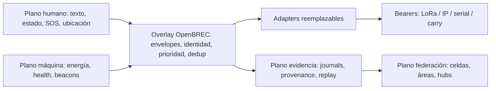

# OpenBREC RF

**OpenBREC es una Open Spec y plataforma de referencia offline-first para construir comunicaciones, energía y evidencia sensorial interoperable en operaciones BREC/USAR (búsqueda y rescate en estructuras colapsadas).** Define contratos abiertos, perfiles reemplazables y una implementación de referencia que funcionan sin cloud, sin red eléctrica y sin backhaul.

> OpenBREC produce y transporta indicios; no diagnostica ni garantiza la presencia, ausencia o rescate de una persona. El silencio de radio, la falta de movimiento, calor o detección nunca son evidencia de ausencia.

[Empezar ahora](docs/START_HERE.md) · [Arquitectura](docs/architecture.md) · [Open Spec normativa](docs/open-spec/README.md) · [FAQ](docs/faq.md) · [Glosario](docs/glossary.md)

## Estado honesto del proyecto

La Open Spec está `8 / 8` y su autoridad **spec-first** es `1.0.0-draft.1`, ejecutable offline. Todo el contenido del proyecto está en estado `specified` o `simulated`: es un **marco de referencia con simulación verificada, sin ninguna validación física**. El carril opcional de evidencia física P1a está en `0 / 8` y en pausa declarativa hasta que exista hardware real; sus detalles viven en [P1A Asset Intake](docs/governance/P1A_ASSET_INTAKE.md). Nada aquí acredita rango, autonomía, sensibilidad, seguridad eléctrica, cumplimiento regulatorio ni readiness de campo.

| Estado | Significado |
|---|---|
| `specified` | Contrato y criterios definidos; no implica ejecución. |
| `simulated` | Ejecutado con datos o entorno sintético reproducible. **Todo el software del repo está aquí.** |
| `bench-validated` | Ensayado físicamente en banco para la configuración declarada. |
| `field-validated` | Ensayado en campo bajo el perfil y condiciones declarados. |
| `unsupported` | Fuera del contrato o deliberadamente no soportado. |
| `unverified` | Sin evidencia suficiente para asignar otro estado. |

## El problema

En estructuras colapsadas o incidentes extensos, los equipos pierden cloud, red eléctrica, backhaul y coordinación central. Cada grupo lleva radios, terminales, sensores y fuentes de energía incompatibles. Una solución útil debe operar localmente, atravesar particiones, componer el hardware disponible y conservar evidencia crítica sin convertir señales incompletas en certezas.

## ¿Qué lugar ocupa OpenBREC?

SARCOP, TAK y CalTopo ya cubren el common operating picture **donde hay nube**, y el mesh táctico comercial donde hay presupuesto de élite. OpenBREC no compite con eso: es la capa de **respaldo e interoperabilidad offline-first** que sigue operando donde esos sistemas se apagan, y exporta evidencia con provenance hacia ellos en vez de reemplazarlos.

- **Complemento, no competidor:** fallback para cuando no hay ArcGIS/cloud/satélite.
- **Nicho realista:** equipos voluntarios, brigadas comunitarias y países sin task forces.
- **Barrera honesta:** sin validación física ni certificación INSARAG/FEMA, ningún equipo clasificado lo adoptaría hoy; la adopción la da la evidencia y la comunidad de práctica, no la tecnología (lección Project OWL).

Análisis completo con fuentes: [panorama SAR/USAR y posicionamiento](docs/research/sar-landscape.md). Los caminos técnicos concretos de complemento — puente CoT/TAK local, Meshtastic MQTT, export CAP/EDXL, CalTopo y APRS opcional — están en la [arquitectura de integración con el ecosistema SAR](docs/research/sar-integration.md) y su [guía operativa](docs/guides/ecosystem-integration.md).

## Cómo está armado



Cada nivel local sigue operando si pierde el nivel superior. El transporte mueve envelopes; el overlay conserva identidad, prioridad, autenticidad, deduplicación y semántica. La vista completa — planos, transportes (Meshtastic, MeshCore, Reticulum, LoRaWAN, carry bundle), energía, beacons, federación y el pipeline de evidencia — está en [Arquitectura](docs/architecture.md).

Además, los dominios de RF sensing de la encarnación previa (Wi-Fi CSI, metadata pasiva, SDR receive-only, drones como geometría, RF quieting) están reintegrados como **addons experimentales** con invariantes de safety en contrato y estados de evidencia honestos (ADR-004), junto a la detección pasiva de redes de localización crowdsourced — Apple Find My, Google Find Hub, Samsung — como indicio débil (`offline-finding-observation`, RFC-0002). La base citable es la [investigación SOTA de RF sensing](docs/research/rf-sensing-state-of-the-art.md). Tres addons (`csi-link-observation`, `passive-rf-observation`, `offline-finding-observation`) tienen simuladores de replay determinísticos que los elevan a `simulated` (gates `rf-sensing-*`). Ninguno es capacidad validada: CSI/Kismet/SDR en SAR real son `unverified` y RF quieting es `specified` sin literatura. Como excepción separada y gobernada (ADR-005), el addon `emergency-autojoin-profile` define un AP de emergencia que responde a cualquier SSID sondeado para convertir el teléfono de una víctima que no puede actuar en baliza vía portal cautivo — sólo bajo `emergency_assumed_risk`, nunca por defecto, con eficacia `unverified` ([guía](docs/guides/emergency-autojoin.md)).

## Tres caminos

| Quiero… | Camino |
|---|---|
| **Entender** el proyecto | [Start Here](docs/START_HERE.md) → [Arquitectura](docs/architecture.md) → [FAQ](docs/faq.md) |
| **Probar sin hardware** | [Quickstart off-grid](docs/guides/quickstart-offgrid.md): gates, replay y pipeline lab-sim (API → MQTT → worker → PWA) |
| **Implementar** la spec | [Cómo implementar la spec](docs/guides/implementing-the-spec.md) → [Open Spec](docs/open-spec/README.md) y [Conformance](docs/open-spec/CONFORMANCE.md) |

## Qué no es

- No es un producto certificado, un sistema de despacho ni una garantía de rescate.
- No detecta personas: organiza indicios con incertidumbre explícita y puede abstenerse.
- No exige un fabricante, SKU, bearer, sensor, frecuencia ni topología.
- No convierte un ACK técnico de radio en lectura, comprensión o aceptación humana.
- No acredita capacidades físicas: simulación y CI no son evidencia física.

## Safety boundaries

- Silencio de radio, movimiento, calor o detección **nunca** implica ausencia de personas.
- Sin funciones ofensivas de Wi-Fi/radio y sin TX no gobernado (modos `receive_only`, `conducted_only`, `jurisdiction_validated`; la excepción vital `emergency_assumed_risk` es acotada y nunca equivale a autorización legal).
- Los plugins publican observaciones; nunca escriben hechos consolidados.
- Ante evidencia insuficiente, el sistema se abstiene (`unknown`); no infiere.
- Un SOS con firma inválida se preserva para review; nunca se descarta silenciosamente.

## Estructura del repositorio

| Ruta | Contenido |
|---|---|
| `docs/open-spec/`, `schemas/`, `specs/` | Open Spec normativa, contratos y perfiles versionados |
| `openbrec/`, `apps/` | Reference implementation (core Python, API, fusion-worker, PWA) |
| `docs/guides/` | Manuales orientados a tareas |
| `docs/reference-builds/` | Composiciones reproducibles por capacidades |
| `docs/evidence-packs/`, `docs/field-profiles/` | Evidencia física y perfiles de campo (vacíos en esta versión) |
| `fixtures/`, `tests/` | Fixtures, replay y validación |
| `docs/research/` | Investigación citable (p.ej. estado del arte de RF sensing) |
| `docs/legacy/` | Encarnación Wi-Fi-CSI previa (histórico, sin autoridad) |

## Validación offline

```bash
uv sync --frozen
uv run --offline python scripts/validate_docs.py
uv run --offline python scripts/validate_bundle.py
uv run --offline python -m openbrec.verify open-spec
uv run --offline python -m openbrec.verify open-spec-energy
uv run --offline python -m openbrec.verify open-spec-transports
uv run --offline python -m openbrec.verify open-spec-messaging
uv run --offline python -m openbrec.verify open-spec-beacons
uv run --offline python -m openbrec.verify open-spec-federation
uv run --offline python -m openbrec.verify open-spec-builds
uv run --offline python -m openbrec.verify open-spec-exit
uv run --offline python -m openbrec.verify rf-sensing-csi
uv run --offline python -m openbrec.verify rf-sensing-passive
uv run --offline python -m openbrec.verify rf-sensing-multimodal
uv run --offline python -m openbrec.verify ruview-model-format
uv run --offline python -m openbrec.verify rf-sensing-offline-finding
uv run --offline python -m unittest discover tests -q
uv run --offline python -m openbrec.verify core-replay --bundle fixtures/replay/core/m0-six-node.json
```

Cada gate valida su perfil normativo en `specs/openbrec/1.0.0-draft.1/`: `energy-architecture-profiles.json`, `multi-bearer-transport-profiles.json`, `messaging-interoperability-profiles.json`, `beacon-capability-profiles.json`, `recursive-federation-profiles.json` y `reference-build-profiles.json`; los gates `rf-sensing-*` ejecutan los simuladores de replay de los dominios RF (fixtures en `fixtures/replay/`). La suite completa (337 tests) corre sin hardware. El pipeline software end-to-end con datos sintéticos se describe en el [Quickstart off-grid](docs/guides/quickstart-offgrid.md). Consultar [Validación y troubleshooting](docs/guides/validation-troubleshooting.md) para interpretar resultados.

## Contribución y licencias

Leé [CONTRIBUTING.md](CONTRIBUTING.md), [CODE_OF_CONDUCT.md](CODE_OF_CONDUCT.md) y [SECURITY.md](SECURITY.md). Un cambio normativo exige nueva versión, fixtures y vectores de compatibilidad; un nuevo transporte/sensor entra como perfil o adapter reemplazable declarado `unverified` hasta tener evidencia; la evidencia física se publica separada de la norma.

- software/configuración: [Apache-2.0](LICENSE);
- hardware de referencia: [CERN-OHL-S-2.0](LICENSES/CERN-OHL-S-2.0.txt);
- documentación: [CC BY-SA 4.0](LICENSES/CC-BY-SA-4.0.txt).

OpenBREC es experimental y se entrega sin garantía. Quien construye u opera una implementación debe validar seguridad eléctrica, radio, regulación, procedimientos humanos y condiciones de misión.

## Roadmap y referencias

El roadmap vigente es [ROADMAP.md](ROADMAP.md); [DELIVERY_BOARD.md](DELIVERY_BOARD.md) es audit trail histórico. La documentación de la encarnación Wi-Fi-CSI previa está archivada en [docs/legacy/](docs/legacy/README.md), sin autoridad normativa; sus dominios de RF sensing fueron reintegrados como addons experimentales (ver [ADR-004](docs/adr/ADR-004-rf-sensing-reintegration.md)).

## Índice de manuales y guías

| Necesidad | Ruta |
|---|---|
| Entender y elegir | [Start Here](docs/START_HERE.md) · [Arquitectura](docs/architecture.md) · [Glosario](docs/glossary.md) |
| Probar sin hardware | [Quickstart off-grid](docs/guides/quickstart-offgrid.md) |
| Implementar la spec | [Cómo implementar la spec](docs/guides/implementing-the-spec.md) |
| Planificar escala/topología | [Deployment planning](docs/guides/deployment-planning.md) |
| Dimensionar energía/solar | [Energía](docs/guides/energy.md) |
| Elegir/integrar bearer | [Transportes](docs/guides/transports.md) |
| Implementar mensajes/SOS | [Mensajería y SOS](docs/guides/messaging-sos.md) |
| Integrar sensores | [Beacons](docs/guides/beacons.md) |
| Particionar y reconciliar | [Federación](docs/guides/federation.md) |
| Construir/reutilizar | [Construcción y reutilización](docs/guides/building-reuse.md) |
| Validar/recuperar | [Validation & troubleshooting](docs/guides/validation-troubleshooting.md) |
| Registro de víctimas | [Victim tracking](docs/guides/victim-tracking.md) |
| Identidad y claves offline | [Identity & key lifecycle](docs/guides/identity-key-lifecycle.md) |
| Disciplina de reloj | [Clock discipline](docs/guides/clock-discipline.md) |
| GIS offline | [Offline mapping](docs/guides/offline-mapping.md) |
| Interop CAP/EDXL-DE | [Interoperación](docs/guides/interop-emergency-standards.md) |
| Marco regulatorio | [Regulatory](docs/guides/regulatory.md) |
| Doctrina USAR | [USAR doctrine integration](docs/guides/usar-doctrine-integration.md) |
| Sensing RF experimental | [CSI](docs/guides/csi-sensing.md) · [RF pasiva](docs/guides/passive-rf.md) · [SDR receive-only](docs/guides/sdr-beacons.md) · [Drones](docs/guides/drone-geometry.md) · [RF quieting](docs/guides/rf-quieting.md) · [Offline finding](docs/guides/offline-finding.md) |
| Rutas de solución | [Kit mínimo personal/equipo](docs/reference-builds/personal-team-kit.md) · [ResponseCell](docs/reference-builds/response-cell.md) · [Deployment federado](docs/reference-builds/federated-deployment.md) |

Los principios de diseño (offline-first, replayable, capability-driven, life-safety-first, open hardware, evidence-not-assertions, abstention) se desarrollan en [Arquitectura](docs/architecture.md) y tienen autoridad normativa en la [Open Spec](docs/open-spec/README.md). Las recetas reutilizables por capacidad están en el [índice de reference builds](docs/reference-builds/README.md).
