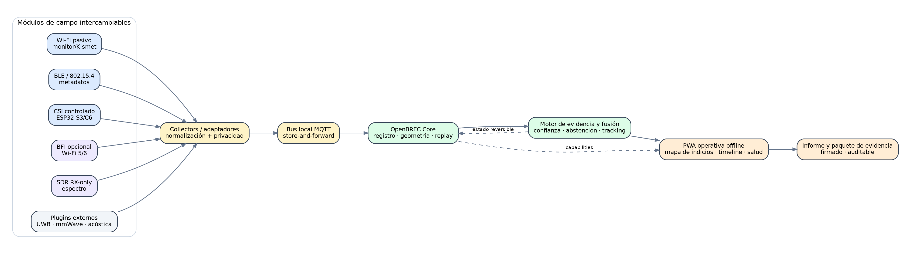

# OpenBREC RF

OpenBREC RF es una plataforma open source, modular y offline-first para investigar **radio-tomografía oportunista, despliegue rápido de sensores y fusión explicable de evidencia** durante operaciones BREC/USAR en estructuras colapsadas.



## Qué hace diferente al proyecto

- reutiliza captura Wi‑Fi pasiva, BLE, CSI, BFI, SDR y herramientas defensivas de ciberseguridad como sensores de contexto;
- forma enlaces radio controlados alrededor de sectores o vacíos;
- admite antenas externas omni y direccionales como componentes calibrados;
- integra RuView como collector/model provider opcional, sin acoplar el core;
- permite desplegar Drop Nodes con drones y convertir la trayectoria del dron en una apertura sintética;
- incorpora cortinas o recintos de atenuación RF para reducir interferencia de forma temporal y medible;
- funciona con las capacidades disponibles y se abstiene cuando la evidencia es insuficiente.

> [!IMPORTANT]
> El sistema produce **indicios**, no diagnósticos ni certezas de víctima. La ausencia de RF nunca descarta una persona atrapada.

> [!NOTE]
> Estado actual: M0 y P0 simulado completos. La autoridad actual es spec-first: Open Spec está `4 / 8`, mientras P1a física opcional permanece `0 / 8`. Publicar contratos y perfiles no requiere poseer hardware; evidence packs físicos sólo elevan claims de una implementación exacta. No es una plataforma operacional ni un perfil de campo.

P1a-01 está `blocked_external_evidence`: su gate existe, pero faltan nueve assets
reales autorizados, inspeccionados y bajo custodia. Se comprueba sin promover la
task con:

```bash
uv run --offline python -m openbrec.verify p1a-assets --evidence-dir evidence/p1a/p1a-01
```

Mientras no exista el denominador 9/9, el fallo de ese comando es el resultado
seguro esperado y el progreso P1a permanece `0 / 8`; esto no bloquea la spec.

La frontera abierta se valida con:

```bash
uv run --offline python -m openbrec.verify open-spec
uv run --offline python -m openbrec.verify open-spec-energy
uv run --offline python -m openbrec.verify open-spec-transports
uv run --offline python -m openbrec.verify open-spec-messaging
```

Los nueve perfiles permiten componentes alternativos y comienzan `unverified`.
Sólo `lab_validated` y `field_validated` requieren evidence packs físicos.
La energía admite topologías por componente, central, híbrida o por reemplazo;
solar es un addon opcional y ningún claim puede presentarse como perpetuo.
Los transportes LoRaWAN privado, Meshtastic, MeshCore, Reticulum/RNode y carry
bundle son adapters reemplazables. No existe ganador universal: cada
implementación documenta misión, topología, seguridad, energía, regulación,
coexistencia, alternativas descartadas y gaps; el overlay firmado OpenBREC
conserva identidad, prioridad, deduplicación y semántica por encima del bearer.
Texto breve, estado, SOS y ubicación tienen contenidos cerrados y lifecycle
append-only. Recepción técnica, lectura y aceptación operativa son estados
separados y nunca garantizan rescate. Posible distress no verificable se preserva
para review con acceso, auditoría y retención gobernados, sin autenticarlo.

## Documentos principales

- [`OPENBREC_RF_TECHNICAL_DESIGN.md`](OPENBREC_RF_TECHNICAL_DESIGN.md) — diseño técnico completo.
- [`BOM.md`](BOM.md) — componentes por niveles, Uruguay y fuentes oficiales/US.
- [`CODEX_MASTER_PROMPT.md`](CODEX_MASTER_PROMPT.md) — bundle de ejecución para Codex.
- [`AGENTS.md`](AGENTS.md) — reglas para agentes de desarrollo.
- [`docs/08-ruview-evaluation.md`](docs/08-ruview-evaluation.md) — validación e integración de RuView.
- [`docs/09-drone-deployment.md`](docs/09-drone-deployment.md) — drones, Drop Pods y scans móviles.
- [`docs/10-rf-quieting.md`](docs/10-rf-quieting.md) — cortinas, carpas y aislamiento medido.
- [`docs/superpowers/plans/2026-07-17-openbrec-p0-simulated-addons-plan.md`](docs/superpowers/plans/2026-07-17-openbrec-p0-simulated-addons-plan.md) — plan P0 completado, completamente simulado.
- [`docs/superpowers/plans/2026-07-17-openbrec-p1a-bench-conducted-plan.md`](docs/superpowers/plans/2026-07-17-openbrec-p1a-bench-conducted-plan.md) — plan P1a de banco/conducted y autorizaciones task-by-task.
- [`docs/superpowers/plans/2026-07-18-openbrec-open-spec-plan.md`](docs/superpowers/plans/2026-07-18-openbrec-open-spec-plan.md) — autoridad spec-first, secuencia OS-01–OS-08 y separación de evidence packs físicos.
- [`specs/openbrec/1.0.0-draft.1/reference-capability-profiles.json`](specs/openbrec/1.0.0-draft.1/reference-capability-profiles.json) — nueve roles abiertos con alternativas y criterios de aceptación.
- [`specs/openbrec/1.0.0-draft.1/energy-architecture-profiles.json`](specs/openbrec/1.0.0-draft.1/energy-architecture-profiles.json) — cuatro topologías energéticas abiertas, source adapters y mappings por rol.
- [`specs/openbrec/1.0.0-draft.1/multi-bearer-transport-profiles.json`](specs/openbrec/1.0.0-draft.1/multi-bearer-transport-profiles.json) — cinco perfiles de transporte reemplazables, overlay común y modos regulatorios acotados.
- [`specs/openbrec/1.0.0-draft.1/messaging-interoperability-profiles.json`](specs/openbrec/1.0.0-draft.1/messaging-interoperability-profiles.json) — texto, estado, SOS y ubicación con seguridad de aplicación y distress append-only.
- [`docs/governance/P0_RESIDUAL_REGISTER.md`](docs/governance/P0_RESIDUAL_REGISTER.md) — residuales, owners, gates y stop conditions P0.

## Perfiles planificados posteriores a M0

El único perfil ejecutable actual es `lab-sim`. Las opciones siguientes se conservan como diseño/backlog y no aparecen todavía en el Compose ejecutable:

| Perfil | Sensores / capacidades |
|---|---|
| `field-basic` | Wi‑Fi pasivo, BLE y mapa de actividad. |
| `field-csi` | Enlaces CSI controlados y detección de cambio. |
| `field-ruview` | Firmware/procesamiento RuView mediante adapter. |
| `field-spectrum` | SDR receive-only y barridos direccionales. |
| `field-drone-drop` | Telemetría de dron y Drop Nodes. |
| `field-drone-rf` | Barrido RF móvil con pose conocida. |
| `field-rf-quiet` | Medición antes/después con cortinas o recinto RF. |
| `lab-bfi` | BFI experimental con participantes registrados. |
| `advanced-fusion` | Plugins avanzados UWB/mmWave/acústica/sísmica. |

## Validación local

El comando histórico sólo comprueba estructura:

```bash
python3 scripts/validate_bundle.py
```

Los gates contractuales M0-02 se ejecutan con el entorno bloqueado y sin resolver dependencias por red:

```bash
uv run --offline python -m openbrec.verify schema
uv run --offline python -m openbrec.verify fixtures
uv run --offline python -m openbrec.verify schema-compat
uv run --offline python -m openbrec.verify contracts-gen --check
```

El runtime M0-03 separa provisioning de startup offline:

```bash
uv run --offline python -m openbrec.verify compose-build
uv run --offline python -m openbrec.verify offline-startup
```

El primer gate puede descargar imágenes y construye los servicios. El segundo usa `--pull never --no-build`, prueba API → MQTT → worker, rechazo contractual, shell PWA y ausencia de egress. La operación y sus límites están en [`docs/runtime/lab-sim.md`](docs/runtime/lab-sim.md).

M0-04 separa replay de adaptador y core, y verifica disposición/preservación:

```bash
uv run --offline python -m openbrec.verify adapter-replay
uv run --offline python -m openbrec.verify core-replay
uv run --offline python -m openbrec.verify determinism --runs 10
uv run --offline python -m openbrec.verify review-quarantine
uv run --offline python -m openbrec.verify life-safety-preservation
uv run --offline python -m openbrec.verify privacy
uv run --offline python -m openbrec.verify security
```

Los receipts evaluados sobre un SHA limpio están en `evidence/m0/<gate>/m0-04-receipt.json`. El storage SQLite es una referencia ejecutable portable de laboratorio; no acredita todavía la integración del worker con PostgreSQL ni custodia de claves de campo.

M0-05 ejecuta la campaña sintética común y la PWA explicable:

```bash
uv run --offline python -m openbrec.verify simulator --scenario fixtures/replay/core/m0-six-node.json
uv run --offline python -m openbrec.verify core-replay --bundle fixtures/replay/core/m0-six-node.json
uv run --offline python -m openbrec.verify determinism --runs 10
uv run --offline python -m openbrec.verify ui-smoke
```

El gate de UI construye la PWA, la sirve sólo en loopback y conduce Chromium para comprobar capas semánticas, selección de zona y recarga sin red. Los receipts limpios están en `evidence/m0/<gate>/m0-05-receipt.json`. La campaña es sintética y todos los resultados se abstienen; no acredita detección ni operación de campo.

M0-06 cierra la frontera durable y la salida reproducible:

```bash
uv run --offline python -m openbrec.verify compose-build
uv run --offline python -m openbrec.verify offline-startup
uv run --offline python -m openbrec.verify postgres-disposition
uv run --offline python -m openbrec.verify key-lifecycle
uv run --offline python -m openbrec.verify secret-scan
uv run --offline python -m openbrec.verify sbom --output /tmp/openbrec-m0.cdx.json
uv run --offline python -m openbrec.verify licenses
uv run python -m openbrec.verify vulnerability-scan
uv run python -m openbrec.verify all --evidence-dir /tmp/openbrec-m0-evidence
```

El último comando orquesta los mismos gates independientes y exige SHA limpio e integridad canónica de cada receipt. `vulnerability-scan` necesita acceso a los servicios de advisories; `offline-startup` continúa sin build, pull ni egress. El cierre, sus límites y las aprobaciones lógicas están en [`docs/security/2026-07-17-m0-06-exit-review.md`](docs/security/2026-07-17-m0-06-exit-review.md).

Los residuales M0 están en [`docs/governance/M0_RESIDUAL_REGISTER.md`](docs/governance/M0_RESIDUAL_REGISTER.md). Los residuales iniciales del plan P0 están en [`docs/governance/P0_RESIDUAL_REGISTER.md`](docs/governance/P0_RESIDUAL_REGISTER.md); ninguno autoriza claims físicos o de campo.

## Licencias

- software y configuración: Apache-2.0;
- hardware de referencia: CERN-OHL-S-2.0;
- documentación: CC BY-SA 4.0;
- dependencias y proyectos externos conservan sus licencias. RuView no está vendorizado y se referencia bajo MIT.
