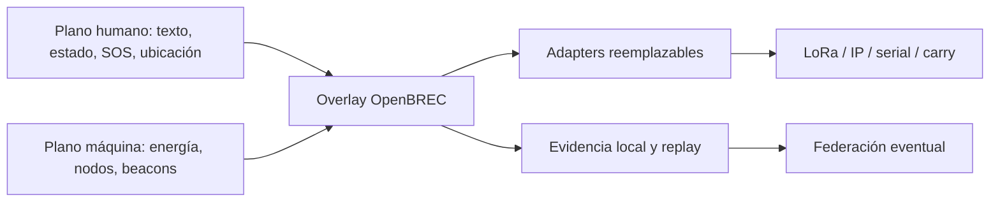

# OpenBREC RF

**OpenBREC es una Open Spec y plataforma de referencia offline-first para construir comunicaciones, energía y evidencia sensorial interoperable en operaciones BREC/USAR.**

> OpenBREC produce y transporta indicios; no diagnostica ni garantiza la presencia, ausencia o rescate de una persona. El silencio de radio, la falta de movimiento, calor o detección nunca son evidencia de ausencia.

[Empezar ahora](docs/START_HERE.md) · [Open Spec normativa](docs/open-spec/README.md) · [Manuales](docs/guides/README.md) · [Reference builds](docs/reference-builds/README.md)

## El problema

En estructuras colapsadas o incidentes extensos, los equipos pueden perder cloud, red eléctrica, backhaul y coordinación central. Distintos grupos llevan radios, terminales, sensores y fuentes incompatibles. Una solución útil debe funcionar localmente, atravesar particiones, combinar hardware disponible y conservar evidencia crítica sin convertir señales incompletas en certezas.

## Visión y propuesta de valor

OpenBREC ofrece contratos abiertos, perfiles reemplazables y recetas reproducibles para que una persona o equipo pueda:

- comunicarse mediante texto breve, estado, SOS y ubicación;
- desplegar energía local, baterías y solar como addons combinables;
- incorporar beacons acústicos, de movimiento, térmicos o futuros;
- conectar Meshtastic, MeshCore, Reticulum, LoRaWAN u otros transportes;
- formar ResponseCells y deployments federados que operen durante particiones;
- validar por simulación, banco o campo sin confundir niveles de evidencia.

## Casos de uso

- kit personal o de equipo sin dependencia de una red superior;
- comunicación entre equipos en zonas sin cobertura pública;
- telemetría y estado de componentes off-grid;
- beacons remotos que preservan observaciones e incertidumbre;
- coordinación de múltiples celdas, áreas y hubs opcionales;
- laboratorio, replay y comparación reproducible de adapters/componentes.

## Qué es OpenBREC

OpenBREC se divide en seis capas con autoridad explícita:

1. **Open Spec normativa:** contratos, invariantes, perfiles y conformidad.
2. **Reference implementation:** software reemplazable que demuestra la spec.
3. **Manuales y guías:** rutas para construir, integrar, operar y diagnosticar.
4. **Reference builds:** composiciones abiertas basadas en capacidades.
5. **Evidence packs:** evidencia de una combinación y protocolo exactos.
6. **Field profiles:** configuraciones posteriormente validadas para un contexto.

La separación completa está en la [arquitectura documental](docs/DOCUMENTATION_ARCHITECTURE.md).

## Qué no es

- No es un producto certificado, un sistema de despacho ni una garantía de rescate.
- No exige un fabricante, SKU, bearer, sensor, frecuencia ni topología.
- No convierte un ACK de radio en lectura, comprensión o aceptación operativa.
- No controla vuelo ni habilita capacidades ofensivas de Wi-Fi/SDR.
- No acredita rango, autonomía, sensibilidad o field readiness sin evidencia.
- No requiere hardware ni pruebas físicas para publicar o utilizar la Open Spec.

## Estado y madurez real

La Open Spec está `8 / 8` y su autoridad **spec-first** es `1.0.0-draft.1`. Los contratos, fixtures, simulador, replay y referencia `lab-sim` permiten evaluación offline; el proyecto se mantiene en un nivel experimental de laboratorio, no operacional.

La ruta física P1a es un carril opcional de evidencia y permanece sin aceptación física. Sus detalles viven en [P1A Asset Intake](docs/governance/P1A_ASSET_INTAKE.md); no bloquea la spec, manuales ni builds.

## Arquitectura general



Cada capa local sigue operando si pierde el nivel superior. El transporte mueve envelopes; OpenBREC conserva identidad, prioridad, autenticidad, deduplicación y semántica.

## Principios

- **offline-first:** las funciones locales críticas no requieren cloud;
- **replayable:** fixtures y journals permiten reproducir decisiones;
- **capability-driven:** se compone con sensores y componentes disponibles;
- **life-safety-first:** ante conflicto real, preservar vida y evidencia crítica tiene prioridad, con privacidad y control de acceso aún vigentes;
- **open hardware:** interfaces y capacidades importan más que una marca;
- **evidence, not assertions:** todo claim incluye fuente, confianza y límites;
- **abstention:** evidencia insuficiente produce `unknown`, no una inferencia negativa.

## Componentes principales

- contratos JSON Schema y perfiles versionados;
- core y servicios de referencia Python/FastAPI;
- MQTT 5 local y almacenamiento/replay;
- PWA offline de referencia;
- adapters para sensores, energía y transportes;
- simulador, fixtures, verificadores y receipts;
- planos de hardware y BOM por capacidades.

## Cuatro planos operativos

| Plano | Responsabilidad | Regla clave |
|---|---|---|
| Humano | Texto, estado, SOS, ubicación y receipts | ACK técnico no equivale a aceptación humana. |
| Máquina | Energía, health, telemetría y observaciones | Nunca competir silenciosamente con SOS. |
| Evidencia | Journals, provenance, replay y review | Separar observación, hipótesis y hecho. |
| Federación | Sincronización entre equipos/celdas/áreas | El nivel inferior opera sin el superior. |

## Perfiles de energía

OpenBREC permite energía por componente, sitio compartido, híbrida o reemplazo logístico. Baterías portátiles, solar, generadores, red o vehículo son source adapters opcionales. Cada build declara cargas, Wh utilizables, pérdidas, temperatura, margen, degradación y reserva crítica. Ninguna configuración se presenta como perpetua ni como “72 horas” reales sin medición. Ver [guía de energía](docs/guides/energy.md) y `energy-architecture-profiles.json` en [perfiles normativos](specs/openbrec/1.0.0-draft.1/energy-architecture-profiles.json).

## Perfiles de transporte

No existe ganador universal:

- **Meshtastic:** despliegue ad hoc y movilidad; vigilar flooding, hops y airtime.
- **MeshCore:** repetidores planificados y menor chatter; requiere diseño de infraestructura.
- **Reticulum/RNode:** routing multi-bearer y seguridad E2E avanzada; mayor complejidad/overhead.
- **LoRaWAN privado:** telemetría star-of-stars; exige gateway/servidor local y disciplina de claves/counters.
- **Carry bundle:** fallback de alta latencia para particiones o ausencia de RF.

El entorno, densidad, movilidad, energía, seguridad, regulación y coexistencia determinan la selección. Consultar [Transportes](docs/guides/transports.md) y [`multi-bearer-transport-profiles.json`](specs/openbrec/1.0.0-draft.1/multi-bearer-transport-profiles.json).

## Mensajería, estado, SOS y ubicación

`HumanMessage` usa seguridad de aplicación por encima del bearer. El lifecycle es append-only y distingue creación, aceptación del adapter, transmisión, recepción técnica, visualización y aceptación operativa. Retries conservan identidad; TTL/expiración nunca significa ausencia o rescate fallido. Ver [Mensajería y SOS](docs/guides/messaging-sos.md) y [`messaging-interoperability-profiles.json`](specs/openbrec/1.0.0-draft.1/messaging-interoperability-profiles.json).

## Beacons y abstención

Un beacon puede usar una modalidad acústica, de movimiento, térmica u otra extensión. Publica `Observation` con tiempo, zona, provenance, unidad, incertidumbre, health y sensores ausentes. La combinación multimodal es opcional; todo modelo puede abstenerse. Raw audio o payload sensible permanece deshabilitado por defecto, con preservación gobernada ante posible distress. Ver [Beacons](docs/guides/beacons.md) y [`beacon-capability-profiles.json`](specs/openbrec/1.0.0-draft.1/beacon-capability-profiles.json).

## Operación jerárquica y autónoma

La jerarquía `Node → Team → ResponseCell → OperationalArea → IncidentFederation/Hub` es recursiva y opcional. Cada nivel mantiene identidad, journal, policy y funciones críticas cuando se parte. Al reconectar, sincroniza de forma eventual, deduplica y preserva conflictos/provenance. Ver [Federación](docs/guides/federation.md) y [`recursive-federation-profiles.json`](specs/openbrec/1.0.0-draft.1/recursive-federation-profiles.json).

## Privacidad, seguridad y preservación

OpenBREC minimiza identificadores, payloads y retención; usa identidades por incidente, claves revocables, ACL y cifrado/autenticidad de aplicación. En BREC la vida viene primero: posible distress no verificable no se descarta silenciosamente, sino que se preserva para review con acceso, auditoría, retención y disposición explícitos. El bearer se considera no confiable para identidad y aceptación.

## Safety boundaries

- no TX activo en SDR en la fase inicial;
- no funciones ofensivas Wi-Fi/radio;
- no TX no gobernado: usar `receive_only`, `conducted_only` o `jurisdiction_validated`; una excepción `emergency_assumed_risk` sólo puede ser vital, acotada, con doble autorización, parámetros/geografía exactos, monitoreo, expiración, stop condition y kill switch, y nunca equivale a autorización legal;
- no aceptar claims de atenuación, cobertura, autonomía o detección sin medición;
- no inferir ausencia por silencio, sensores ausentes o abstención;
- no permitir que plugins escriban hechos consolidados;
- no presentar simulación o CI como evidencia física/humana.

## Cómo empezar

1. Abrir [Start Here](docs/START_HERE.md).
2. Ejecutar el [Quickstart off-grid](docs/guides/quickstart-offgrid.md).
3. Elegir una de las tres rutas de solución.
4. Validar offline y registrar límites.
5. Crear un evidence pack sólo si se ejecuta una prueba física real.

## Cómo elegir un perfil

Definí misión, escala, energía, topología, privacidad, threat model, regulación y componentes disponibles. Elegí capacidades mínimas, no marcas. Compará alternativas y asigná a cada una un estado real. La [guía de planificación](docs/guides/deployment-planning.md) ofrece el flujo completo.

## Reference builds disponibles

- [Kit mínimo personal/equipo](docs/reference-builds/personal-team-kit.md)
- [ResponseCell](docs/reference-builds/response-cell.md)
- [Deployment federado](docs/reference-builds/federated-deployment.md)

También hay recetas reutilizables de energía, telemetría, mensajería, beacon y gateway en el [índice de reference builds](docs/reference-builds/README.md).

## Reutilizar hardware existente

Inventariá capacidad, interfaz, versión, firmware, energía, bandas y límites. Implementá un adapter versionado y declaralo `unverified` hasta probarlo. Un teléfono, ESP32, SBC, gateway o radio comercial es un ejemplo reemplazable, nunca autoridad. Ver [Construcción y reutilización](docs/guides/building-reuse.md) y [`reference-build-profiles.json`](specs/openbrec/1.0.0-draft.1/reference-build-profiles.json).

## Validar una implementación

Validá primero documentos/contratos, luego fixtures/replay/simulación. Banco y campo son carriles opcionales posteriores. Un [evidence pack](docs/evidence-packs/README.md) fija SHA, configuración, hardware, entorno, protocolo, resultados y límites; sólo esa combinación puede elevar su estado.

## Estados de soporte y evidencia

| Estado público | Interpretación |
|---|---|
| `specified` | Contrato y aceptación definidos; no ejecutado necesariamente. |
| `simulated` | Ejecutado con datos o entorno sintético reproducible. |
| `bench-validated` | Ensayo físico de banco para la combinación declarada. |
| `field-validated` | Ensayo de campo para el perfil/condiciones declarados. |
| `unsupported` | Fuera del contrato o deliberadamente no soportado. |
| `unverified` | No hay evidencia suficiente. |

Los tokens de máquina históricos `lab_validated` y `field_validated` se muestran como `bench-validated` y `field-validated`. Ver [arquitectura documental](docs/DOCUMENTATION_ARCHITECTURE.md).

## Estructura del repositorio

```text
docs/open-spec/       Open Spec y conformidad
specs/openbrec/       perfiles normativos versionados
schemas/              contratos JSON Schema
openbrec/, apps/      reference implementation
docs/guides/          manuales orientados a tareas
docs/reference-builds composiciones y recetas
docs/evidence-packs/  contrato de evidencia por implementación
docs/field-profiles/  perfiles de campo posteriores
fixtures/, tests/     replay y validación
hardware/, firmware/  referencias abiertas reemplazables
```

## Desarrollo y validación offline

Provisionar dependencias una vez:

```bash
uv sync --frozen
```

Ejecutar validación documental y estructural:

```bash
uv run --offline python scripts/validate_docs.py
uv run --offline python scripts/validate_bundle.py
```

Validar la Open Spec:

```bash
uv run --offline python -m openbrec.verify open-spec
uv run --offline python -m openbrec.verify open-spec-energy
uv run --offline python -m openbrec.verify open-spec-transports
uv run --offline python -m openbrec.verify open-spec-messaging
uv run --offline python -m openbrec.verify open-spec-beacons
uv run --offline python -m openbrec.verify open-spec-federation
uv run --offline python -m openbrec.verify open-spec-builds
uv run --offline python -m openbrec.verify open-spec-exit
```

Ejecutar replay de referencia:

```bash
uv run --offline python -m openbrec.verify core-replay --bundle fixtures/replay/core/m0-six-node.json
```

Consultar [Validación y troubleshooting](docs/guides/validation-troubleshooting.md) para interpretar resultados. `scripts/validate_bundle.py` es estructural; no demuestra que Compose, radio o hardware funcionen.

## Contribuciones

Leé [CONTRIBUTING.md](CONTRIBUTING.md), [CODE_OF_CONDUCT.md](CODE_OF_CONDUCT.md) y [SECURITY.md](SECURITY.md). Un cambio normativo debe incluir compatibilidad, fixtures y explicación; un nuevo transporte/sensor entra como perfil o adapter reemplazable; una evidencia física se publica separada de la norma.

## Roadmap

- **Completado:** bundle M0/P0 simulado y Open Spec `1.0.0-draft.1`.
- **Actual:** documentación pública, reference builds y validadores reproducibles.
- **Opcional posterior:** evidence packs de banco, field profiles, más adapters y validación a escala.

El [Delivery Board](DELIVERY_BOARD.md) conserva la historia y gates internos; no es la entrada pública ni condiciona la utilidad de la spec.

## Licencia y límites de responsabilidad

- software/configuración: [Apache-2.0](LICENSE);
- hardware de referencia: [CERN-OHL-S-2.0](LICENSES/CERN-OHL-S-2.0.txt);
- documentación: [CC BY-SA 4.0](LICENSES/CC-BY-SA-4.0.txt);
- dependencias/proyectos externos conservan sus licencias; ver [LICENSES.md](LICENSES.md).

OpenBREC es experimental y se entrega sin garantía. Quien construye u opera una implementación debe validar seguridad eléctrica, radio, regulación, procedimientos humanos y condiciones de misión.

## Índice de manuales y guías

| Necesidad | Ruta |
|---|---|
| Entender y elegir | [Start Here](docs/START_HERE.md) |
| Probar sin hardware | [Quickstart off-grid](docs/guides/quickstart-offgrid.md) |
| Planificar escala/topología | [Deployment planning](docs/guides/deployment-planning.md) |
| Dimensionar energía/solar | [Energía](docs/guides/energy.md) |
| Elegir/integrar bearer | [Transportes](docs/guides/transports.md) |
| Implementar mensajes/SOS | [Mensajería y SOS](docs/guides/messaging-sos.md) |
| Integrar sensores | [Beacons](docs/guides/beacons.md) |
| Particionar y reconciliar | [Federación](docs/guides/federation.md) |
| Construir/reutilizar | [Construcción y reutilización](docs/guides/building-reuse.md) |
| Validar/recuperar | [Validation & troubleshooting](docs/guides/validation-troubleshooting.md) |
