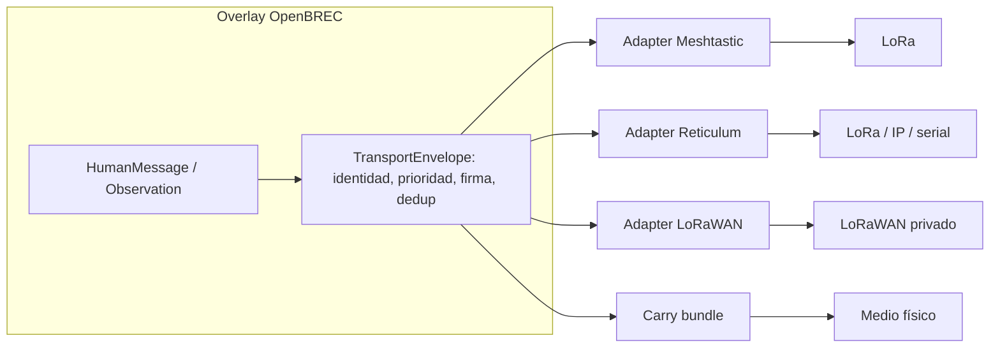
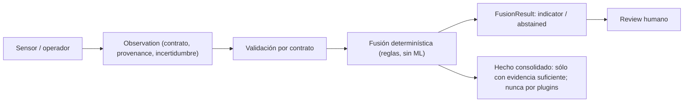

# Arquitectura de OpenBREC

Vista unificada del sistema: concepto, planos operativos, overlay y transportes, energía, beacons, federación, pipeline de evidencia y estados de evidencia. Este documento explica cómo encajan las piezas; el detalle normativo vive en la [Open Spec](open-spec/README.md) y el detalle de cada tarea en las [guías](guides/README.md). Si algo aquí contradice la spec, prevalece la spec.

## Concepto y problema

En estructuras colapsadas o incidentes extensos, los equipos pierden cloud, red eléctrica, backhaul y coordinación central, y cada grupo lleva hardware incompatible. OpenBREC responde con una **Open Spec offline-first**: contratos abiertos que cualquier implementación puede cumplir, perfiles reemplazables para transporte, energía y sensores, y una reference implementation que los demuestra con datos sintéticos. El diseño sigue principios fijos: offline-first, replayable, capability-driven, life-safety-first, open hardware, evidence-not-assertions y abstention.

## Los cuatro planos operativos

Todo lo que hace el sistema pertenece a uno de cuatro planos. La separación es normativa: cada plano tiene reglas que ninguna implementación puede relajar.

| Plano | Responsabilidad | Regla clave |
|---|---|---|
| Humano | Texto breve, estado, SOS, ubicación y receipts | Un ACK técnico no equivale a lectura, comprensión o aceptación humana. |
| Máquina | Energía, health de nodos, telemetría y observaciones de beacons | Nunca compite silenciosamente con el tráfico humano/SOS. |
| Evidencia | Journals append-only, provenance, replay y review | Observación, hipótesis y hecho consolidado son cosas distintas. |
| Federación | Sincronización entre equipos, celdas, áreas y hubs | Cada nivel opera sin el superior; la reconexión es eventual y conserva conflictos. |

## Overlay, envelopes y transportes

OpenBREC es un **overlay**: no define radio propia. Todo lo que viaja es un `TransportEnvelope` que conserva identidad, prioridad, autenticidad de aplicación, deduplicación y semántica por encima del bearer. El bearer se considera no confiable para identidad y aceptación.

Los bearers son **reemplazables** y se eligen por contexto, no por marca: Meshtastic (ad hoc, movilidad), MeshCore (repetidores planificados), Reticulum/RNode (routing multi-bearer, E2E), LoRaWAN privado (telemetría star-of-stars) y carry bundle (fallback de alta latencia sin RF). Ninguno es requisito de conformidad; el entorno, la regulación y la energía determinan la selección. Detalle: [Transportes](guides/transports.md).

## Energía

La energía es un plano de primera clase, no un accesorio: cada componente puede tener energía propia, de sitio compartida, híbrida o por reemplazo logístico. Baterías, solar, generadores, red o vehículo son source adapters opcionales. Cada build declara cargas, Wh utilizables, pérdidas, temperatura, margen, degradación y reserva crítica; ninguna configuración se presenta como “72 horas” reales sin medición. Detalle: [Energía](guides/energy.md).

## Beacons y abstención

Un beacon publica `Observation` con tiempo, zona, provenance, unidad, incertidumbre, health y sensores ausentes declarados. Las modalidades (acústica por rasgos, movimiento, térmica, extensiones) son opcionales y combinables. Dos invariantes:

- **Abstención:** ante evidencia insuficiente el resultado es `unknown`, nunca una inferencia negativa. La falta de una modalidad no es evidencia contra ella.
- **Separación de hechos:** los plugins y sensores publican observaciones; nunca escriben hechos consolidados. El registro de una persona localizada (`VictimRecord`) lo crea sólo un operador humano ([Registro de víctimas](guides/victim-tracking.md)).

Raw audio y payloads sensibles permanecen deshabilitados por defecto; ante posible distress se preserva material en una zona de review gobernada. Detalle: [Beacons](guides/beacons.md).

## Dominios de RF sensing externos (addons experimentales)

Además de los beacons del plano máquina, la spec reintegra como addons experimentales los dominios de RF sensing de la encarnación previa (ADR-004), cada uno con sus boundaries fijados como consts de contrato:

- **Wi-Fi CSI / radio-tomografía** (`csi-link-observation`): observaciones de amplitud con baseline obligatoria; `silence_means_absence: false` y detección automática de personas prohibida; evidencia máxima declarable `bench-validated`. RuView entra como proveedor opcional version-pinned (`ruview-observation`, ADR-001) cuyas salidas nunca son `victim_detected`.
- **Metadata pasiva** (`passive-rf-observation`): probe requests, BT, rtl_433 y DroneID con `subject_ref` seudonimizado por HMAC rotativo por incidente; sin retención de payload, sin intercepción de contenido, sin emulación activa (Lifeseeker/Wi2SAR quedan fuera como referencias externas).
- **SDR receive-only** (`sdr-receive-profile`): decodificación de balizas 406 MHz Cospas-Sarsat y DF con array coherente; `mode: receive_only_in_field` y demodulación de tráfico de terceros prohibida.
- **Drones como geometría de sensing** (`drone-deployment-event`): drop pods, relay y scan móvil; el autopiloto conserva el vuelo (`flight_authority_in_core: false`, ADR-002), el release exige confirmación humana y las muestras de caída nunca fusionan.
- **RF quieting** (`rf-isolation-profile`): aislamiento medido por banda con incertidumbre, baseline antes/después obligatoria y prohibición de envolver un sector con posible víctima sin análisis (ADR-003); dominio `specified` sin literatura SAR publicada.

Los estados de evidencia por tecnología y su base citable están en la [investigación SOTA](research/rf-sensing-state-of-the-art.md); las guías de dominio son [CSI](guides/csi-sensing.md), [RF pasiva](guides/passive-rf.md), [SDR](guides/sdr-beacons.md), [drones](guides/drone-geometry.md) y [RF quieting](guides/rf-quieting.md). Ninguno tiene runtime: son contratos y guías, y todo collector futuro nace `unverified`.

## Federación recursiva

La jerarquía `Node → Team → ResponseCell → OperationalArea → IncidentFederation/Hub` es recursiva y opcional. Cada nivel mantiene identidad, journal, policy y funciones críticas cuando se parte de la red; al reconectar, sincroniza de forma eventual, deduplica y preserva conflictos y provenance en vez de sobrescribir. Detalle: [Federación](guides/federation.md).

## Pipeline de evidencia

El camino de un dato dentro del sistema es fijo:

La fusión usa reglas determinísticas con abstención: una sola fuente produce un indicio de confianza baja; la corroboración exige al menos dos sensores de al menos dos tipos; ante calidad insuficiente o sólo `no_event_detected` el resultado es `abstained` con razones explícitas. Ningún resultado confirma presencia ni ausencia de personas.

**Implementación de referencia (lab-sim).** El repo incluye este pipeline funcionando end-to-end con datos sintéticos: `POST /v1/observations` (API FastAPI) → MQTT QoS1 → fusion-worker (valida, persiste en PostgreSQL y fusiona con `openbrec/fusion.py`) → `GET /v1/observations` y `GET /v1/fusion-results[/{id}]` → PWA offline-first que consume la API y cae a fixtures estáticos verificados cuando no está disponible, con indicador visible de la fuente. Todo corre local; el recorrido está en el [Quickstart off-grid](guides/quickstart-offgrid.md).

## Estados de evidencia y escalera

Cada capacidad declara uno de seis estados. Son una escalera de claims, no un score de calidad:

| Estado | Significado |
|---|---|
| `specified` | Contrato y criterios definidos; no implica ejecución. |
| `simulated` | Ejecutado con datos o entorno sintético reproducible. |
| `bench-validated` | Ensayado físicamente en banco para la configuración declarada. |
| `field-validated` | Ensayado en campo bajo el perfil y condiciones declarados. |
| `unsupported` | Fuera del contrato o deliberadamente no soportado (disposición, no fallo). |
| `unverified` | Sin evidencia suficiente para asignar otro estado. |

Subir un escalón exige evidencia nueva y específica: `simulated` requiere escenario y receipt determinístico; los niveles físicos requieren un [evidence pack](evidence-packs/README.md) de la combinación exacta (versión, configuración, hardware, entorno, protocolo, resultados y límites). Ningún estado físico se infiere desde CI. En la versión actual todo el proyecto está en `specified`/`simulated`; P1a (0 / 8) es el carril físico, en pausa declarativa.

## Safety boundaries transversales

Aplican a todos los planos y a toda implementación conformante:

- **Silencio ≠ ausencia:** el silencio de radio, la falta de movimiento, calor o detección nunca son evidencia de ausencia de una persona.
- **ACK técnico ≠ aceptación:** la recepción de radio no demuestra lectura, comprensión ni aceptación operativa.
- **No TX no gobernado:** sólo los modos regulatorios `receive_only`, `conducted_only` y `jurisdiction_validated`; la excepción vital `emergency_assumed_risk` es acotada, con doble autorización y kill switch, y nunca equivale a autorización legal. Sin funciones ofensivas de Wi-Fi/radio y sin TX activo en SDR en la fase inicial.
- **Abstención antes que inferencia:** evidencia insuficiente produce `unknown`.
- **Evidencia preservada:** un SOS con firma inválida o un dato ambiguo se preserva para review; nunca se descarta silenciosamente.
- **Claims honestos:** no aceptar atenuación, cobertura, autonomía o detección sin medición; no presentar simulación como evidencia física.

## Dónde seguir

- Implementar la spec: [Cómo implementar la spec](guides/implementing-the-spec.md).
- Autoridad normativa: [Open Spec](open-spec/README.md) y [Conformance](open-spec/CONFORMANCE.md).
- Mapa de documentos y precedencia: [arquitectura documental](DOCUMENTATION_ARCHITECTURE.md).
- Términos: [Glosario](glossary.md). Preguntas: [FAQ](faq.md).
