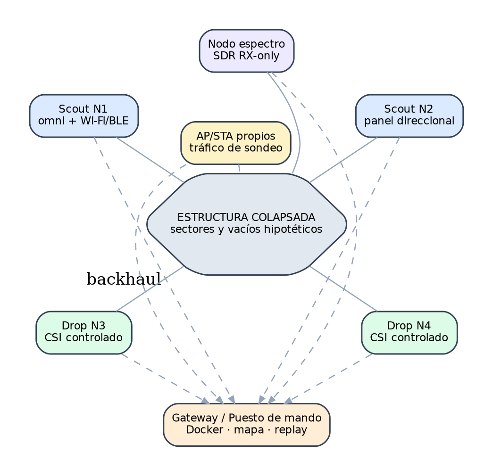

> ⚠️ Documento histórico — corresponde a la encarnación Wi-Fi-CSI previa del proyecto. Sin autoridad normativa. Ver [docs/legacy/README.md](README.md).

# Despliegue mediante drones

## Tesis de innovación

La contribución no es “usar un dron para mirar”, sino emplearlo como **constructor rápido de una red de sensing** y como plataforma de medición móvil. Un dron puede ubicar transmisores, receptores, relays o referencias en zonas inaccesibles y registrar pose precisa para convertir una secuencia RF en información espacial.

## Capacidades

- drop controlado de nodos;
- colocación por winch sin aterrizaje;
- relay temporal;
- scan RF móvil con SDR/Wi‑Fi receive-only;
- synthetic aperture por trayectoria;
- revisión visual de ubicación del nodo;
- recuperación cuando sea seguro.

## Interfaz

OpenBREC consume MAVLink o una API vendor-approved mediante `drone-mavlink`; el autopiloto mantiene toda la autoridad de vuelo. El bridge publica pose, estado de motores, payload, drop y calidad de navegación.

## Eventos mínimos

- `drone_pose`;
- `payload_armed`;
- `payload_released`;
- `drop_impact`;
- `drop_stable`;
- `node_online`;
- `node_position_estimate`;
- `drone_emi_baseline`;
- `mission_aborted`.

## Drop Pod

Ver [`hardware/drop-pod.md`](../../hardware/drop-pod.md). Debe ser autoenderezable, identificable, de antena externa, con buffer local y sin medición válida durante caída/impacto.

## Caminos de hardware

1. **Accesible:** airframe open PX4/ArduPilot, Pixhawk y release PWM.
2. **Field:** plataforma soportada localmente, RTK/VIO, winch ligero y redundancia.
3. **Industrial:** dron de carga/winch para gateway, batería o kit RF; integración cerrada como plugin.
4. **Interior:** microdrone protegido solo para reconocimiento/relay ligero; el polvo y la pérdida de señal limitan su uso.

## Safety gate

No se habilita un perfil drone hasta documentar responsable UAS, masa, C.G., autonomía, release test, geofence, lost-link, zona de caída y procedimiento de abort.

## Referencias

- PX4 payloads: https://docs.px4.io/main/en/payloads/
- PX4 package delivery: https://docs.px4.io/main/en/flying/package_delivery_mission.html
- ArduPilot grippers: https://ardupilot.org/copter/docs/common-grippers-landingpage.html
- Holybro X500 v2: https://docs.px4.io/main/en/complete_vehicles/holybro_x500_v2.html
- DJI FlyCart 30 specs: https://www.dji.com/flycart-30/specs
