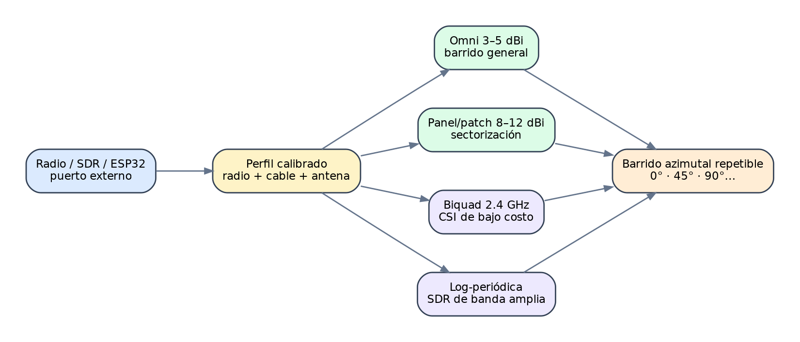
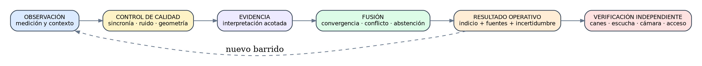
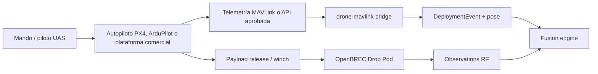

> ⚠️ Documento histórico — corresponde a la encarnación Wi-Fi-CSI previa del proyecto. Sin autoridad normativa. Ver [docs/legacy/README.md](README.md).

# OpenBREC RF

**Plataforma abierta y modular de fusión radioeléctrica para búsqueda técnica en estructuras colapsadas**

> Diseño técnico, especificación, planificación y arquitectura de referencia.
> Versión 0.2 — 14 de julio de 2026.

| Abierto | Modular | Offline-first | Explicable |
|---|---|---|---|
| Hardware y software reproducibles | Usa únicamente las capacidades presentes | Opera sin Internet | Conserva fuentes, conflicto e incertidumbre |

> [!WARNING]
> OpenBREC RF es una plataforma experimental de apoyo BREC/USAR. No es un detector de vida certificado, un equipo médico ni un sustituto del mando, la búsqueda canina, la escucha técnica, el análisis estructural o los procedimientos operativos vigentes.

# Control del documento

| **Campo**       | **Valor**                                                      |
|-----------------|----------------------------------------------------------------|
| Proyecto        | OpenBREC RF                                                    |
| Documento       | Diseño técnico, especificación, planificación y BoM            |
| Versión         | 0.2 — integración CSI, drones y aislamiento RF                    |
| Fecha           | 14 de julio de 2026                                            |
| Uso previsto    | Investigación, prototipado y pruebas autorizadas en BREC/USAR  |
| Estado          | Experimental; no apto como único medio de decisión operacional |
| Bundle asociado | repositorio OpenBREC-RF / CODEX_MASTER_PROMPT.md                    |

# Resumen ejecutivo

OpenBREC RF propone una plataforma de bajo costo que convierte
capacidades habituales de observación radioeléctrica y ciberseguridad
defensiva —modo monitor Wi‑Fi, descubrimiento BLE, receptores SDR,
análisis de espectro, Wi‑Fi CSI y BFI— en una red distribuida de
sensores para priorizar sectores y vacíos durante la búsqueda técnica en
estructuras colapsadas.

La propuesta no intenta reproducir un radar comercial de signos vitales.
Su innovación reside en la combinación adaptativa de tres familias de
evidencia: emisiones oportunistas de dispositivos, perturbaciones
físicas de enlaces radio controlados y barridos direccionales
calibrados. El sistema funciona con las capacidades presentes: desde un
kit económico de ESP32 y radios USB hasta nodos Wi‑Fi 6E, SDR, UWB,
radar mmWave y sensores acústicos o sísmicos integrados como plugins.

El núcleo es offline-first, explica por qué asigna prioridad a una zona
y se abstiene cuando la cobertura o la coherencia son insuficientes. Una
detección de dispositivo no se interpreta como persona viva; una
alteración CSI no se interpreta como identidad; y la ausencia de RF
nunca descarta víctimas.

<table>
<colgroup>
<col style="width: 100%" />
</colgroup>
<thead>
<tr class="header">
<th>
<strong>Tesis de innovación</strong>

Radio-tomografía oportunista y cooperativa, desplegable con hardware
globalmente disponible, con antenas externas como parte calibrada del
sensor y un motor de fusión que degrada capacidades de manera
honesta.
</th>
</tr>
</thead>
<tbody>
</tbody>
</table>

## Decisión de diseño principal

- **Core estable; sensores intercambiables.** Ninguna tecnología
  —incluido BFI— es obligatoria para ejecutar el sistema.

- **Wi‑Fi incluido desde el inicio.** Se utiliza como fuente pasiva,
  transporte independiente y enlace controlado de sensing.

- **Antenas de campo.** Omnidireccionales y direccionales se usan con
  perfiles registrados, no como accesorios genéricos.

- **Recepción defensiva.** Las funciones de “piña” se limitan a
  descubrimiento, captura de metadatos y telemetría autorizada.

- **Validación BREC.** Los resultados deben compararse con ground truth
  y técnicas independientes en escombros simulados.

# Índice de contenidos

1.  1\. Problema, alcance y oportunidad de innovación

2.  2\. Principios de diseño y límites operativos

3.  3\. Concepto de operaciones BREC

4.  4\. Arquitectura modular y modelo de capacidades

5.  5\. Módulos radioeléctricos y de ciberseguridad defensiva

6.  6\. Diseño de nodos y topologías de despliegue

7.  7\. Antenas externas, barridos y calibración

8.  8\. Datos, evidencia, fusión y modelos

9.  9\. Software, seguridad y operación offline

10. 10\. BoM escalonada y compras

11. 11\. Plan de desarrollo y validación

12. 12\. Bundle de implementación para Codex

13. 13\. Riesgos, gobernanza y criterios de éxito

14. Apéndices: contratos, perfiles, pruebas y referencias

# 1. Problema, alcance y oportunidad de innovación

## 1.1 Problema operacional

En un colapso, la geometría original del edificio deja de ser una
referencia suficiente. Los vacíos pueden quedar aislados por hormigón,
acero, polvo, agua, mobiliario y capas heterogéneas. A la vez,
rescatistas, maquinaria, redes vecinas y dispositivos abandonados
generan ruido. Ningún sensor económico resuelve por sí solo presencia,
vitalidad, posición e identidad.

OpenBREC RF se orienta a una pregunta más concreta y operacional: ¿qué
sectores justifican una verificación técnica adicional, qué fuentes
sostienen esa prioridad y con qué incertidumbre?

## 1.2 Qué existe y dónde está la brecha

| **Familia existente**     | **Fortaleza**                                          | **Limitación que deja abierta**                                                        |
|---------------------------|--------------------------------------------------------|----------------------------------------------------------------------------------------|
| Canes y búsqueda física   | Alta sensibilidad operacional y adaptación al terreno. | Disponibilidad, fatiga, seguridad de acceso y necesidad de confirmación.               |
| Escucha sísmica/acústica  | Detecta golpes, voz y vibraciones.                     | Ruido de maquinaria, contacto mecánico y víctimas inmóviles.                           |
| Cámaras de búsqueda       | Confirmación visual directa.                           | Requiere acceso a un vacío o perforación.                                              |
| Radar de signos vitales   | Puede detectar micro-movimientos sin dispositivo.      | Costo, geometría, materiales, cobertura puntual y soluciones cerradas.                 |
| Localización de teléfonos | Aprovecha dispositivos ya presentes.                   | MAC aleatoria, batería agotada, propagación compleja y asociación persona-dispositivo. |
| Wi‑Fi sensing académico   | Hardware común y capacidad device-free.                | Resultados usualmente controlados; poca validación en escombros reales.                |

## 1.3 Diferenciador propuesto

La novedad no es afirmar que Wi‑Fi “ve personas”, sino construir una
plataforma de experimentación operacional que reúna técnicas hoy
separadas:

- Captura pasiva multirradio para detectar actividad de dispositivos y
  cambios de entorno.

- Enlaces CSI controlados colocados deliberadamente alrededor de
  sectores o vacíos.

- Barridos con antenas direccionales que convierten intensidad y
  perturbación en evidencia sectorial.

- SDR de recepción para observar bandas y eventos no cubiertos por una
  sola interfaz.

- Fusión con geometría, movimiento de rescatistas, cronología del
  colapso y anotaciones de mando.

- Plugins para sensores más caros sin convertirlos en dependencia del
  core.

<table>
<colgroup>
<col style="width: 100%" />
</colgroup>
<thead>
<tr class="header">
<th>
<strong>Hipótesis de investigación</strong>

La convergencia espacio-temporal de varias observaciones débiles y
baratas puede producir una priorización más útil que cualquier
observación económica aislada, siempre que el sistema modele conflicto,
ruido y abstención.
</th>
</tr>
</thead>
<tbody>
</tbody>
</table>

## 1.4 Alcance de v0.2

- **Incluye:** arquitectura, contratos, perfiles, nodos, antenas, BoM,
  software base, validación y bundle para Codex.

- **No incluye:** certificación, promesas de detección de vida,
  explotación ofensiva de redes ni procedimientos de ingreso
  estructural.

- **Resultado de fase inicial:** plataforma reproducible para generar
  datasets y comparar configuraciones de RF en un campo BREC.

# 2. Principios de diseño y límites operativos

## 2.1 Principios

| **Principio**        | **Implicación**                                                                             |
|----------------------|---------------------------------------------------------------------------------------------|
| Capability-driven    | El servidor descubre qué puede medir cada nodo y habilita solo inferencias sostenibles.     |
| Evidence-first       | Se conserva la cadena observación → calidad → evidencia → resultado, sin saltos semánticos. |
| Offline-first        | Toda función esencial opera sin Internet y tolera enlaces intermitentes.                    |
| Commodity-first      | La referencia usa componentes disponibles internacionalmente y piezas reemplazables.        |
| Scale-up, not fork   | El mismo contrato admite radios, computación y sensores avanzados.                          |
| Reproducible         | Calibraciones, versiones, antenas, orientación y datasets quedan registrados.               |
| Safe by construction | No incluye capacidades activas ofensivas ni inspección de contenido.                        |

## 2.2 Límites técnicos no negociables

- Sin deauthentication, disassociation, jamming o interferencia
  intencional.

- Sin evil twin, portales engañosos, captura de credenciales o cracking
  de handshakes.

- Sin inspección ni persistencia de payloads de terceros.

- Sin emulación celular, IMSI catcher ni funciones equivalentes.

- SDR en recepción por defecto; toda transmisión queda fuera del perfil
  operativo y requiere un banco de laboratorio autorizado.

- AP y estaciones propios deben identificarse claramente y no suplantar
  redes preexistentes.

## 2.3 Semántica operacional

| **Dato observado** | **Interpretación permitida**                                    | **Interpretación prohibida**                       |
|--------------------|-----------------------------------------------------------------|----------------------------------------------------|
| Wi‑Fi/BLE activo   | Existe actividad compatible con un dispositivo en la cobertura. | “Hay una víctima viva”.                            |
| RSSI convergente   | El emisor es más compatible con ciertos sectores.               | Coordenada exacta sin modelo de error.             |
| Cambio CSI         | Cambió la propagación del enlace controlado.                    | Identidad o respiración sin validación específica. |
| BFI clasificado    | Hipótesis biométrica en entorno entrenado.                      | Identificación universal o de desconocidos.        |
| Energía SDR        | Evento o portadora en una banda y dirección.                    | Tipo de dispositivo sin demodulación validada.     |
| Sin señal          | No se obtuvo evidencia RF en esa ventana.                       | “Sector despejado”.                                |

# 3. Concepto de operaciones BREC

## 3.1 Rol dentro de la búsqueda técnica

OpenBREC RF es una capa de priorización y registro. No reemplaza el
size-up, la evaluación estructural, la búsqueda canina, la escucha, las
cámaras ni los radares certificados. Su aporte es mantener una imagen
explicable de indicios radioeléctricos antes, durante y después de
cambios en el escenario.

## 3.2 Ciclo de misión

15. Autorización de mando, identificación de riesgos RF y definición de
    retención de datos.

16. Creación del incidente, sectores, accesos seguros y vacíos
    hipotéticos.

17. Barrido pasivo de fondo antes de instalar transmisores propios.

18. Despliegue de nodos de perímetro y registro de coordenadas, altura,
    azimut y antena.

19. Prueba de backhaul y sincronización; inicio de captura
    store-and-forward.

20. Activación escalonada de enlaces CSI propios y barridos
    direccionales.

21. Fusión de evidencias y selección de sectores a verificar.

22. Contraste con técnicas independientes y anotación del resultado.

23. Recalibración después de movimientos de escombros, maquinaria o
    cambios meteorológicos.

24. Cierre: exportación firmada, preservación del dataset autorizado y
    destrucción de identificadores sensibles.

*Figura 1 — Topología conceptual de despliegue alrededor de una
estructura colapsada.*

## 3.3 Modos de operación

| **Modo**           | **Objetivo**                                                      | **Sensores mínimos**               | **Salida**                              |
|--------------------|-------------------------------------------------------------------|------------------------------------|-----------------------------------------|
| Baseline           | Medir ruido, ocupación del espectro y dispositivos preexistentes. | Wi‑Fi monitor + BLE.               | Mapa de fondo y calidad de canales.     |
| Passive sweep      | Buscar eventos y emisores sin transmitir.                         | Wi‑Fi/BLE; SDR opcional.           | Indicios de dispositivo por sector.     |
| Controlled sensing | Medir perturbaciones de enlaces propios.                          | Dos o más nodos CSI.               | Cambio físico del canal por enlace.     |
| Directional scan   | Aumentar discriminación angular.                                  | Antena panel/biquad/log-periódica. | Perfil de sector por azimut.            |
| Fusion             | Combinar fuentes y cronología.                                    | Core + cualquier combinación.      | Prioridad, incertidumbre y explicación. |
| Replay             | Reanalizar y comparar algoritmos.                                 | Dataset local.                     | Resultado reproducible y auditable.     |

# 4. Arquitectura modular y modelo de capacidades

*Figura 2 — Arquitectura lógica: módulos independientes normalizan
observaciones hacia un core común.*

## 4.1 Núcleo obligatorio

- **Incident Registry:** incidentes, despliegues, zonas, vacíos y
  anotaciones.

- **Capability Registry:** manifiestos, versiones, bandas, tasas y
  límites de cada nodo.

- **Event Bus:** MQTT local con autenticación y tolerancia a
  desconexión.

- **Normalizer:** contratos únicos, timestamps, privacidad y control de
  calidad.

- **Evidence Engine:** reglas determinísticas, ventanas y transformación
  de observaciones.

- **Fusion Engine:** convergencia, conflicto, tracking, incertidumbre y
  abstención.

- **PWA:** mapa de sectores, timeline, salud, fuentes y operación táctil
  offline.

- **Replay/Audit:** reproducción determinística, exportación y
  trazabilidad.

## 4.2 Registro de capacidades

<table>
<colgroup>
<col style="width: 100%" />
</colgroup>
<thead>
<tr class="header">
<th>{ 
"node_id": "rf-scout-03", 
"software_version": "0.1.0", 
"capabilities": { 
"wifi_passive": true, 
"ble_scan": true, 
"wifi_csi": false, 
"wifi_bfi": false, 
"sdr_energy": true, 
"uwb": false 
}, 
"antennas": ["omni-dual-5dbi", "panel-10dbi"], 
"limits": {"bands": ["2.4GHz", "5GHz"], "offline_buffer_s": 3600} 
}</th>
</tr>
</thead>
<tbody>
</tbody>
</table>

La interfaz deriva una matriz de capacidades por zona. Si solo existe
Wi‑Fi pasivo, puede informar actividad de dispositivo y distribución
RSSI; no habilita presencia device-free ni posición precisa. Si hay CSI,
agrega cambio físico de enlaces. Si hay UWB, agrega rangos cooperativos.
BFI se muestra únicamente donde exista infraestructura compatible y un
modelo válido.

## 4.3 Perfiles de despliegue

| **Perfil**      | **Hardware**                                      | **Capacidades**                             | **Uso**                    |
|-----------------|---------------------------------------------------|---------------------------------------------|----------------------------|
| field-basic     | Gateway + 4 nodos + 2 radios monitor + BLE.       | Actividad RF, RSSI, sector y replay.        | MVP económico.             |
| field-csi       | field-basic + 4–8 ESP32-S3 con antena externa.    | Perturbación de enlaces propios y barridos. | Investigación principal.   |
| field-spectrum  | field-csi + RTL-SDR/log-periódica.                | Eventos de espectro y bandas adicionales.   | Caracterización RF.        |
| lab-bfi         | AP/STA Wi‑Fi 5/6 + capturador compatible.         | BFI y modelos temporales.                   | Laboratorio, no requisito. |
| advanced-fusion | UWB/mmWave/acústica/sísmica/computación superior. | Evidencia independiente y mayor precisión.  | Escala institucional.      |

## 4.4 Resiliencia y degradación

- Los collectors mantienen buffers locales y reenvían cuando vuelve el
  backhaul.

- La pérdida de un nodo recalcula cobertura y reduce confianza; no
  detiene el incidente.

- La UI indica datos atrasados, sensores en conflicto y áreas sin
  cobertura.

- El gateway puede funcionar en laptop, mini-PC o Raspberry Pi; el
  formato de datos no cambia.

- Los plugins comerciales cerrados pueden integrarse por anotación
  manual o importación, sin bloquear el core.

# 5. Módulos radioeléctricos y de ciberseguridad defensiva

## 5.1 Wi‑Fi pasivo obligatorio

El módulo de Wi‑Fi pasivo usa interfaces Linux en modo monitor y Kismet
como colector distribuido. Captura únicamente metadatos necesarios:
timestamp, canal, tipo de trama, potencia, identificador efímero y
características del transmisor. Los payloads se descartan antes de
persistir.

- Inventario de actividad por banda, canal y sector.

- Comparación RSSI entre nodos y perfiles de antena.

- Detección de cambios después de movimientos de escombros.

- Correlación temporal de identificadores efímeros sin prometer
  identidad persistente.

- Captura remota para separar radios de sensing del gateway.

## 5.2 Uso de plataformas tipo WiFi Pineapple

Una WiFi Pineapple puede integrarse como appliance de laboratorio o
collector pasivo porque concentra varias radios, reconocimiento y
automatización. No debe ser el núcleo de campo: es una plataforma de
auditoría, incluye capacidades ofensivas que deben deshabilitarse y su
fabricante no la presenta como equipo fail-safe para ambientes
peligrosos.

| **Capacidad**                     | **Uso permitido en OpenBREC**                         | **Control**                                       |
|-----------------------------------|-------------------------------------------------------|---------------------------------------------------|
| Reconocimiento multicanal         | Inventario y telemetría pasiva.                       | Perfil bloqueado y lista de funciones permitidas. |
| AP propio                         | Red de rescate identificada o tráfico CSI controlado. | SSID no suplantador y autorización del incidente. |
| Automatización                    | Exportar métricas hacia MQTT/API.                     | Plugin revisado y firmado.                        |
| Deauth/evil twin/captive phishing | No permitido.                                         | Scanner CI, configuración inmutable y auditoría.  |

## 5.3 BLE y 802.15.4

BLE aporta anuncios de teléfonos, relojes, tags y dispositivos IoT;
802.15.4 permite observar Thread/Zigbee y sensores potencialmente
activos. Un nRF52840 económico ofrece una plataforma multiprotocolo
reproducible. La dirección o identificador se HMAC-ea con una clave por
incidente y no se presenta como identidad personal.

## 5.4 Wi‑Fi CSI controlado

CSI es el eje experimental principal porque describe amplitud y fase por
subportadora en un enlace conocido. Los nodos ESP32-S3/C6 se colocan en
pares o redes alrededor de sectores y generan tráfico propio. El sistema
analiza cambios relativos respecto a un baseline; esto reduce la
dependencia de dispositivos de víctimas y permite comparar geometrías y
antenas.

- Varios enlaces simultáneos forman una tomografía radioeléctrica de
  baja resolución.

- La medición se etiqueta con pareja Tx/Rx, canal, ancho de banda,
  antena y orientación.

- Se priorizan features robustas y detección de cambio antes de modelos
  complejos.

- Los rescatistas y maquinaria deben registrarse como perturbaciones
  conocidas.

## 5.5 BFI opcional

BFI se incorpora como plugin avanzado para Wi‑Fi 5/6 cuando el AP y los
clientes generan feedback de beamforming y el capturador puede
extraerlo. Puede aportar patrones temporales y, en investigación
controlada, hipótesis biométricas; no es necesario para field-basic ni
field-csi. Los modelos BFI deben incluir clase unknown, validación
cruzada por entorno y consentimiento explícito si se intenta identidad.

## 5.6 SDR receive-only

RTL-SDR ofrece un camino económico para observar energía y eventos fuera
de las bandas cubiertas por radios Wi‑Fi. HackRF amplía el rango y la
flexibilidad, pero en la fase operativa se configura exclusivamente en
recepción. El primer objetivo no es demodular comunicaciones de
terceros: es detectar cambios de ocupación, interferencia y
direccionalidad con una antena log-periódica.

## 5.7 Integraciones de escala

| **Módulo**             | **Aporte**                                           | **Relación con víctimas**                                        |
|------------------------|------------------------------------------------------|------------------------------------------------------------------|
| UWB                    | Rangos de alta precisión entre anclas/tags.          | Localiza rescatistas y nodos; solo víctimas con tag cooperativo. |
| mmWave                 | Presencia y micro-movimiento independiente de Wi‑Fi. | Puede validar presencia; depende del producto y geometría.       |
| Acústica/sísmica       | Voz, golpes y vibración.                             | Evidencia directa cuando existe respuesta.                       |
| Cámara/boroscopio      | Confirmación visual.                                 | Requiere acceso al vacío.                                        |
| Sensores estructurales | Movimiento, inclinación y seguridad.                 | Explican cambios de RF y protegen al equipo.                     |

# 6. Diseño de nodos y topologías de despliegue

## 6.1 Drop Node económico

| **Elemento** | **Especificación de referencia**                                       |
|--------------|------------------------------------------------------------------------|
| MCU          | ESP32-S3 preferido; ESP32-WROOM-32 válido para prototipo inicial.      |
| Radio        | 2.4 GHz Wi‑Fi + BLE; CSI según plataforma/firmware.                    |
| Antena       | Conector U.FL/w.FL a SMA/RP-SMA; omni o biquad/panel calibrada.        |
| Energía      | USB-C 5 V desde power bank; medición de tensión y autonomía.           |
| Caja         | IP65 plástica, alivio de tensión, ventilación/condensación controlada. |
| Montaje      | Trípode, imán solo cuando sea seguro o clamp; orientación marcada.     |
| Transporte   | ID visible, QR de inventario y perfil de antena.                       |

## 6.2 RF Scout Node

Nodo de mayor capacidad basado en Raspberry Pi 5 o mini-PC x86, con dos
o más radios USB. Se recomienda separar físicamente la interfaz de
captura, el backhaul y, si se usa, el SDR. Ejecuta Kismet remote
capture, BLE, collectors y buffering local.

- Ethernet/PoE preferido para estabilidad y sincronización.

- SSD en lugar de microSD para capturas sostenidas.

- Radios con conectores externos y drivers Linux probados en el kernel
  exacto.

- Caja no metálica o feedthroughs RF apropiados; protección mecánica de
  conectores.

## 6.3 Gateway/Puesto de mando

El gateway aloja Docker, PostgreSQL, MQTT, API, fusión y PWA. Una laptop
de campo o mini-PC resistente es preferible cuando se conectan varias
radios o se ejecuta replay intensivo. Raspberry Pi 5 es suficiente para
MVP y captura moderada.

## 6.4 Topologías

| **Topología**     | **Ventaja**                     | **Riesgo**                                | **Recomendación**                                       |
|-------------------|---------------------------------|-------------------------------------------|---------------------------------------------------------|
| Estrella Wi‑Fi    | Rápida y económica.             | La radio de backhaul compite con sensing. | Usar banda/canal separado o radios distintas.           |
| Ethernet/PoE      | Estable, alimenta y sincroniza. | Cableado en zona compleja.                | Preferida en perímetro seguro.                          |
| Store-and-forward | Tolera pérdida de red.          | Datos no inmediatos.                      | Obligatoria en todos los nodos.                         |
| Mesh              | Extiende cobertura.             | Latencia y propagación impredecible.      | Solo como contingencia; no mezclar métricas de sensing. |

# 7. Antenas externas, barridos y calibración

Las antenas externas pueden mejorar cobertura, relación señal/ruido y
discriminación angular, pero también pueden empeorar la consistencia si
se usan sin registrar patrón, polarización, pérdida de cable y
orientación. En OpenBREC se tratan como parte del sensor.

*Figura 3 — El perfil calibrado combina radio, cable, conectores,
antena, orientación y banda.*

## 7.1 Kit de antenas recomendado

| **Tipo**              | **Uso**                                 | **Ganancia orientativa** | **Notas**                                                      |
|-----------------------|-----------------------------------------|--------------------------|----------------------------------------------------------------|
| Omni dual-band        | Baseline e inventario general.          | 3–5 dBi                  | Patrón amplio; preferir pares iguales en MIMO.                 |
| Panel/patch           | Sectorización de Wi‑Fi/BLE.             | 8–12 dBi                 | Registrar beamwidth y orientación; útil para barridos.         |
| Biquad 2.4 GHz        | Enlaces CSI económicos y direccionales. | 8–12 dBi                 | Construcción reproducible y validación con VNA.                |
| Log-periódica         | Barrido SDR de banda amplia.            | Variable                 | Caracterizar por banda; usar coaxial corto.                    |
| Antena del fabricante | Referencia comparativa.                 | Según modelo             | No descartarla: puede ser más estable que una antena genérica. |

## 7.2 Conectores y cable

- **SMA vs RP‑SMA:** no son mecánicamente equivalentes en el pin
  central; etiquetar todos los adaptadores.

- **U.FL/w.FL:** son conectores frágiles para placa; usar pigtail fijado
  y alivio mecánico.

- **Coaxial:** LMR‑195/240 corto para instalaciones temporales; evitar
  RG174 largo.

- **Pérdida:** registrar pérdida estimada por frecuencia; el cable puede
  cancelar la ganancia nominal.

- **MIMO:** mantener dos antenas equivalentes y la
  separación/orientación recomendadas.

## 7.3 Barrido direccional

25. Capturar 30–60 s con omni para baseline.

26. Instalar panel o biquad sin mover el punto de referencia.

27. Medir azimut e inclinación y registrar el antenna_profile_id.

28. Capturar ventanas repetibles en 0°, 45°, 90°… o según sectores.

29. Comparar energía, RSSI y métricas CSI normalizadas por perfil.

30. Repetir en sentido inverso para detectar deriva temporal.

31. No interpretar un máximo aislado: exigir consistencia entre nodos y
    tiempos.

## 7.4 Instrumentación recomendada

- NanoVNA o analizador equivalente para verificar ROE/S11 de antenas
  construidas.

- Atenuadores y cargas de 50 Ω para pruebas de banco.

- Brújula/inclinómetro o soporte con escala de azimut.

- Etiquetas físicas y archivo de calibración por conjunto
  radio-cable-antena.

- RF switch receive-only opcional para barridos repetibles con varias
  antenas.

# 8. Datos, evidencia, fusión y modelos

*Figura 4 — Cadena semántica que evita transformar una medición aislada
en una afirmación absoluta.*

## 8.1 Contrato de observación

<table>
<colgroup>
<col style="width: 100%" />
</colgroup>
<thead>
<tr class="header">
<th>{ 
"schema_version": "1.0.0", 
"observation_id": "01J...", 
"incident_id": "INC-2026-004", 
"sensor_id": "drop-07", 
"sensor_type": "wifi_csi", 
"timestamp": "2026-07-14T17:31:02.381Z", 
"zone_id": "sector-b-void-2", 
"antenna_profile_id": "biquad-24g-v2", 
"measurements": {"link_id": "tx2-rx7", "change_score": 0.68}, 
"quality": {"clock": 0.95, "snr": 0.72, "geometry": 0.61} 
}</th>
</tr>
</thead>
<tbody>
</tbody>
</table>

## 8.2 Motor determinístico v1

- Ventanas temporales y normalización de timestamps.

- Mediana, Hampel y EMA para outliers y suavizado.

- Baseline adaptativo con protección frente a “aprender” un evento como
  fondo.

- Reglas espaciales y transiciones posibles entre sectores.

- Pesos por calidad, diversidad de fuente y geometría.

- Conflict score y abstención obligatoria.

- Replay determinístico para comparar parámetros.

## 8.3 Fusión adaptativa

Cada Evidence declara qué afirma, qué no afirma y durante cuánto tiempo
es válida. El FusionResult integra evidencias independientes, penaliza
fuentes correlacionadas y produce un estado por zona.

| **Estado UI**         | **Condición conceptual**                                        | **Acción sugerida**                             |
|-----------------------|-----------------------------------------------------------------|-------------------------------------------------|
| Sin evidencia         | Cobertura válida sin eventos relevantes.                        | Continuar barrido; no descartar víctimas.       |
| Indicio débil         | Una fuente o calidad baja.                                      | Repetir con otra antena/nodo.                   |
| Indicio               | Fuente consistente en varias ventanas.                          | Reorientar despliegue y contrastar.             |
| Indicio convergente   | Fuentes independientes coinciden en tiempo y sector.            | Priorizar verificación BREC.                    |
| Requiere verificación | Conflicto, cobertura incompleta o modelo fuera de distribución. | No escalar semánticamente; recopilar más datos. |

## 8.4 ML con disciplina experimental

- Baselines KNN/XGBoost antes de redes profundas.

- Modelos temporales para CSI/BFI solo después de disponer de datasets
  suficientes.

- Clase unknown y detección fuera de distribución obligatorias.

- Separar train/test por día, escenario de escombros, operador y
  configuración de antena.

- Reportar sensibilidad, falsos positivos por hora, tiempo a primer
  indicio y tasa de abstención correcta.

- Model cards y dataset cards con condiciones, población y limitaciones.

## 8.5 Privacidad de identificadores

Las MAC/BLE se convierten a HMAC rotativo con una clave por incidente
antes de persistir. La clave puede destruirse al cierre. El objetivo es
correlacionar observaciones durante la misión, no construir una base de
vigilancia. BFI biométrico se mantiene fuera del perfil operativo
inicial y requiere consentimiento y revisión específica.

# 9. Software, seguridad y operación offline

## 9.1 Monorepo de referencia

<table>
<colgroup>
<col style="width: 100%" />
</colgroup>
<thead>
<tr class="header">
<th>apps/ 
api/ web/ fusion-worker/ 
collectors/ 
kismet/ ble-bluez/ esp-csi/ bfi-wibfi/ sdr-soapysdr/ 
firmware/ 
esp32-csi-node/ esp32-drop-node/ 
packages/ 
contracts/ geometry/ confidence/ privacy/ 
infra/ 
compose/ migrations/ dashboards/ 
fixtures/ 
synthetic/ replay/ 
docs/</th>
</tr>
</thead>
<tbody>
</tbody>
</table>

## 9.2 Stack recomendado

| **Capa**   | **Tecnología**                | **Justificación**                                                   |
|------------|-------------------------------|---------------------------------------------------------------------|
| Firmware   | ESP-IDF                       | Acceso estable a CSI, Wi‑Fi/BLE y tareas de tiempo real.            |
| Collectors | Python/Rust según driver      | Integración rápida; Rust donde rendimiento/seguridad lo justifique. |
| Bus        | Mosquitto MQTT                | Ligero, offline y ampliamente soportado.                            |
| API        | FastAPI + WebSocket           | Contratos Pydantic y flujo en tiempo real.                          |
| Datos      | PostgreSQL + archivos Parquet | Metadatos operativos y datasets reproducibles.                      |
| Web        | React/TypeScript PWA          | Offline, táctil y portable.                                         |
| Despliegue | Docker Compose                | Adecuado para gateway; evita complejidad prematura.                 |

## 9.3 Controles de seguridad

- Metadata-only por defecto y stripping de payloads en el borde.

- Autenticación local, RBAC, claves por incidente y audit log
  append-only.

- Exportaciones cifradas y firmadas; retención configurable.

- Contenedores non-root, SBOM, escaneo de secretos y versiones fijadas.

- Gate CI que rechaza funciones o comandos de deauth, jamming, phishing
  y cracking.

- Actualización offline por paquete firmado y rollback.

## 9.4 Interfaz operativa

- Wizard de preparación e inventario de nodos.

- Matriz de capacidades por sector.

- Plano o croquis con heatmaps separados por fuente.

- Timeline sincronizado con anotaciones y cambios de escombros.

- Detalle de cada indicio: fuentes, calidad, edad, limitaciones y
  evidencia contraria.

- Modo silencio operacional y alto contraste.

- Exportación de informe de búsqueda y dataset técnico.

# 10. BoM escalonada y compras

<table>
<colgroup>
<col style="width: 100%" />
</colgroup>
<thead>
<tr class="header">
<th>
<strong>Criterio de compra</strong>

No comprar en cantidad hasta validar el chipset, el driver Linux, el
modo monitor/CSI y el conector de antena del modelo exacto. Los enlaces
de Uruguay son búsquedas o publicaciones dinámicas; stock, importación y
homologación deben verificarse al momento de comprar.
</th>
</tr>
</thead>
<tbody>
</tbody>
</table>

## 10.1 Presupuesto por nivel

| **Nivel**             | **Objetivo**                                           | **Rango indicativo USD** | **Resultado**                                                |
|-----------------------|--------------------------------------------------------|--------------------------|--------------------------------------------------------------|
| MVP laboratorio/campo | Wi‑Fi/BLE pasivo + 4–8 nodos CSI + gateway.            | 600–1.200                | Dataset y mapa de indicios básico.                           |
| Field Kit robusto     | Más energía, cajas, antenas, SDR, repuestos y montaje. | 2.000–5.000              | Despliegue reproducible en campo de entrenamiento.           |
| Advanced Research     | Wi‑Fi 6E/BFI, UWB, mmWave y cómputo superior.          | 7.000–15.000+            | Investigación multimodal y comparación con equipos cerrados. |

## 10.2 Compra inicial recomendada

| **Componente**                        | **Cant.** | **Uso**                                   | **UY**                                                                                                                                                               | **Oficial/US**                                                                            |
|---------------------------------------|-----------|-------------------------------------------|----------------------------------------------------------------------------------------------------------------------------------------------------------------------|-------------------------------------------------------------------------------------------|
| ESP32-S3 con antena externa           | 8         | Nodos CSI y repuestos                     | [Uruguay](https://listado.mercadolibre.com.uy/esp32-s3-antena-externa)                                                                                        | [Seeed](https://www.seeedstudio.com/XIAO-ESP32S3-p-5627.html)                      |
| ESP32-WROOM-32 USB-C                  | 4         | Aprovechar placa económica para prototipo | [Mercado Libre](https://www.mercadolibre.com.uy/wroom32-placa-de-desarrollo-esp32-wifi--bluetooth-usb-c/up/MLUU2820929900?pdp_filters=item_id%3AMLU701714144) | [Referencia](https://www.sparkfun.com/sparkfun-thing-plus-esp32-wroom-usb-c.html)  |
| Raspberry Pi 5 8GB o mini-PC usado    | 1         | Gateway                                   | [Uruguay](https://listado.mercadolibre.com.uy/raspberry-pi-5)                                                                                                 | [Oficial](https://www.raspberrypi.com/products/raspberry-pi-5/)                    |
| Radios USB monitor con antena externa | 2         | Captura Wi‑Fi separada                    | [Uruguay](https://listado.mercadolibre.com.uy/adaptador-wifi-monitor-mode-antena-externa)                                                                     | [ALFA AXML](https://www.alfa.com.tw/products/awus036axml)                          |
| nRF52840 Dongle                       | 2         | BLE/802.15.4                              | [Uruguay](https://listado.mercadolibre.com.uy/nrf52840-dongle)                                                                                                | [Nordic](https://www.nordicsemi.com/Products/Development-hardware/nRF52840-Dongle) |
| Omni dual-band 3–5 dBi                | 8         | Baseline                                  | [Uruguay](https://listado.mercadolibre.com.uy/antena-wifi-dual-band-rp-sma)                                                                                   | [US search](https://www.amazon.com/s?k=dual+band+2.4+5ghz+rp-sma+antenna)          |
| Panel dual-band 8–12 dBi              | 2         | Barrido sectorial                         | [Uruguay](https://listado.mercadolibre.com.uy/antena-panel-wifi-dual-band)                                                                                    | [US search](https://www.amazon.com/s?k=dual+band+directional+panel+antenna+rp-sma) |
| RTL-SDR Blog V4                       | 2         | Espectro RX-only                          | [Uruguay](https://listado.mercadolibre.com.uy/rtl-sdr-v4)                                                                                                     | [Oficial](https://www.rtl-sdr.com/buy-rtl-sdr-dvb-t-dongles/)                      |
| Cajas IP65 + tripods + coaxial        | 1 kit     | Robustez y repetibilidad                  | [Uruguay](https://listado.mercadolibre.com.uy/caja-estanca-ip65)                                                                                              | [US search](https://www.amazon.com/s?k=ip65+plastic+project+box)                   |
| Power banks USB-C PD 65 W             | 3         | Autonomía                                 | [Uruguay](https://listado.mercadolibre.com.uy/power-bank-65w-20000mah)                                                                                        | [US search](https://www.amazon.com/s?k=usb-c+pd+power+bank+65w+20000mah)           |

## 10.3 Componentes avanzados

| **Componente**           | **Uso**                                           | **UY**                                                          | **Oficial/US**                                                  |
|--------------------------|---------------------------------------------------|-----------------------------------------------------------------|-----------------------------------------------------------------|
| WiFi Pineapple Mark VII  | Desarrollo pasivo opcional; no core.              | [UY](https://listado.mercadolibre.com.uy/wifi-pineapple) | [Hak5](https://shop.hak5.org/products/wifi-pineapple)    |
| HackRF One               | SDR amplio RX-only en campo; TX solo laboratorio. | [UY](https://listado.mercadolibre.com.uy/hackrf-one)     | [Great Scott](https://greatscottgadgets.com/hackrf/one/) |
| Wi‑Fi 6/6E AP + clientes | Banco BFI y sensing avanzado.                     | [UY](https://listado.mercadolibre.com.uy/router-wifi-6e) | [Wi-BFI](https://arxiv.org/abs/2309.04408)               |
| DWM3000/DW3000           | UWB para nodos/rescatistas cooperativos.          | [UY](https://listado.mercadolibre.com.uy/dwm3000)        | [Qorvo](https://www.qorvo.com/products/p/DWM3000)        |
| TI IWR6843AOP EVM        | Presencia/mmWave independiente.                   | [UY](https://listado.mercadolibre.com.uy/radar-mmwave)   | [TI](https://www.ti.com/tool/IWR6843AOPEVM)              |
| NanoVNA                  | Caracterización de antenas y cables.              | [UY](https://listado.mercadolibre.com.uy/nanovna)        | [US search](https://www.amazon.com/s?k=NanoVNA-H4)       |

## 10.4 Reglas de procurement

- Comprar 1–2 unidades de prueba por chipset antes del lote.

- Registrar chipset real; el nombre comercial del adaptador no garantiza
  que no cambie entre revisiones.

- Preferir conectores externos estándar y repuestos compatibles.

- No depender de una única tienda o placa: mantener una matriz de
  equivalencias.

- Separar repuestos de RF, cables y alimentación en kits numerados.

- Documentar número de serie, firmware, kernel, driver, antena y pruebas
  de recepción.

# 11. Plan de desarrollo y validación

## 11.1 Roadmap

| **Hito**             | **Duración** | **Alcance**                                               | **Gate**                                 |
|----------------------|--------------|-----------------------------------------------------------|------------------------------------------|
| M0 Fundación         | 2 semanas    | Contratos, simulador, Compose offline, UI de capacidades. | Replay determinístico.                   |
| M1 RF pasivo         | 4 semanas    | Kismet, BLE, HMAC, mapas RSSI.                            | Captura sanitizada y 12 nodos simulados. |
| M2 CSI distribuido   | 6 semanas    | Firmware ESP32-S3, sincronía, antenas.                    | Detección de cambio reproducible.        |
| M3 Campo controlado  | 6–10 semanas | Cajas, energía, escombros simulados.                      | Métricas BREC y operadores ciegos.       |
| M4 Espectro/802.15.4 | 6 semanas    | RTL-SDR y familias adicionales.                           | Eventos por banda/sector.                |
| M5 BFI experimental  | 8–12 semanas | Wi-BFI, AP/STA propios, OOD.                              | Modelo de laboratorio documentado.       |
| M6 Integración       | Continuo     | Procedimientos, ergonomía y revisión externa.             | Piloto con equipo SAR.                   |

## 11.2 Banco de pruebas escalonado

32. Entorno abierto: pérdidas, orientación, sincronía y repetibilidad.

33. Muros simples: ladrillo, hormigón, metal y combinaciones.

34. Caja de escombros: maniquí, actuador respiratorio, teléfonos, tags y
    fuentes de ruido.

35. Campo BREC: escenarios reconfigurables, maquinaria y rescatistas en
    movimiento.

36. Ensayo ciego: equipo de análisis desconoce ground truth hasta cerrar
    el resultado.

37. Comparación multimodal: canes, escucha, cámara y sensores
    comerciales disponibles.

## 11.3 Métricas de éxito

| **Métrica**             | **Definición**                                     | **Objetivo inicial**                               |
|-------------------------|----------------------------------------------------|----------------------------------------------------|
| Tiempo a primer indicio | Desde inicio de barrido hasta prioridad útil.      | \< 10 min tras despliegue básico.                  |
| Falsos positivos        | Indicios convergentes sin target por hora.         | Medir por escenario; reducir iterativamente.       |
| Sensibilidad de evento  | Targets/eventos detectados dentro de ventana.      | Reportar por fuente, material y profundidad.       |
| Error de sector         | Distancia o sector entre resultado y ground truth. | Mejor que RSSI de un único nodo.                   |
| Abstención correcta     | Casos ambiguos etiquetados como no concluyentes.   | Alta; se prioriza seguridad sobre cobertura.       |
| Disponibilidad          | Tiempo con core y nodos operativos.                | \> 95 % en ensayo de 8 h.                          |
| Autonomía               | Operación por batería.                             | 8 h para gateway y nodos críticos.                 |
| Carga cognitiva         | Tiempo/errores del operador.                       | Wizard y explicación entendibles en entrenamiento. |

## 11.4 Diseño experimental

- Separar entrenamiento y evaluación por día y configuración de
  escombros.

- Registrar condiciones ambientales, agua, metal, polvo, maquinaria y
  número de personas.

- Comparar omni vs direccional y una fuente vs fusión.

- Publicar resultados negativos y escenarios donde el sistema se
  abstiene.

- No utilizar random split como única evidencia de generalización.

- Mantener datasets sintéticos separados de capturas reales.

# 12. Bundle de implementación para Codex

El bundle adjunto traduce esta especificación a una estructura
ejecutable por un agente de coding. Incluye prompt maestro, reglas para
agentes, contratos JSON Schema, perfiles Docker, documentación y BoM.

## 12.1 Contenido

<table>
<colgroup>
<col style="width: 100%" />
</colgroup>
<thead>
<tr class="header">
<th>openbrec_rf_bundle/ 
README.md 
AGENTS.md 
CODEX_MASTER_PROMPT.md 
bom.csv 
docker-compose.yml 
schemas/ 
observation.schema.json 
capability-manifest.schema.json 
fusion-result.schema.json 
config/profiles/ 
field-basic.yaml 
field-csi.yaml 
lab-bfi.yaml 
advanced-fusion.yaml 
docs/ 
01-concepto-operacional.md 
02-arquitectura.md 
03-antenas.md 
04-validacion.md 
05-seguridad-etica.md 
06-roadmap.md</th>
</tr>
</thead>
<tbody>
</tbody>
</table>

## 12.2 Orden recomendado para Codex

38. Leer AGENTS.md y CODEX_MASTER_PROMPT.md; crear ADR-0001 para alcance
    y red lines.

39. Implementar lab-sim sin hardware: contratos, simulador, API, PWA y
    replay.

40. Agregar collector Kismet mediante fixtures sanitizados, no capturas
    con payloads.

41. Agregar BLE sintético y HMAC por incidente.

42. Construir motor determinístico y pruebas de abstención.

43. Generar firmware ESP32 solo después de congelar contratos de
    telemetría.

44. Agregar hardware real por perfiles y documentar la matriz de
    compatibilidad.

## 12.3 Gates de aceptación

- Arranque completo sin Internet.

- Mismo replay produce el mismo resultado y explicación.

- Pérdida de nodos degrada confianza sin caída total.

- Ningún evento persiste payloads o identificadores directos.

- El scanner CI falla ante patrones de deauth/jamming/credential
  capture.

- La UI distingue dispositivo, presencia inferida e identidad
  hipotética.

- Cada resultado enumera fuentes usadas, ausentes y en conflicto.

# 13. Integración validada con RuView

## 13.1 Decisión

RuView se integra como **proveedor opcional de CSI, extracción de features y modelos experimentales**, no como dependencia del núcleo ni como autoridad de detección. OpenBREC conserva sus contratos de observación, su motor de evidencia y su política de abstención.

RuView aporta componentes reutilizables: firmware ESP32-S3/C6, streaming CSI mediante UDP, servidor Rust/Axum, puente WebSocket, librerías Python y modelos publicados. Su pipeline documentado transporta frames CSI desde ESP32 por UDP al servidor y luego por WebSocket al consumidor. El proyecto usa licencia MIT, lo que permite integración y adaptación conservando el aviso de copyright.

## 13.2 Resultado de la validación

| Dimensión | Evaluación para OpenBREC | Decisión |
|---|---|---|
| Firmware ESP32 CSI | Aporta una base más madura que comenzar desde cero. | Adaptador soportado y pin de versión. |
| Formato de frames | El ADR-018 y el flujo UDP/WebSocket facilitan ingestión desacoplada. | Normalizar a `Observation`; no acoplar el core. |
| Rust y edge processing | Adecuado para collectors eficientes y despliegues ARM/x86. | Reutilizar selectivamente. |
| Modelos publicados | Útiles como baseline, pero orientados a ambientes controlados. | Solo perfil experimental y validación BREC propia. |
| Inferencia live | Existe una brecha documentada entre el contenedor JSONL publicado y el loader binario RVF del sensing-server. | Ejecutar sin `--model`, usar Python o implementar adaptador antes de depender de inferencia live. |
| Afirmaciones de pose/vitales | No constituyen evidencia BREC hasta demostrar robustez con escombros, polvo, acero, múltiples personas y cambios de geometría. | Nunca convertir directamente en `victim_detected`. |

## 13.3 Modos de integración

1. **Raw-frame adapter, recomendado:** `collector-ruview` recibe ADR-018, conserva el frame crudo y genera features OpenBREC.
2. **Sidecar Python:** usa el paquete `ruview`/`wifi-densepose` para extractores concretos y publica hipótesis etiquetadas con versión de modelo.
3. **Sensing-server bridge:** consume `ws://<host>:8765/ws/sensing`, útil para laboratorio y demos.
4. **Vendor pin opcional:** submódulo Git fijado a un commit revisado; no seguir `main` automáticamente.

El commit de referencia revisado para esta especificación es `90667d0f1d9f4dc129d999c7998d4036cac2e1b8` del 14 de julio de 2026. La integración debe ejecutar contract tests contra la versión fijada.

# 14. Integración de drones y nodos aerodesplegables

## 14.1 Objetivo operativo

Los drones no se incorporan para sustituir el reconocimiento aéreo existente, sino para **crear rápidamente una geometría de sensing** donde los rescatistas no pueden colocar nodos con seguridad. El sistema admite plataformas comerciales y PX4/ArduPilot sin acoplar el control de vuelo al core.

Casos de uso:

- entregar Drop Nodes sobre techos, fachadas, patios interiores y sectores aislados;
- bajar un nodo mediante cable sin aterrizar;
- instalar relays para extender MQTT/mesh;
- ejecutar barridos RF móviles con pose conocida;
- construir una apertura sintética al correlacionar CSI/RSSI/espectro con trayectoria y orientación;
- ubicar nodos ya desplegados mediante GNSS, UWB, visión o marcadores fiduciales;
- retirar sensores cuando el riesgo operacional lo permita.

## 14.2 Separación de responsabilidades

OpenBREC **no arma, despega ni navega el dron de forma autónoma en v0.2**. Consume telemetría y solicita acciones de payload únicamente mediante una interfaz con confirmación humana y políticas del operador UAS.

## 14.3 Drop Pod v1

- masa objetivo: 150–350 g sin batería externa pesada;
- ESP32-S3/C6 con antena externa y almacenamiento local;
- IMU para detectar impacto y confirmar reposo;
- GNSS cuando haya cielo visible; UWB o baliza visual para GNSS-denied;
- carcasa plástica IP54/IP65, esquinas elastoméricas y geometría autoenderezable;
- aro de izado y punto de liberación independiente de la antena;
- beacon óptico/acústico local desactivable;
- buffer store-and-forward y reloj monotónico;
- inhibición automática de mediciones durante caída, rebote y rotor cercano.

## 14.4 Perfiles de dron

| Perfil | Plataforma | Payload | Uso |
|---|---|---:|---|
| `drone-light-drop` | quad abierto PX4/ArduPilot o dron con release homologado | 0,15–0,35 kg | Uno o dos Drop Pods. |
| `drone-tether-place` | multirrotor con winch/cable | 0,3–2 kg | Colocación sin contacto sobre superficies inciertas. |
| `drone-mobile-rf` | plataforma con RTK/VIO y sensor receive-only | 0,2–1 kg | Barrido móvil y apertura sintética. |
| `drone-heavy-logistics` | plataforma industrial de carga | varios kg | Gateway, batería, relay o kit de cortinas RF. |

## 14.5 Controles de seguridad

- autorización del mando y del responsable UAS;
- geofence, zona estéril y observador;
- prohibición de vuelo sobre rescatistas o víctimas conocidas;
- evaluación de polvo, humo, gas, explosividad, cables y estabilidad estructural;
- prueba de masa, centro de gravedad y liberación antes del incidente;
- doble confirmación para liberar carga;
- registro de vuelo, drop, posición estimada e incertidumbre;
- baseline EMI con motores apagados/encendidos para separar ruido del dron;
- retorno o aterrizaje seguro ante pérdida del bridge OpenBREC.

# 15. Recintos, cortinas y zonas de atenuación RF

## 15.1 Cambio de concepto

La “carpa de Faraday” se modela como **RF Quieting Kit**. No se presume aislamiento perfecto: se mide atenuación por banda, dirección, costuras y configuración. En BREC normalmente será más útil una cortina o barrera parcial que una jaula completa.

## 15.2 Modos de uso

1. **Command-post quiet zone:** aislar radios, gateway y banco de prueba de emisores propios.
2. **Sector curtain:** colocar una o más pantallas entre fuentes externas dominantes y el sector investigado.
3. **Controlled-illumination enclosure:** crear una zona temporal para medir enlaces CSI propios con menor interferencia.
4. **Calibration tent:** validar nodos, antenas y modelos fuera del frente de búsqueda.
5. **Full enclosure:** solo en pruebas o sobre equipamiento, nunca sobre una zona donde pueda haber víctimas sin una evaluación específica.

## 15.3 Diseño modular

- estructura plegable de 3×3 m o paneles autoportantes;
- tejido conductor multicapa reemplazable;
- solapes de 150–300 mm y fijación conductiva continua;
- piso conductor opcional para laboratorio;
- panel de paso con fibra, alimentación filtrada o baterías internas;
- ventilación pasiva compatible con la continuidad del blindaje;
- puntos de tierra solo cuando el diseño eléctrico lo requiera y sea seguro;
- etiquetas de orientación y configuración reproducible;
- medición de atenuación antes/después con transmisor conocido y SDR.

## 15.4 Limitaciones y riesgo operacional

Una pantalla RF puede reducir señales de teléfonos de víctimas, alterar el multipath, degradar comunicaciones de seguridad o aumentar reflexiones locales. Por ello:

- se usa por ventanas temporales y con autorización del mando;
- nunca se utiliza como único método de exclusión;
- se registra un baseline abierto y otro atenuado;
- se mantiene un canal de comunicaciones de emergencia independiente;
- la UI advierte cuándo una observación ocurrió bajo un `isolation_profile_id`;
- la ausencia de emisiones durante el aislamiento no se interpreta como ausencia de víctima.

## 15.5 Alternativas antes de montar una carpa completa

Prioridad recomendada: selección de canal → reducción de potencia propia → antena direccional → separación física → cancelación por referencia → cortina parcial → recinto completo. Estas opciones suelen ser más rápidas, ligeras y menos riesgosas.

# 16. Riesgos, gobernanza y criterios de éxito

## 16.1 Riesgos principales

| **Riesgo**                       | **Manifestación**                                 | **Mitigación**                                                               |
|----------------------------------|---------------------------------------------------|------------------------------------------------------------------------------|
| Generalización pobre             | Modelos funcionan solo en el escenario entrenado. | Baselines determinísticos, OOD, validación por entorno y abstención.         |
| Falsos positivos por rescatistas | Movimiento del equipo domina CSI/mmWave.          | Tags de rescatista, geofencing temporal y anotaciones sincronizadas.         |
| Interferencia y saturación       | Redes vecinas/maquinaria reducen calidad.         | Baseline, selección de canal, SDR y métricas de calidad.                     |
| Radio/driver incompatible        | Adaptador cambia de chipset o kernel.             | Matriz de hardware, pruebas antes de lote y contenedores no ocultan drivers. |
| Sobreinterpretación              | Operador lee un heatmap como certeza.             | Lenguaje controlado, explicación y entrenamiento.                            |
| Privacidad                       | Captura accidental de terceros.                   | Metadata-only, HMAC, retención corta y auditoría.                            |
| Fragilidad mecánica              | Conectores/antenas fallan en campo.               | Pigtails fijados, repuestos, cajas y pruebas de transporte.                  |
| Dependencia de nube              | Pérdida de Internet inutiliza el sistema.         | Offline-first y paquetes de actualización firmados.                          |

## 16.2 Gobernanza open source

- Software bajo Apache-2.0 para adopción institucional y comercial
  compatible.

- Diseños de hardware bajo CERN-OHL-S-2.0 para preservar apertura de
  modificaciones.

- Documentación bajo CC BY-SA 4.0.

- Datasets con licencia separada, evaluación de privacidad y
  consentimiento.

- Security policy, responsible disclosure y revisión obligatoria de
  plugins de radio.

- Perfiles “safe” firmados; las funciones prohibidas quedan fuera del
  repositorio oficial.

## 16.3 Criterio de éxito del proyecto

<table>
<colgroup>
<col style="width: 100%" />
</colgroup>
<thead>
<tr class="header">
<th>
<strong>Éxito realista</strong>

Demostrar en un campo BREC que un kit abierto y reproducible puede
reducir el área de búsqueda o el tiempo de verificación en ciertos
escenarios, explicando cuándo funciona, cuándo falla y cómo cambia el
resultado al agregar sensores o antenas.
</th>
</tr>
</thead>
<tbody>
</tbody>
</table>

## 16.4 Próxima decisión

El siguiente paso recomendado no es comprar el nivel Advanced. Es
ejecutar M0/M1, adquirir un kit MVP reducido y construir un banco de
escombros instrumentado. La prioridad experimental debe ser comparar
cuatro configuraciones: Wi‑Fi/BLE pasivo; CSI omni; CSI direccional; y
fusión de ambas. Solo después se justifica BFI, SDR avanzado o mmWave.

# Apéndice A — Requisitos funcionales

| **ID** | **Requisito**                                              | **Nivel** |
|--------|------------------------------------------------------------|-----------|
| FR-001 | Registrar incidentes, zonas, vacíos y despliegues offline. | MVP       |
| FR-002 | Descubrir capacidades y limitaciones de cada nodo.         | MVP       |
| FR-003 | Ingerir Wi‑Fi pasivo, BLE y CSI mediante plugins.          | MVP       |
| FR-004 | Registrar perfil de antena y orientación por observación.  | MVP       |
| FR-005 | Transformar observaciones en evidencias explicables.       | MVP       |
| FR-006 | Fusionar por zona con confianza, conflicto y abstención.   | MVP       |
| FR-007 | Reproducir datasets de forma determinística.               | MVP       |
| FR-008 | Operar con pérdida temporal de backhaul.                   | MVP       |
| FR-009 | Exportar informe y paquete de evidencia.                   | Field     |
| FR-010 | Agregar SDR, BFI, UWB y mmWave sin modificar el core.      | Advanced  |

# Apéndice B — Requisitos no funcionales

| **ID**  | **Requisito**                                                       |
|---------|---------------------------------------------------------------------|
| NFR-001 | Inicio offline en menos de 5 minutos sobre hardware de referencia.  |
| NFR-002 | Procesar al menos 50 eventos/s por nodo y 12 nodos en laptop común. |
| NFR-003 | No persistir payloads ni identificadores directos.                  |
| NFR-004 | Trazabilidad de versiones, calibración y decisiones de fusión.      |
| NFR-005 | Recuperación automática tras reinicio o pérdida de conectividad.    |
| NFR-006 | Exportación portable y verificable sin servicio externo.            |
| NFR-007 | UI usable con guantes/pantalla táctil y alto contraste.             |
| NFR-008 | Arquitectura compatible con ARM64 y x86-64.                         |

# Apéndice C — BoM completa

La lista de materiales autoritativa se mantiene en [`BOM.md`](BOM.md), con niveles MVP, Field, Drone, RF Quieting y Advanced, enlaces de Uruguay y fuentes oficiales/Estados Unidos.

# Apéndice D — Fuentes y proyectos de referencia

**\[R1\] Kismet — datasources y captura remota.**
[https://www.kismetwireless.net/docs/readme/datasources/](https://www.kismetwireless.net/docs/readme/datasources/)
— Base para collectors Wi‑Fi/BLE/SDR distribuidos.

**\[R2\] Linux Wireless — iw y modos de interfaz.**
[https://wireless.docs.kernel.org/en/latest/en/users/documentation/iw.html](https://wireless.docs.kernel.org/en/latest/en/users/documentation/iw.html)
— Referencia de configuración Linux.

**\[R3\] Espressif ESP-CSI.**
[https://github.com/espressif/esp-csi](https://github.com/espressif/esp-csi)
— Herramientas y ejemplos oficiales de CSI.

**\[R4\] Wi-BFI: WiFi Beamforming Feedback Information.**
[https://arxiv.org/abs/2309.04408](https://arxiv.org/abs/2309.04408)
— Extracción 802.11ac/ax y soporte SU/MU-MIMO.

**\[R5\] BFId / ScienceDaily — identificación mediante BFI.**
[https://www.sciencedaily.com/releases/2026/05/260522023127.htm](https://www.sciencedaily.com/releases/2026/05/260522023127.htm)
— Investigación reciente; no implica robustez BREC.

**\[R6\] Through-the-wall presence detection using WiFi CSI.**
[https://arxiv.org/abs/2304.13105](https://arxiv.org/abs/2304.13105)
— Ejemplo académico de presencia device-free.

**\[R7\] Wireless sensing security survey.**
[https://arxiv.org/abs/2412.03064](https://arxiv.org/abs/2412.03064)
— Riesgos y doble uso de wireless sensing.

**\[R8\] ALFA AWUS036AXML.**
[https://www.alfa.com.tw/products/awus036axml](https://www.alfa.com.tw/products/awus036axml)
— Radio tri-band con antenas externas; validar drivers.

**\[R9\] Nordic nRF52840 Dongle.**
[https://www.nordicsemi.com/Products/Development-hardware/nRF52840-Dongle](https://www.nordicsemi.com/Products/Development-hardware/nRF52840-Dongle)
— BLE/Thread/Zigbee/802.15.4.

**\[R10\] RTL-SDR Blog V4.**
[https://www.rtl-sdr.com/buy-rtl-sdr-dvb-t-dongles/](https://www.rtl-sdr.com/buy-rtl-sdr-dvb-t-dongles/)
— Receptor SDR económico.

**\[R11\] HackRF One.**
[https://greatscottgadgets.com/hackrf/one/](https://greatscottgadgets.com/hackrf/one/)
— SDR abierto; OpenBREC lo limita a recepción en campo.

**\[R12\] WiFi Pineapple Mark VII.**
[https://shop.hak5.org/products/wifi-pineapple](https://shop.hak5.org/products/wifi-pineapple)
— Appliance opcional de desarrollo defensivo.

**\[R13\] Raspberry Pi 5.**
[https://www.raspberrypi.com/products/raspberry-pi-5/](https://www.raspberrypi.com/products/raspberry-pi-5/)
— Gateway ARM de referencia.

**\[R14\] Seeed XIAO ESP32S3.**
[https://www.seeedstudio.com/XIAO-ESP32S3-p-5627.html](https://www.seeedstudio.com/XIAO-ESP32S3-p-5627.html)
— Nodo compacto con posibilidad de antena externa.

**\[R15\] Qorvo DWM3000.**
[https://www.qorvo.com/products/p/DWM3000](https://www.qorvo.com/products/p/DWM3000)
— UWB cooperativo.

**\[R16\] TI IWR6843AOPEVM.**
[https://www.ti.com/tool/IWR6843AOPEVM](https://www.ti.com/tool/IWR6843AOPEVM)
— Radar mmWave opcional.

**\[R17\] OpenWrt Table of Hardware.**
[https://openwrt.org/toh/start](https://openwrt.org/toh/start) —
Routers reproducibles y configurables.

**\[R18\] INSARAG.**
[https://www.insarag.org/](https://www.insarag.org/) — Marco
internacional USAR; adaptar la operación a la doctrina aplicable.

**[R19] RuView.**  
https://github.com/ruvnet/RuView — Plataforma CSI/Rust/ESP32 evaluada como complemento.

**[R20] RuView ADR-059 — Live ESP32 CSI Pipeline.**  
https://github.com/ruvnet/RuView/blob/main/docs/adr/ADR-059-live-esp32-csi-pipeline.md

**[R21] PX4 Payloads and Package Delivery.**  
https://docs.px4.io/main/en/payloads/ — Interfaz abierta para payloads, grippers y misiones.

**[R22] ArduPilot Grippers.**  
https://ardupilot.org/copter/docs/common-grippers-landingpage.html

**[R23] NIST Response Robots.**  
https://www.nist.gov/el/intelligent-systems-division-73500/response-robots — Métodos y arenas de evaluación reproducible.

**[R24] Portable RF shielded enclosures — Select Fabricators.**  
https://select-fabricators.com/portable-shielded-enclosures/ — Referencia comercial; no implica recomendación.

**[R25] PX4 Holybro X500 v2 developer kit.**  
https://docs.px4.io/main/en/complete_vehicles/holybro_x500_v2.html

# Apéndice E — Declaración de madurez

<table>
<colgroup>
<col style="width: 100%" />
</colgroup>
<thead>
<tr class="header">
<th>
<strong>TRL inicial estimado: 2–3</strong>

Los componentes y técnicas existen por separado, pero su integración
abierta y validación específica para estructuras colapsadas requieren
investigación. La primera meta no es despliegue real, sino demostrar
reproducibilidad y utilidad incremental en un campo BREC
controlado.
</th>
</tr>
</thead>
<tbody>
</tbody>
</table>

La afirmación central debe permanecer falsable: el proyecto será útil
solo si reduce tiempo, área o incertidumbre frente a baselines claros y
sin aumentar una tasa inaceptable de falsos positivos o carga cognitiva.
