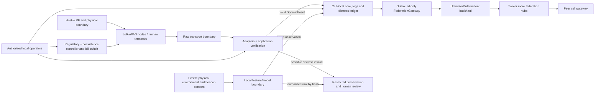

# OpenBREC RF threat model

## Executive summary

OpenBREC RF is currently a TRL 2–3 laboratory reference with supported core contracts, a contained `lab-sim`, deterministic replay and portable plus PostgreSQL disposition stores; it is not an operational or field runtime. Its planned addons combine private LoRa communications, acoustic/PIR/thermal beacons, human terminals, local processing and a multi-organization federation with intermittent backhaul. The highest risks are forged distress semantics, sensor spoofing or misleading automation, unauthorized raw capture, stolen endpoint keys, insecure development configuration, RF denial and over-trust in a federation hub or transport identity.

The design mitigates those risks with application-layer signatures and encryption, incident-scoped identity, append-only distress state, local autonomy, outbound-only federation gateways, hub key isolation, explicit RF operating profiles and replayable security gates. Possible distress is preserved even when invalid; it is marked `unverified_distress` and cannot become authenticated or `operator.accepted` without the required signed evidence.

There is no deployed field application to assess. M0 now provides executable laboratory evidence, including a worker that commits to PostgreSQL before acknowledging, but addon threat ratings still describe proposed architecture and conditional risk. Before field implementation, every high-risk path needs schemas, fixtures, negative tests, owners and evidence receipts. Implemented deltas and limits are reviewed in the dated M0 security reviews under `docs/security/`.

## Scope and assumptions

In scope:

- the planned LoRaWAN component plane and human LoRa P2P/mesh plane;
- Meshtastic, MeshCore, Reticulum/RNode and their local radio/IP/device adapters;
- transport-profile selection, multi-bearer failover, deduplication, anti-loop and carry bundles;
- application identity, protected human messages, SOS and distress handling;
- `IncidentFederation → OperationalArea → ResponseCell → Deployment → Site`;
- federation gateways, at least two hubs, intermittent backhaul and physical bundles;
- regulatory override, RF coexistence, commissioning, loss and rekey workflows;
- acoustic, PIR and low-resolution thermal beacon processing, controlled raw capture, review and operator projections;
- responder and deliverable-terminal UX for alerts, status, SOS and location;
- contracts, replay, evidence preservation and audit boundaries.

Out of scope:

- energy details not needed to explain radio, beacon or human trust boundaries;
- cloud services not selected by the design;
- flight control, offensive SDR, jamming, cellular emulation and Wi-Fi attack capabilities, which are prohibited by `AGENTS.md`;
- guarantees against a sufficiently capable wide-area RF jammer;
- legal interpretation of a particular incident or jurisdiction.

Assumptions:

- multiple organizations and potentially hostile or compromised peers may share an incident;
- a radio attacker can listen, replay, inject, congest and jam within physical range;
- endpoints can be lost, stolen, opened or temporarily controlled;
- a federation hub, backhaul endpoint or peer cell may be compromised;
- cells may lose time synchronization and all upstream connectivity for at least 24 hours;
- no central CA, OCSP, DNS, cloud service or hub is available on the local critical path;
- operators can make mistakes under time pressure, including break-glass activation;
- an attacker or uncontrolled environment can inject sound, heat, movement, vibration or misleading context near a beacon;
- cryptographic libraries and primitives are correctly implemented only after vector and misuse tests prove it;
- the repository has executable M0 contracts/services/replay plus P0 simulated
  energy and incident-scoped messaging/SOS controls; bearer-specific adapters,
  physical radio, beacon, federation and field controls remain unimplemented.

Repository evidence: `AGENTS.md`, `SECURITY.md`, `docker-compose.yml`,
`openbrec/replay.py`, `openbrec/disposition.py`,
`openbrec/postgres_disposition.py`, `openbrec/keyring.py`,
`openbrec/simulator.py`, `openbrec/messaging.py`, `apps/web/src/main.tsx`, both
versioned disposition migrations, the dated reviews under `docs/security/`, the
M0 key lifecycle SOP and the approved design specifications under
`docs/superpowers/specs/`.

Open questions before field implementation:

- which hardware profiles provide validated non-exportable key storage;
- exact maximum credential validity by role and storage level;
- which LoRaWAN network server and Meshtastic/MeshCore/Reticulum versions become P1 references for each profile;
- measured antenna isolation, filter needs and capacity bounds;
- responsible security, RF, privacy and incident-operation owners;
- jurisdiction-specific evidence and review cadence for each deployment.
- sensor reference profiles, operational detection thresholds and acceptable alert rates by environment;
- authorized raw-capture roles, review capacity and retention periods by incident profile.

## System model

### Primary components

- Radio nodes and terminals: sensors, component nodes, human terminals and relays exposed to physical capture and hostile RF.
- Beacon sensor boundary: microphones, PIR and low-resolution thermal arrays exposed to physical tampering, adversarial stimuli and environmental interference.
- Local feature/model pipeline: turns raw windows into typed observations and must abstain outside validated conditions.
- LoRaWAN network server: local machine-plane session and routing authority for a `ResponseCell`.
- Meshtastic, MeshCore, Reticulum/RNode or alternative bearer: untrusted transport selected per human/gateway profile.
- Transport policy controller: chooses authorized primary/fallback/carry bearers and must prevent loops and duplicate semantics.
- Raw transport boundary: contains protobufs, manufacturer IDs and transport metadata.
- MQTT brokers: a raw bridge broker/listener and a distinct core event bus are planned for addons; current Compose provides only the contained `lab-sim` core broker.
- Identity authority and trust store: cell-local incident root, actor-device bindings, cached revocations and policy.
- Distress ledger and evidence stores: append-only authenticated SOS state plus quarantined or sealed unverified material.
- Operator UX and review queue: derived alert projections, coverage, confidence, missing sensors and signed human annotations.
- Regulatory and coexistence controllers: local RF mode, authorization, expiry, scan, limits and kill switch.
- Federation gateway: outbound-only producer/consumer of approved federation events.
- Federation hubs: replicated coordination stores that know public bindings and federation sessions, not cell content or radio root keys.
- Core contract, replay and receipt services: validate `DomainEvent`, provenance, handling and deterministic reconstruction.

### Data flows and trust boundaries

1. A radio or terminal emits transport bytes into a physically hostile RF boundary.
2. A local adapter parses bytes inside `RawTransportBoundary`; transport identity is not trusted.
3. Transport policy validates that the bearer/profile is authorized; application signatures, AEAD, incident binding, TTL, sequence and authorization are verified before an authenticated `HumanMessage` reaches the core boundary.
4. Possible distress that fails validation crosses only into the restricted preservation boundary as `unverified_distress`.
5. Beacon raw windows cross into a local processing boundary; only typed observations reach the core, while authorized snippets/grids enter the restricted evidence vault by hash.
6. LoRaWAN observations cross through a separate adapter after session, counter and provenance checks.
7. Core events enter append-only local logs and derived state; plugins cannot write consolidated facts directly.
8. Derived alert projections cross a human decision boundary; an operator can annotate or assign work but cannot rewrite sensor history.
9. `FederationGateway` selects and minimizes allowed summaries, signs them and initiates an authenticated outbound connection.
10. Hubs replicate signed events across an untrusted or partially trusted backhaul. Receiving cells revalidate every event and may reject superior intent.
11. During partition, signed encrypted bundles may cross a physical custody boundary and reconcile by append-only union.
12. Operators cross privileged boundaries when enrolling peers, accepting SOS, authorizing raw capture, changing trust or enabling RF modes.

Current runtime and CI distinction: `scripts/validate_bundle.py` still performs only structural file/JSON/name checks and an offensive-term scan. Independent M0 jobs validate contracts, Compose, replay, privacy/security, simulation/UI and supply chain. In `lab-sim`, Mosquitto and PostgreSQL publish no host ports, the network is internal, and PostgreSQL/key material arrives through ephemeral file secrets. The worker semantically validates a `DomainEvent`, executes one PostgreSQL disposition transaction and only then emits an ephemeral durable-processing notification. The PWA alone binds to host loopback. MQTT remains anonymous inside the contained network. Key custody is an in-memory/secret-file laboratory profile: Python zeroization is best-effort, recovery wrapping key custody is external, and field storage remains `unverified`. These controls must not be treated as field controls.

### Diagram

## Assets and security objectives

| Asset | Security objective |
|---|---|
| Human life-safety signals | Preserve possible distress; authenticate provenance when possible; never create false operational acceptance. |
| Actor/device bindings and private keys | Prevent export, impersonation and unauthorized role elevation; support offline revocation and rekey. |
| Message and location content | Confidentiality, integrity, incident scoping, bounded disclosure and auditable life-safety exceptions. |
| Append-only event and receipt logs | Integrity, completeness, deterministic replay, conflict visibility and no silent overwrite. |
| RF availability and spectrum use | Prioritize SOS, bound airtime, stop harmful interference and preserve a local kill switch. |
| Local autonomy | Continue critical functions without parent, hub, Internet, DNS, online CA or quorum. |
| Federation summaries and topology | Authenticity, minimal disclosure, eventual reconciliation and resistance to a malicious hub. |
| Firmware, schemas and configuration | Version pinning, provenance, SBOM, signed release inputs and reproducible gates. |
| Raw transport identifiers and payloads | Containment, short retention, incident-scoped pseudonymization and no promotion to facts. |
| Beacon raw audio, thermal grids and placement | Local containment, encryption, authorized capture, review before disposition and no biometric derivation. |
| Sensor observations and model outputs | Provenance, uncertainty, abstention, adversarial/environmental testing and no automatic presence/absence claim. |
| Operator alert semantics | Separate urgency from confidence; prevent false confirmation, false absence and misleading SOS expectations. |
| Regulatory decisions | Explicit mode, evidence, actors, scope, expiry, stop conditions and non-claim of legality. |

## Attacker model

### Capabilities

- Passive RF monitoring and traffic analysis, including location correlation.
- Packet injection, replay, spoofing of transport fields, congestion and jamming.
- Possession of a Meshtastic channel key or default configuration.
- Manipulation of MeshCore paths/default credentials, Reticulum announces/interfaces or multi-bearer routing policy.
- Theft or temporary physical access to terminals, nodes, storage and removable media.
- Compromise of a peer cell, federation hub, backhaul endpoint or operator account.
- Submission of malformed, oversized, duplicated, delayed or conflicting payloads and bundles.
- Supply-chain compromise of firmware, adapter dependencies, images or generated contracts.
- Social engineering of operators during enrolment, SOS acceptance or break-glass RF activation.
- Clock disruption, brownout and rollback attempts against counters, nonces and revocation state.
- Acoustic, thermal, motion or placement manipulation intended to trigger, suppress or mislocalize a candidate.
- Attempts to activate, export or retain raw sensor material outside approved roles and scope.

### Non-capabilities

- Breaking correctly implemented Ed25519, X25519, HKDF-SHA-256 or AES-256-GCM directly.
- Extracting keys from hardware declared `supported` without defeating its validated physical protection.
- Forging a cell signature solely by compromising a hub that never receives cell private keys.
- Guaranteeing wide-area denial outside the attacker's available transmit power and physical reach.
- Compelling every isolated cell to accept a conflicting event when local verification and autonomy remain intact.

These non-capabilities are design assumptions to be challenged by implementation evidence, not current guarantees.

## Entry points and attack surfaces

- LoRaWAN RF frames, joins, frame counters and downlinks.
- LoRa mesh RF packets, paths, announces, relay behavior and version downgrade.
- BLE, USB/serial and TCP device control interfaces.
- Raw Meshtastic protobufs and MQTT bridge topics.
- Local MQTT listeners, credentials, ACLs and retained messages.
- QR/fingerprint enrolment and actor-device binding workflows.
- Operator UI actions for `operator.accepted`, revocation, rekey and RF override.
- Federation HTTPS batch/poll endpoints and mutual-TLS identity.
- Signed file bundles, removable media and chain of custody.
- Schema catalogs, fixtures, generated models, firmware and container supply chain.
- Local stores, backup/export, evidence vault and closure/deletion workflows.
- Antennas, RF connectors, shared power and co-site receivers.
- Microphones, PIR/thermal fields of view, placement records, calibration, baselines and physical controls.
- Model/configuration updates, thresholds, raw-capture authorization and review/disposition actions.
- Operator and deliverable-terminal wording, offline state, alerts and accessibility channels.

## Top abuse paths

1. An attacker with a known/default mesh channel key spoofs a sender and injects a fake SOS; a weak adapter trusts the transport `from` field and an operator sees it as authenticated.
2. A stolen terminal retains a valid incident binding and group key; the attacker reads traffic, impersonates a responder and receives new location messages before revocation propagates.
3. A team adapts the current development Compose profile for field use by adding a permissive MQTT listener but no field ACL/TLS policy; injection or observation becomes possible and placeholder credentials expose supporting data.
4. A stressed operator enables a broad RF override without bounded frequency, TTL or monitoring; transmission interferes with another rescue service and cannot be stopped remotely after partition.
5. A compromised federation hub changes topology, drops handoffs or claims a target accepted an SOS; cells that treat hub state as authority misroute rescue effort.
6. A malicious peer presents a convincing QR/fingerprint and receives excessive rights; it exfiltrates summaries or injects policy intent across cells.
7. Brownout rolls back a LoRaWAN frame counter or AEAD nonce state; replayed frames are accepted and message integrity or confidentiality degrades.
8. A compromised firmware or adapter release bypasses signature checks, leaks manufacturer IDs or converts invalid observations directly into evidence.
9. Encrypted traffic patterns and fine-grained location summaries expose victim, responder or site locations to a passive observer or over-privileged federation operator.
10. Two isolated cells assign the same resource or complete conflicting handoffs; last-write-wins reconciliation silently removes one safety-relevant history.
11. An attacker or ordinary rescue equipment emits sound, heat or movement crafted to look like a victim signal; naive fusion creates a high-confidence candidate and diverts resources.
12. A compromised operator account enables snippets or thermal-grid retention broadly, exports raw material and exposes victims, responders or private locations.
13. Alert copy, color or automation presents silence as absence or a candidate as confirmed; responders deprioritize a real search area or over-trust a false signal.
14. A multi-bearer gateway bridges raw floods or repeatedly fails over the same message; packets loop across adapters, exhaust airtime/energy and obscure whether a distress is one logical event or many.

## Threat model table

| ID | Threat scenario | Preconditions | Impact | Existing/planned controls | Evidence and owner gate | Residual risk | Priority |
|---|---|---|---|---|---|---|---|
| TM-001 | Forged or unauthenticated distress is treated as authentic or reaches `operator.accepted`. | Attacker can inject mesh packets or transport key is shared/default; adapter or UI trusts transport metadata. | False dispatch, resource diversion, missed real distress and loss of trust. | OpenBREC signature/AEAD, actor-device binding, append-only SOS prerequisites, separate `unverified_distress`, zero-false-acceptance gate. | Crypto vectors, forged/late/duplicate fixtures, derived-state replay; owners: security + operations. | Human verification can still make mistakes; preservation may increase review load. | High |
| TM-002 | Stolen endpoint exposes content or impersonates an actor. | Physical capture before detection; exportable software key or long-lived group membership. | Location/content disclosure, false messages and peer compromise. | Non-exportable keys where supported, short incident bindings, local revocation cache, group rekey, wipe SOP, `trust_stale` restrictions. | Hardware manifest, extraction/wipe test, disconnected theft drill; owners: device security + cell lead. | Past group traffic may remain readable; emergency hardware can be lower assurance. | High |
| TM-003 | Development MQTT/Compose is deployed as a field system. | Current placeholders are reused without field profile, ACL, TLS or secret replacement. | Remote/local injection, metadata disclosure and unauthorized control-plane access. | Separate raw/core brokers, local-only field listener, auth/ACL, no default secret, quotas, `retain=false`, deployment profile separation. | Compose field preflight, port scan, negative ACL test, secret scan; owners: platform + security. | Misconfiguration remains possible; the controls are not implemented now. | High |
| TM-004 | Congestion, jamming, near-far or an unsafe RF override denies rescue traffic or harms another service. | RF proximity, co-site radios, broad override or insufficient monitoring. | SOS loss, receiver desensitization, external interference and regulatory consequence. | Separate radios/antennas, airtime budgets, SOS priority, exact override scope/TTL, double auth or bounded break-glass, scan, stop condition and local kill switch; no offensive response. | Conducted/co-site tests, override drill and signed session receipt; owners: RF lead + incident commander. | A capable jammer can still deny service; assumed-risk operation can still interfere. | High |
| TM-005 | Compromised federation hub forges authority, suppresses events or gains cell secrets. | Hub or operator account compromised; cells over-trust hub data. | Misdirection, delayed handoff, privacy loss and cross-cell compromise. | Hub has no cell keys, verifies but cannot originate cell signatures, two hubs, outbound-only gateways, local autonomy, signed events and reconciliation. | Malicious-hub simulation, key inventory and failover drill; owners: federation + security. | Hub can delay/drop visible traffic and analyze permitted metadata. | High |
| TM-006 | Malicious or mistaken peer enrolment grants broad access or policy authority. | Social engineering, weak QR ceremony or unavailable organization root. | Data disclosure, malicious intent distribution and topology poisoning. | Human fingerprint comparison, `unverified_peer` minimum rights, local approval, scoped bindings, expiry, revocation and rejection of unsafe intent. | Peer-enrolment negative tests and role matrix; owners: identity + operations. | Human ceremony errors remain possible under stress. | High |
| TM-007 | Replay, rollback or nonce reuse causes duplicate actions or cryptographic failure. | Brownout, non-atomic persistence, clock loss or malicious old bundle. | Duplicate distress, false state, LoRaWAN replay or AEAD confidentiality/integrity loss. | Persistent boot/session/sequence, nonce uniqueness, LoRaWAN counters, TTL with clock uncertainty, idempotent event IDs and rollback alarms. | Brownout/fuzz/replay tests and deterministic receipts; owners: firmware + core. | Extreme storage failure can require emergency degraded handling. | Medium |
| TM-008 | Compromised firmware, adapter or schema supply chain bypasses boundaries. | Unpinned dependency, unsigned build, malicious generator or stale SBOM. | Key leakage, hidden TX, invalid facts and fleet-wide compromise. | Version pinning, SBOM, license and secret scans, signed artifacts, contract fixtures, adapter-only observations and reproducible builds where practical. | Provenance/SBOM gate and malicious-fixture test; owners: release + security. | Hardware vendor and compiler trust cannot be eliminated. | High |
| TM-009 | Traffic analysis or excess federation disclosure reveals sensitive locations and relationships. | Passive RF observer or authorized hub with broad summaries. | Targeting, victim privacy harm and operational exposure. | Incident HMAC IDs, encrypted content, summary minimization, explicit disclosure basis, retention/access logs and life-safety exception review. | Privacy fixtures, field log inspection and disclosure audit; owners: privacy + operations. | RF timing and topology metadata cannot be fully hidden. | Medium |
| TM-010 | Split-brain reconciliation silently overwrites handoff, topology or resource history. | Long partition, concurrent decisions and last-write-wins implementation. | Lost task ownership, duplicated deployment or missed response. | Append-only union, signed causal events, monotonic safety states, visible conflict events and authorized resolution. | 24-hour partition/50k-site replay with conflict assertions; owners: federation + core. | Human resolution may be slow and local views may temporarily diverge. | High |
| TM-011 | Adversarial or environmental sound, heat, motion or placement creates or suppresses a beacon candidate. | Physical/RF proximity, unmodeled environment, stale baseline or overconfident model/fusion. | Resource diversion, missed distress, false location and alert fatigue. | Typed observations, health/placement invalidation, deterministic baseline, OOD/abstention, non-independent fusion and mandatory human review. | Adversarial fixtures, 20+ background beacon-hours per environment and relocation drills; owners: sensing + search operations. | Real incidents exceed test coverage and multiple sensors may share one false cause. | High |
| TM-012 | Raw audio, thermal grids or fine placement data are captured, retained or exported without justified scope. | Compromised operator, broad role, weak retention worker or exposed vault. | Victim/responder privacy harm, surveillance, legal risk and loss of trust. | Features-only default, dual-role authorization, bounded break-glass, encryption, hash references, vault ACL, hold/review and deletion receipts. | Negative authorization/export tests and retention fault injection; owners: privacy + security. | Life-safety preservation intentionally retains some sensitive material longer. | High |
| TM-013 | UX or automation communicates a false presence, false absence or rescue guarantee. | Ambiguous copy, color-only state, hidden missing sensor, alert pressure or derived score treated as fact. | Unsafe prioritization, abandoned search area, false expectation and operational error. | Prohibited labels, separate priority/confidence, visible coverage/missing sensors, signed external confirmation and comprehension gates. | Contract copy scan and usability tests with responders/non-prepared users; owners: product safety + operations. | Stress, language and accessibility conditions can still produce misinterpretation. | High |
| TM-014 | Multi-bearer failover, raw bridging or downgrade creates loops, duplicate semantics or priority inversion. | Two or more adapters are active; policy trusts transport ACK/path, re-emits raw traffic or lacks stable message identity/TTL. | Airtime and battery exhaustion, SOS delay, duplicate dispatch and cross-bearer compromise. | `TransportProfile`, common signed message ID, per-path receipts, dedup, anti-loop, no raw bridge, authorized failover and SOS scheduling before interfaces. | Meshtastic/MeshCore/Reticulum+carry replay with partition, flood, path churn and malicious adapter; owners: communications + core security. | Independent bearers can fail together through shared spectrum, power, hardware or policy. | High |

## Criticality calibration

No current vulnerability is rated Critical because the repository does not contain an operational radio, beacon, identity, federation, SOS or human-terminal runtime. A future finding becomes Critical when a plausible path can create a false authenticated `operator.accepted`, systematically suppress or falsely confirm life-safety candidates, expose incident-wide keys across many cells, disable local kill switches, or cause broad harmful transmission with no effective containment.

High means a plausible compromise can misroute rescue activity, expose a cell, deny critical communication, cross an important trust boundary or create unsafe RF behavior. Medium means meaningful harm requires additional position, timing, physical access or human error and is substantially contained to metadata, temporary inconsistency or one degraded component. Low is reserved for limited issues with no credible life-safety, trust-boundary or sensitive-data consequence.

Ratings must be recalibrated when runtime, deployment topology and hardware evidence exist. Current placeholder configuration is not evidence of a remotely reachable production exposure; TM-003 is conditional on field reuse.

## Focus paths for security review

1. `protected-human-message` canonicalization, AEAD associated data, nonce persistence and signature verification.
2. Derivation of SOS state and the absolute prevention of false `operator.accepted`.
3. Preservation boundary for `unverified_distress`, including access, retention and no silent loss.
4. Cell incident-root lifecycle, QR/fingerprint enrolment, loss, revocation, rekey and stale-trust behavior.
5. Raw Meshtastic/MeshCore/Reticulum/MQTT containment and proof that transport IDs, paths, announces or ACKs cannot become identity or facts.
6. Field Compose/network exposure, secret handling, broker separation and negative ACL tests.
7. LoRaWAN OTAA key custody, DevNonce/JoinNonce/frame-counter durability and brownout recovery.
8. Federation event minimization, outbound-only gateway, malicious-hub behavior and cross-cell authorization.
9. Append-only partition reconciliation and signed handoff/resource conflict semantics at 50,000-site scale.
10. Regulatory override state machine, break-glass TTL, persistent alerts, harmful-interference stop and local kill switch.
11. Firmware/schema/container provenance, SBOM, version pinning and adapter boundary enforcement.
12. Co-site radio measurements, airtime budgets, SOS capacity and detected-jamming degradation without offensive response.
13. Beacon raw boundary, capture authorization, vault access, review hold and deletion receipts.
14. Sensor spoofing, placement invalidation, OOD/abstention and proof that fusion cannot emit presence or absence.
15. Operator/terminal copy, priority-confidence separation, missing coverage, SOS semantics and accessibility under offline field conditions.
16. Transport-profile selection, multi-bearer dedup/anti-loop, downgrade behavior, SOS priority before interfaces and failure-domain independence.
