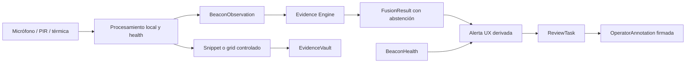

# Beacons, terminales humanos, privacidad y UX de OpenBREC RF

- Estado: diseño derivado de decisiones aprobadas; documento pendiente de revisión
- Fecha: 2026-07-17
- Especificación padre: `2026-07-16-offgrid-energy-lora-beacons-design.md`
- Dependencias: contratos/replay, radio/seguridad/regulación y energía
- Alcance: acústica, PIR, térmica, cadena de evidencia, revisión, terminales, privacidad, accesibilidad y validación humana
- Fuera de alcance: implementación visual, selección final de sensores, vigilancia continua, identificación biométrica y control de rescate

## 1. Propósito y condición de avance

Esta especificación define cómo un `BeaconNode` obtiene señales remotas y cómo esas señales llegan a una persona sin transformarse en certezas falsas. Separa explícitamente:

```text
señal del sensor
  → BeaconObservation
  → Evidence
  → FusionResult
  → proyección de alerta
  → revisión y OperatorAnnotation
```

La interfaz nunca convierte silencio, pérdida de sensor o falta de cobertura en “zona vacía”. Una detección tampoco equivale a persona, identidad, condición médica ni rescate confirmado.

Un beacon puede tener una sola modalidad. La referencia P1 usa tres unidades tri-modales —acústica, PIR y matriz térmica de baja resolución— para probar solapamiento, pérdida de nodo y corroboración. Tres beacons no habilitan por sí solos triangulación; ésta exige geometría, sincronización y calibración específicas.

Este documento no autoriza implementación, captura operacional de audio ni compra de sensores. Su aprobación cierra las cuatro especificaciones hijas y habilita construir la matriz de decisión; el plan conjunto sigue condicionado por M0 ejecutable.

## 2. Autoridad y precedencia

La autoridad será:

1. `AGENTS.md` para safety, privacidad, abstención y red lines.
2. ADR-0001 aceptado para precedencia y límites del core.
3. Esta especificación para beacons, terminales y UX.
4. Contratos/replay para `Observation → Evidence → FusionResult`, preservación y receipts.
5. Radio/seguridad para mensajería, SOS, identidad y federación.
6. Energía para prioridad, shedding y brownout.
7. JSON Schemas aceptados para forma de datos.
8. `DELIVERY_BOARD.md` para secuencia y estado.

Una pantalla, modelo, adapter o driver no puede promover semántica que los contratos prohíben. La UI es una proyección, no una fuente de verdad.

## 3. Decisiones aprobadas

1. `BeaconNode` es un rol lógico: sensor, relay o ambos.
2. Un sensor validado es el mínimo; tres modalidades forman la referencia.
3. Acústica, PIR y térmica producen observaciones separadas.
4. La fusión puede correlacionarlas, pero no asume independencia estadística.
5. El modo acústico normal procesa continuamente en local y emite features; no graba ni transmite audio continuo.
6. Los snippets activados son experimentales, breves, cifrados, autorizados y revisables.
7. Voiceprint, identidad, emoción, edad, género, idioma y diagnóstico están prohibidos.
8. PIR no prueba ocupación y no detecta de forma fiable una persona inmóvil.
9. Térmica de referencia no produce imagen identificable ni temperatura médica.
10. Silencio, sensor ausente o nodo perdido sólo incrementan incertidumbre o producen `unknown`.
11. Prioridad operacional y confianza se muestran como dimensiones distintas.
12. Una alerta nunca ordena automáticamente despliegue o rescate.
13. Todo material capturado con posible valor vital se conserva para revisión; no hay pérdida silenciosa.
14. La vida precede a privacidad durante un perfil BREC declarado, sin eliminar acceso, cifrado, auditoría, cierre y borrado controlado.
15. El terminal entregable se valida; una red para dispositivos civiles propios queda documentada como red separada no validada inicialmente.

## 4. Objetivos y no objetivos

### 4.1 Objetivos

- Escuchar y clasificar indicios remotos dentro de bandas y entornos declarados.
- Incorporar movimiento y calor sin exigir los tres sensores.
- Mostrar fuente, tiempo, zona, precisión, confianza, cobertura, limitaciones y sensores ausentes.
- Dar al operador una cola offline, mapa/zonas, timeline de evidencia y estado de dispositivos.
- Ofrecer a una persona no preparada SOS, estado, texto breve y ubicación con semántica comprensible.
- Preservar evidencia potencialmente vital y permitir revisión, apelación y corrección.
- Reproducir decisiones desde fixtures y logs.
- Reutilizar hardware compatible mediante capability manifests y adapters.

### 4.2 No objetivos

- Escucha remota continua por humanos.
- Vigilancia ambiental general o grabación indiscriminada.
- Reconocimiento de voz, rostro, individuo o atributo sensible.
- Diagnóstico de vida, muerte, salud o temperatura corporal.
- Contar personas con PIR o térmica de baja resolución.
- Afirmar ausencia por no detectar eventos.
- Afirmar ubicación métrica sin geometría y calibración.
- Sustituir búsqueda técnica, canina, física o decisión de mando USAR.
- Usar color, sonido, vibración o mapa como único canal de información crítica.
- Permitir que un `HumanMessage` escriba observaciones o hechos.

## 5. Personas y contextos de uso

### 5.1 Operador de búsqueda

Usa tablet/teléfono o puesto local para revisar candidatos, comparar sensores, asignar investigación, registrar contexto y efectuar handoff. Necesita operar con ruido, guantes, sol, red intermitente y alta carga cognitiva.

### 5.2 Rescatista de campo

Recibe tareas y alertas mínimas, reporta verificación física y consulta ubicación/incertidumbre. No debe interpretar un score sin explicación.

### 5.3 Persona no preparada con terminal entregable

Necesita tres acciones primarias: SOS, comunicar estado y enviar mensaje breve/ubicación. No debe conocer topología, criptografía ni estados de transporte técnicos.

### 5.4 Técnico de beacon

Instala, calibra y mantiene nodos. Su vista separa salud, cobertura, energía, reloj y configuración de cualquier indicio de presencia.

## 6. Arquitectura lógica



La proyección de alerta se puede regenerar. Sólo eventos core, evidencia, resultados de fusión y anotaciones firmadas forman el log canónico.

## 7. Beacon, topología y placement

### 7.1 Capability mínima

Un beacon es válido con una modalidad `supported` o `experimental`, almacenamiento local, reloj/incertidumbre, energía, health y enlace store-and-forward. Modalidades ausentes se declaran, no se simulan.

La referencia tri-modal incluye:

- acústica con procesamiento local;
- PIR para cambio de radiación infrarroja/movimiento;
- matriz térmica de baja resolución;
- IMU opcional para detectar movimiento del propio nodo;
- relay LoRa opcional, con failure domain y prioridad separados.

### 7.2 Modalidades futuras

Vibración/sísmica, CO2, calidad de aire, UWB, mmWave, cámara u otros sensores se registran como subtipos independientes con threat/privacy review propio. No se agregan campos libres al contrato ni se heredan claims de presencia. Una modalidad que requiere mayor ancho de banda usa almacenamiento local o un transport addon; su ausencia no degrada el core.

### 7.3 Placement record

Cada instalación registra:

- zone, posición y precisión;
- altura, orientación, inclinación y mounting;
- campo de visión y zonas ocluidas;
- superficie, estructura y estabilidad;
- windscreen, enclosure y aperturas;
- fuentes conocidas de ruido, calor, movimiento y radio;
- equipos/rescatistas activos en la zona;
- baseline, timestamp, actor y fotos no sensibles cuando correspondan.

Una relocalización invalida geometría y baseline anteriores hasta nuevo commissioning.

### 7.4 Dirección y localización

Un único beacon reporta zona/cobertura. Dirección, rango o triangulación permanecen `unavailable` salvo que el perfil demuestre array, separación, clock uncertainty, geometría y error por entorno. Tres nodos sin esa evidencia siguen siendo tres observadores, no un localizador.

## 8. Contratos addon

```text
schemas/addons/beacon/1.0.0/
  beacon-capability.schema.json
  beacon-placement.schema.json
  beacon-health.schema.json
  beacon-observation.schema.json
  acoustic-observation.schema.json
  pir-observation.schema.json
  thermal-observation.schema.json
  capture-authorization-event.schema.json
  review-task-event.schema.json
  terminal-capability.schema.json
  terminal-interaction-event.schema.json
  usability-test-receipt.schema.json
  beacon-test-receipt.schema.json
```

`beacon-observation` es una unión discriminada de subtipos de `Observation`. No crea una cadena paralela. Usa envelope, provenance, handling, idempotencia, canonicalización y replay del core.

### 8.1 Campos comunes

- `sensor_type`, capability/schema/model refs;
- ventana `started_at`/`ended_at` y clock uncertainty;
- zone, coverage geometry y precisión;
- calidad, uncertainty y razones de degradación;
- calibración, baseline y placement refs;
- `candidate_labels` con score, threshold y `unknown`;
- limitaciones, interferencias y sensores/capacidades ausentes;
- processing mode y handling policy;
- referencias a material preservado, nunca bytes crudos inline.

`candidate_labels` describe salida de sensor/modelo. No admite `person_present`, `person_absent`, identidad ni diagnóstico.

## 9. Acústica y escucha activa

“Escucha activa” significa procesamiento local continuo dentro del perfil, no que un operador escuche un stream.

Modos:

- `disabled`;
- `features_only`, referencia P1;
- `triggered_snippet`, experimental;
- `live_stream`, `unavailable` en P0/P1 y prohibido en perfiles operativos iniciales.

### 9.1 `features_only`

El buffer es volátil, mínimo para ventanas de cálculo y se sobreescribe. Se emiten:

- sample rate, canales y bandas analizadas;
- noise floor, SNR, clipping y self-noise;
- energía/bandas, duración, periodicidad y features versionadas;
- dirección/uncertainty sólo si el array está calibrado;
- labels como `human_compatible_vocalization_candidate`, `animal_compatible_vocalization_candidate`, `impact_candidate`, `repetitive_signal_candidate` o `unknown`;
- modelo/regla, threshold, dataset/model card y OOD/abstention.

No se transmite waveform ni texto inferido. No se ejecuta speech-to-text.

### 9.2 `triggered_snippet`

P1 experimental limita cada snippet a 15 segundos —hasta 5 segundos previos y 10 posteriores—, cifrado local y sin transmisión automática. La activación normal requiere autorización firmada de `search_lead` y `privacy_safety_reviewer`, con alcance, bandas, zonas, razón y expiración.

Break-glass permite un actor autorizado, razón obligatoria y TTL máximo inicial de 30 minutos. Cada renovación es explícita. La captura se señaliza localmente cuando sea seguro y no comprometa búsqueda o víctima.

Un snippet con posible valor vital se registra en `EvidenceVault`, se enlaza por hash y entra a review. Antes de vencer, un elemento no revisado o vinculado a un caso activo pasa a hold; nunca se borra silenciosamente. La reproducción, exportación y divulgación se auditan.

### 9.3 Prohibiciones

- voiceprint o comparación biométrica;
- identificación, emoción, salud, edad, género o idioma;
- keyword surveillance general;
- activación permanente o por comodidad;
- reproducción fuera de roles y contexto autorizados;
- datasets de personas/víctimas sin base, consentimiento/protección y revisión aplicables.

## 10. PIR y movimiento

PIR produce eventos de cambio/movimiento dentro de su campo de visión. Registra trigger, duración, sensibilidad, refractory interval, masking, temperatura/condiciones declaradas, placement y self-test.

No produce ocupación, conteo, identidad, dirección precisa ni “persona inmóvil ausente”. Un trigger puede deberse a rescatistas, animales, calor móvil, vibración del nodo o ambiente. La falta de trigger sólo significa `no_event_detected` en la ventana/cobertura declarada.

IMU o sensor sísmico futuro usa otro subtipo y no se mezcla con PIR. Un beacon movido invalida baseline y genera health/placement event antes de nuevas inferencias.

## 11. Térmica

La referencia usa una matriz de baja resolución con campo de visión y error medidos. El modo normal transmite features:

- resolución y frame rate;
- min/max/percentiles y temperatura ambiental disponible;
- differential temperature con incertidumbre;
- clusters, centroides normalizados, tamaño y persistencia;
- clipping, píxeles defectuosos, oclusión y calidad;
- `heat_source_candidate`, `moving_heat_candidate`, `fire_hazard_candidate` o `unknown`.

No rotula “cuerpo”, no mide fiebre y no genera imagen identificable. Upscaling, reconstrucción facial o asociación biométrica están prohibidos.

La retención de grid crudo es `experimental`, local, cifrada y bajo handling policy. Se usa para replay/calibración o evidencia autorizada; la federación recibe sólo resumen. Una fuente caliente puede ser equipo, fuego, sol, tubería, animal o persona y exige contexto/fusión.

## 12. Health, baseline y calibración

`BeaconHealth` se mantiene separado de observaciones e incluye:

- sensor presente/ausente y estado;
- energía, temperatura interna y almacenamiento;
- clock source/uncertainty y sync;
- calibración vigente/vencida;
- baseline age y environment class;
- clipping, ruido, oclusión, píxeles defectuosos y PIR masking;
- relay/backhaul, queue depth y pérdida;
- firmware/model/config hashes;
- última prueba y acción requerida.

Preflight captura un baseline sin estímulos objetivo y otro con estímulos controlados. Generador, herramientas, radio, viento, lluvia, pasos y movimiento de equipos se etiquetan como interferencias del escenario.

Un sensor `degraded` puede seguir publicando observaciones con limitaciones. `fault`, `offline`, baseline vencido o incertidumbre fuera de perfil impiden elevar confianza y fuerzan `unknown` cuando corresponda.

## 13. Evidencia y fusión

Reglas iniciales determinísticas correlacionan por ventana, zona, coverage y provenance. No multiplican scores suponiendo independencia entre sensores co-localizados o afectados por el mismo ruido.

Outputs permitidos para UX:

- `single_modality_candidate`;
- `corroborated_candidate`;
- `sensor_artifact_likely`;
- `insufficient_coverage`;
- `unknown`.

`corroborated_candidate` sigue siendo un indicio. “Confirmado” sólo aparece por una `OperatorAnnotation` firmada que referencia verificación humana/física externa; nunca lo emite el modelo.

Cada `FusionResult` incluye fuentes, sensores ausentes, calidad, limitaciones, explicación, zona, precisión y confianza. Si una modalidad desaparece, el sistema recalcula incertidumbre o se abstiene; no conserva el score anterior como si siguiera disponible.

## 14. Modelo de revisión

`ReviewTaskEvent` usa estados append-only:

- `review.created`;
- `review.triaged`;
- `review.assigned`;
- `review.investigating`;
- `review.corroborated_candidate`;
- `review.closed_sensor_artifact`;
- `review.closed_external_resolution`;
- `review.reopened`;
- `review.handed_off`.

Cerrar como artifact exige actor, razón, fuentes revisadas y evidencia causal. No borra observaciones ni significa ausencia de víctima. Nueva evidencia puede reabrir.

La asignación de recursos ocurre fuera del motor de fusión y requiere actor autorizado. La alerta puede sugerir “revisar zona” o “comparar sensores”, no ordenar ingreso, perforación, remoción ni rescate.

## 15. UX del operador

La información se organiza en cuatro vistas offline:

1. Cola de candidatos y distress.
2. Mapa/zonas con coverage y precisión.
3. Detalle con timeline de observaciones, evidencia, anotaciones y cambios.
4. Salud/placement de beacons y capacidades ausentes.

### 15.1 Tarjeta de alerta

Orden obligatorio:

- prioridad operacional;
- rótulo semántico, por ejemplo “Indicio acústico no verificado”;
- zona y precisión;
- antigüedad y duración;
- confianza con explicación;
- fuentes presentes y ausentes;
- interferencias/limitaciones;
- estado de revisión y responsable;
- próxima acción segura sugerida.

Prioridad y confianza nunca comparten un único color o score. Un indicio incierto puede tener prioridad alta por riesgo vital. Una señal de alta confianza puede tener baja urgencia si es conocida/no accionable.

### 15.2 Lenguaje prohibido y permitido

Prohibido:

- “Persona detectada” por sensor;
- “Zona limpia/vacía”;
- “Sin víctimas”;
- “Rescate en camino”;
- “Ubicación exacta” sin error demostrado.

Permitido:

- “Indicio acústico no verificado”;
- “Dos modalidades compatibles en esta ventana”;
- “Sin eventos observados; no implica ausencia”;
- “Cobertura insuficiente”;
- “Gestión aceptada; no garantiza arribo”.

### 15.3 Alert fatigue

Deduplicación agrupa eventos por ventana/causa sin ocultar fuentes. Rate limits reducen notificaciones, no eliminan eventos. Distress, nuevos sensores corroborantes y degradación crítica pueden romper agrupación. El operador puede ajustar presentación, no thresholds del modelo sin política versionada.

## 16. Terminal entregable

La pantalla principal ofrece:

- botón SOS grande y opción física cuando el hardware lo permita;
- estado predefinido: `estoy_aqui`, `necesito_asistencia`, `me_muevo`, `no_puedo_moverme`;
- texto breve o frases localizadas;
- ubicación con precisión y edad visibles;
- batería y conectividad separadas.

Estados visibles:

- `SOS EN COLA — todavía en este dispositivo`;
- `TRANSMITIDO — sin confirmación de destino`;
- `RECIBIDO POR PUESTO`;
- `VISTO POR OPERADOR`;
- `GESTIÓN ACEPTADA — no garantiza arribo`;
- `EXPIRADO/FALLIDO — reintentar o usar alternativa`.

Cancelar SOS requiere acción deliberada y confirmación; no elimina el historial. Reintentos mantienen el mismo message ID/idempotencia. La pérdida de enlace conserva la cola y muestra qué sigue local.

No se exige login online, cloud, email, número telefónico ni lectura técnica. El enrolamiento y claves siguen la especificación de radio.

## 17. Red civil separada

Se documenta una red opcional para personas con dispositivos compatibles propios. No se valida en P1 inicial y no comparte claves, canal, gateway abierto ni trust policy con la red operativa.

Su gateway sólo puede intercambiar tipos allowlisted —principalmente distress, estado y ubicación— a través del boundary de mensajería. Un mensaje no autenticado con posible distress se preserva como `unverified_distress`; no escribe observaciones ni facts.

## 18. Privacidad, preservación y retención

Perfiles:

- `privacy_minimized`: features locales, sin snippets/grids crudos, IDs efímeros y resumen mínimo.
- `life_safety_preservation`: captura excepcional y preservación ampliada por riesgo vital.

Principios:

- no recolectar raw data que no se necesita;
- una vez capturado material autorizado, no perderlo antes de review;
- cifrar localmente y limitar roles, destino y exportación;
- `retention_until`, `review_by` y basis obligatorios;
- un elemento no revisado o asociado a caso activo pasa a hold antes de expirar;
- review/cierre producen disposición explícita: preservar, restringir, exportar o borrar;
- el borrado produce receipt; el log de decisiones permanece sin contenido crudo;
- ubicación de víctima, rescatista, beacon y combustible se trata como sensible;
- federación recibe resumen, no audio, grid térmico ni historial fino por defecto.

El perfil BREC prioriza vida sobre privacidad cuando existe tensión real, pero no convierte todos los datos en públicos ni justifica retención indefinida.

## 19. Accesibilidad y entorno físico

La PWA apunta a WCAG 2.2 AA donde aplique y añade requisitos de campo:

- contraste y legibilidad bajo sol/modo nocturno;
- objetivos táctiles grandes, separación y operación con guantes;
- texto, icono y patrón además de color;
- visual, haptic y audio configurables, nunca un único canal;
- status messages expuestos a tecnologías asistivas;
- foco, teclado/switch y screen reader;
- idioma configurable y frases cortas;
- zoom y tamaño de texto sin pérdida de acción crítica;
- no depender de drag, precisión fina o timeout breve;
- confirmación diferenciada para SOS/cancelación;
- modo silencioso que conserva visual/haptic cuando la operación lo requiera.

Vibración y sonido se pueden desactivar por safety/entorno. La UI sigue comunicando estado por al menos otro canal.

## 20. Integración con radio, energía y federación

- SOS y mensajes humanos tienen prioridad sobre telemetría beacon.
- En `CONSERVE`, se reduce frecuencia no crítica; en `CRITICAL`, sensing se limita; en `SURVIVAL`, relay/distress puede desplazar sensing.
- Todo gap de sensing genera health/coverage, no silencio semántico.
- Store-and-forward conserva observaciones dentro de capacidad y TTL.
- Audio/grid autorizado no se fuerza sobre LoRa: se recupera localmente, por USB, Ethernet/Wi-Fi táctico u otro transport addon de mayor ancho de banda con su propio gate.
- La federación intercambia `candidate_summary`, coverage, health agregado, review state y solicitudes; no raw sensor data por defecto.
- Un hub no confirma presencia, cierra review ni activa captura cruda.
- Una celda aislada conserva sensores, review, modelos, mapas y políticas localmente.

## 21. Gobernanza de modelos y reglas

Cada modelo o regla declara:

- versión/hash y runtime;
- clases, `unknown`, OOD y abstención;
- training/evaluation datasets con licencia y provenance;
- model/dataset card;
- entornos, hardware y placement validados;
- thresholds pre-registrados;
- sensibilidad, precision, false alerts por beacon-hour, abstention y latencia;
- slices por ruido, clima, temperatura, estructura y distancia;
- limitaciones, resultados negativos y owner;
- rollback y kill switch del modelo.

Un cambio de threshold es una nueva configuración versionada y repite replay/evaluación. ML nunca es requisito: reglas determinísticas y features simples deben ofrecer un baseline.

No se entrena automáticamente con incident data. Cualquier uso posterior exige dataset curado, autorización, de-identification, revisión ética/privacidad y trazabilidad.

## 22. P0 simulado

Fixtures mínimos:

- señal objetivo, ruido, silencio, clipping y sensor ausente;
- vocalización humana compatible, animal compatible, golpes, herramientas, radio, viento y generador;
- PIR trigger, persona/objeto inmóvil, nodo movido y masking;
- fuentes térmicas humanas simuladas, animales simulados, sol, fuego/equipo caliente y oclusión;
- modalidades coincidentes y contradictorias;
- reloj incierto, placement vencido y baseline inválido;
- duplicados, eventos tardíos, pérdida de relay y brownout;
- snippet autorizado, no autorizado, expirado y break-glass;
- material sin review próximo a expirar;
- review cerrado/reabierto y handoff;
- UI offline y SOS en cada estado.

Pass absoluto:

- cero outputs automáticos de presencia confirmada o ausencia;
- cero promoción de raw/transport bytes a facts;
- todo sensor ausente aparece en resultado/proyección;
- toda captura controlada tiene autorización, hash, cifrado, retención y audit;
- material no revisado no se borra;
- replay reproduce observaciones, fusión, review y receipts.

## 23. P1 de banco controlado

### 23.1 Topología

- una unidad demuestra capability mínima y funcionamiento aislado;
- tres beacons tri-modales forman la referencia;
- una unidad pierde relay y otra se mueve durante la campaña;
- fixtures reales/sintéticos se capturan para replay;
- no se afirma triangulación salvo perfil separado aprobado.

### 23.2 Campaña sensorial

Por cada environment class:

- al menos 100 trials positivos por target class declarada y modalidad;
- al menos 20 beacon-hours de background negativo representativo;
- distancias, oclusiones, orientación y nivel de señal pre-registrados;
- interferencias de herramientas, voces de rescatistas, radio, viento, lluvia simulada, generador y movimiento del nodo;
- test subjects consentidos o simuladores calibrados; no víctimas reales;
- thresholds fijados antes de abrir el conjunto de evaluación.

Se reportan confusion matrix, sensitivity, precision, false alerts/beacon-hour, abstention, OOD, p50/p95/p99 latency e intervalo de confianza. No se ocultan clases omitidas ni resultados negativos.

P1 puede calificar un perfil `experimental`. Pasar a `supported` requiere thresholds de sensibilidad/alert fatigue aprobados por responsables BREC para cada environment class; esta especificación no inventa un porcentaje universal antes de evidencia.

### 23.3 Gates absolutos

- cero alertas rotuladas como confirmación automática;
- cero inferencias de ausencia;
- 100% de degradaciones/gaps visibles;
- cero snippets fuera de autorización/cap;
- 100% de material capturado trazable a review/disposición;
- health y evidence no se mezclan;
- relay loss no elimina sensing local ni log;
- cada perfil declara falsos positivos y falsos negativos completos.

## 24. P2 de entrenamiento de campo

Se usa sitio de entrenamiento controlado, actores consentidos y mando USAR. Cinco corridas reproducibles incluyen:

- tres beacons en zonas conocidas;
- rubble/occlusion representativos y cambios de placement;
- equipo de rescate trabajando, pausas de escucha y hailing definidos;
- candidatos single/corroborated/unknown/artifact;
- partición de red, pérdida de un beacon y brownout;
- review local, assignment, handoff y reconciliación;
- snippets sólo en runs autorizados;
- terminales entregables offline.

El resultado no se presenta como validación en víctimas reales. Cada claim queda limitado al sitio, sensores, sujetos/simuladores, clima, ruido, geometría y procedimiento.

## 25. Validación humana y UX

Participantes mínimos:

- 8 rescatistas/operadores representativos;
- 8 personas no preparadas para el terminal entregable;
- diversidad de visión, audición, movilidad, idioma/alfabetización y experiencia dentro de lo factible;
- consentimiento y protección de human subjects.

Tareas críticas:

- distinguir prioridad de confianza;
- explicar por qué silencio no significa ausencia;
- identificar sensor ausente/coverage insuficiente;
- revisar, asignar, cerrar como artifact y reabrir;
- interpretar cada estado SOS sin asumir rescate garantizado;
- emitir/cancelar SOS, estado y ubicación offline;
- operar con guantes, sol, ruido y pérdida de red.

Aceptación:

- 100% comprende las dos red lines: no ausencia y `accepted` no garantiza arribo después del briefing;
- al menos 90% completa cada flujo crítico sin ayuda;
- cero SOS o cancelaciones accidentales en el guion;
- ninguna acción crítica depende sólo de color/audio/haptic;
- WCAG 2.2 AA aplicable pasa checks automáticos y manuales;
- todos los errores/comprensiones incorrectas se conservan como evidencia para rediseño.

El tamaño no demuestra generalización poblacional; es un gate inicial de seguridad y usabilidad.

## 26. Hazard register mínimo

| ID | Hazard | Control | Stop condition | Evidencia |
|---|---|---|---|---|
| BX-001 | Falso indicio desvía recursos | Labels no confirmatorios, thresholds, review y contexto | Tasa fuera del perfil o misinterpretación crítica | Campaña y usability receipt |
| BX-002 | Falso negativo se interpreta como zona vacía | Sin clases de ausencia, coverage/missing visibles | Cualquier output/UX de ausencia | Contract/UX scan y tests |
| BX-003 | Audio invade privacidad o expone víctima | Features-only, autorización, cifrado, roles y retención | Captura/reproducción no autorizada | Access logs y preservation receipts |
| BX-004 | Sensor spoofing por sonido/calor/movimiento | Fusión, provenance, health, contexto y OOD | Patrón adversarial no contenido | Adversarial fixtures y field drill |
| BX-005 | Alert fatigue oculta distress real | Agrupación, prioridad separada, budgets y medición | Alert rate supera threshold | Beacon-hours y operator test |
| BX-006 | Placement/calibración falsa precisión | Placement record, invalidación y uncertainty | Nodo movido/baseline vencido | Relocation replay |
| BX-007 | Estado SOS crea falsa expectativa | Semántica append-only y copy explícito | Usuario asume rescate garantizado | Comprehension test |
| BX-008 | Raw data se pierde antes de review | Vault, hold, ledger y deletion receipt | Expiry sin disposición | Retention fault injection |
| BX-009 | Modelo deriva atributos/identidad | Schema y pipeline prohibitivos, review de outputs | Aparición de atributo prohibido | Model/output scan |
| BX-010 | Beacon relay desplaza sensing sin informar | Prioridad y health/coverage events | Gap no registrado | Energy/radio degradation test |

## 27. SOPs y artefactos

Antes de campo:

- commissioning, placement, baseline y calibración;
- pausas de escucha/hailing y coordinación con mando USAR;
- interferencias conocidas y etiquetado de actividad de rescatistas;
- capture authorization, break-glass y review de snippets;
- privacidad, acceso, exportación, hold, cierre y borrado;
- health, relocalización, pérdida de nodo y recuperación;
- revisión, assignment, handoff, artifact y reopen;
- terminal entregable, SOS accidental, cancelación y pérdida;
- accesibilidad, idiomas y operación con guantes/ruido;
- model rollback, threshold change y resultados negativos.

Artefactos:

- schemas, fixtures y modelos generados;
- reference schematic/BOM/enclosure y reusable adapters;
- capability/placement/calibration manifests;
- model/dataset cards y evaluation sets;
- raw traces autorizadas, hashes y receipts;
- confusion matrices, alert rates y latencias;
- usability scripts, resultados y observaciones;
- privacy/safety review y hazard register firmado.

## 28. Riesgos residuales

- Rubble, viento, fuego, maquinaria y rescatistas pueden dominar sensores.
- Una persona inmóvil o silenciosa puede no generar indicios.
- Animales, tuberías, motores o sol pueden parecer señales de interés.
- Corroboración co-localizada puede compartir la misma causa falsa.
- Modelos pueden degradarse fuera de dataset/entorno.
- Audio y ubicación pueden exponer personas aun cifrados.
- Alert fatigue y presión temporal pueden causar error humano.
- Hardware de bajo costo puede variar entre lotes.
- Una UI accesible en laboratorio puede fallar bajo estrés real.

## 29. Fuentes primarias

- INSARAG Guidelines 2020: https://insarag.org/methodology/insarag-guidelines/
- INSARAG Volume II, Manual A, capacidades de búsqueda técnica: https://insarag.org/wp-content/uploads/2021/09/INSARAG20Guidelines20Vol20II2C20Man20A.pdf
- FEMA, US&R Task Force resource typing: https://rtlt.preptoolkit.fema.gov/Public/Resource/ViewFile/8-508-1262?p=19&type=Pdf
- ICRC, Handbook on Data Protection in Humanitarian Action: https://www.icrc.org/en/data-protection-humanitarian-action-handbook
- W3C, WCAG 2.2: https://www.w3.org/TR/WCAG22/
- NIST, AI Risk Management Framework 1.0: https://www.nist.gov/publications/artificial-intelligence-risk-management-framework-ai-rmf-10

Estas fuentes orientan coordinación, protección, accesibilidad y evaluación; no certifican el beacon ni sustituyen procedimientos del equipo USAR.

## 30. Gate posterior

Con esta especificación aprobada quedan cerradas las cuatro hijas. El siguiente trabajo es construir la matriz de decisión solicitada —valor BREC, evidencia, alternativa desacoplada, hardware, energía, privacidad, safety, regulación, esfuerzo y aceptación— y ordenar P0/P1/P2 contra M0. No se implementa ninguna capacidad antes de esa revisión conjunta.
