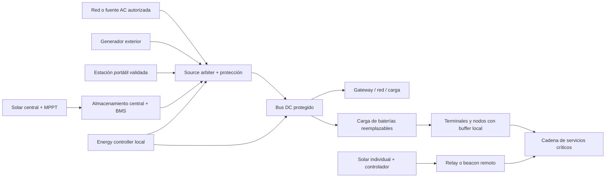

# Energía híbrida, reserva y operación prolongada de OpenBREC RF

- Estado: diseño derivado de decisiones aprobadas; documento pendiente de revisión
- Fecha: 2026-07-17
- Especificación padre: `2026-07-16-offgrid-energy-lora-beacons-design.md`
- Dependencias: contratos/replay y radio/seguridad/regulación aprobados
- Alcance: dominios de energía, cargas, almacenamiento, solar, fuentes auxiliares, degradación, brownout y validación de 72 horas
- Fuera de alcance: selección final de proveedores, instalaciones permanentes, red eléctrica pública, firmware, UX de beacons e implementación

## 1. Propósito y condición de avance

Esta especificación convierte “72 horas” y “operación prolongada” en presupuestos, estados, mediciones y ensayos reproducibles. La energía es un addon: OpenBREC puede funcionar con batería, estación portátil, red, generador o solar siempre que el perfil declare capacidades y límites. Ninguna fuente concreta es requisito del core.

La reserva de 72 horas se prueba sobre la cadena completa de servicios críticos de un deployment. Un componente puede cumplir mediante autonomía local o mediante una ruta de recarga, reemplazo o alimentación incluida en el mismo presupuesto y ensayada. No se exige que cada batería individual dure 72 horas aislada.

Solar, red y generadores no cuentan para aprobar la reserva base. Se ensayan por separado como extensiones. “Indefinido” no será un claim admitido; sólo podrá declararse `sustainable_under_profile` para un entorno, carga, mantenimiento y ventana de evidencia concretos.

Este documento no autoriza compras, construcción de packs, conexión a red, despliegue solar ni uso de generadores. Su aprobación habilita únicamente el diseño hijo de beacons/UX.

## 2. Autoridad y relación con otras especificaciones

La autoridad aplicable será, en orden:

1. `AGENTS.md` para safety, evidencia, offline-first y hardware no inventado.
2. ADR-0001 aceptado para precedencia y límites del core.
3. Esta especificación para energía y sus criterios de aceptación.
4. La especificación de contratos/replay para `DomainEvent`, schemas, unidades y receipts.
5. La especificación de radio para cargas críticas, brownout de contadores y autonomía de celda.
6. JSON Schemas aceptados para la forma de datos.
7. `DELIVERY_BOARD.md` para secuencia y estado.

Esta especificación reemplaza las fórmulas ambiguas de la visión padre. Las pérdidas de conversión se contabilizan una sola vez: o se mide la carga en el límite del almacenamiento o se corrige cada carga con la eficiencia de su ruta.

## 3. Decisiones aprobadas

1. Arquitectura híbrida: distribución central más buffers locales y solar opcional por nodo.
2. LiFePO4 es la química de referencia para almacenamiento central portátil, no una dependencia obligatoria.
3. La reserva base soporta servicios críticos durante 72 horas sin generación externa.
4. Solar central o individual, generadores, estaciones portátiles y red son fuentes auxiliares intercambiables.
5. Un componente crítico cumple con batería propia o con una cadena logística/eléctrica ensayada.
6. La degradación preserva primero distress, comunicación operativa mínima, estado y cierre seguro.
7. La vida precede a conveniencia y retención de datos, pero no permite ignorar un BMS, sobretemperatura, cortocircuito o riesgo de incendio.
8. Los umbrales tienen hysteresis y también consideran runtime inferior, tensión, temperatura, salud y calidad de medición.
9. Brownout nunca puede reutilizar nonce, contador, `boot_id` ni duplicar eventos.
10. Ningún nivel jerárquico depende del superior para administrar su energía o ejecutar safe shutdown.
11. No se conectan en paralelo fuentes, cargadores o packs arbitrarios.
12. Cada claim se limita al hardware, carga, ambiente y método realmente ensayados.

## 4. Objetivos y no objetivos

### 4.1 Objetivos

- Mantener la cadena crítica durante 72 horas con margen verificable.
- Agregar solar a la solución central, a nodos remotos o a ambos.
- Aceptar estaciones portátiles, generadores, red y baterías reemplazables mediante source adapters.
- Medir consumo, generación, SOC, salud, incertidumbre y autonomía inferior.
- Degradar en forma determinística y reversible.
- Recuperar estado y colas después de brownout sin corromper evidencia.
- Permitir diseño abierto, reutilización y sustitución de hardware.
- Producir un BOM por perfil, diagramas eléctricos, SOPs y evidencia de banco.

### 4.2 No objetivos

- Prometer autonomía perpetua.
- Asumir horas solares, capacidad nominal, eficiencia o SOC publicados sin medición.
- Construir packs de litio caseros como referencia de campo.
- Operar generadores en espacios cerrados o semi-cerrados.
- Conectar inversores a una red o instalación existente sin diseño y competencia local aplicables.
- Cargar celdas fuera de límites del fabricante o anular protecciones del BMS.
- Tratar una estación portátil como UPS, pass-through o arranque automático sin ensayo.
- Alimentar toda capacidad no crítica durante 72 horas.
- Usar apagado abrupto como estrategia normal de conservación.

## 5. Alternativas consideradas

### 5.1 Energía sólo central

Simplifica mantenimiento y medición, pero crea cables largos, pérdidas y un dominio de fallo amplio. No cubre bien relays o beacons remotos.

### 5.2 Solar y batería en cada nodo

Reduce dependencia del centro, pero multiplica controladores, sombras, conectores, mantenimiento y riesgos de instalación. Nodos pequeños pueden no tener superficie o sol suficiente.

### 5.3 Arquitectura híbrida elegida

El gateway, red local, carga y PoE usan un dominio central protegido. Nodos críticos tienen buffer local o batería reemplazable. Relays/beacons remotos pueden incorporar solar individual. La pérdida de la fuente central degrada cada nodo según su autonomía; la pérdida de un nodo solar no colapsa la celda.

## 6. Modelo del sistema



### 6.1 `EnergyDomain`

Un `EnergyDomain` es una frontera medible con fuentes, almacenamiento, distribución y cargas propias. Puede representar una `ResponseCell`, un deployment, un gateway o un nodo remoto. Cada dominio tiene ID por incidente y opera sin su nivel superior.

Un servicio crítico puede cruzar varios dominios. El presupuesto debe trazar la cadena completa y demostrar que ningún dominio intermedio queda sin energía antes de 72 horas.

### 6.2 Límites de medición

- `source_boundary`: salida utilizable de una fuente.
- `storage_boundary`: terminales de descarga/carga del almacenamiento.
- `distribution_boundary`: salida del bus protegido.
- `load_boundary`: entrada de cada carga.

Toda potencia o energía declara su frontera. No se mezclan mediciones de límites diferentes sin aplicar una ruta de conversión versionada.

## 7. Clasificación de cargas

Cada carga define estados, potencia medida, inrush, duty cycle, latencia de apagado/arranque, dependencia, prioridad y efecto de pérdida.

- `L0_LIFE_SAFETY`: recepción/preservación de distress, terminal SOS mínimo y control de apagado.
- `L1_MISSION_CRITICAL`: gateway local mínimo, mensajería de rescatistas, store-and-forward, reloj y almacenamiento necesarios para continuidad.
- `L2_MISSION_SUPPORT`: sensing, fusión, relays adicionales, UI operativa y carga programada.
- `L3_DEFERRABLE`: observabilidad ampliada, cómputo intensivo, interfaces no esenciales y carga de conveniencia.

Una carga no puede autodeclararse `L0`. La clasificación requiere owner operativo, dependencia, modo reducido y criterio de aceptación. `L0` y el subconjunto mínimo de `L1` forman la cadena crítica de 72 horas.

## 8. Familia contractual addon

Los schemas objetivo son objetos cerrados Draft 2020-12 registrados como payloads addon del `DomainEvent` core:

```text
schemas/addons/energy/1.0.0/
  energy-capability.schema.json
  energy-status.schema.json
  energy-load-profile.schema.json
  energy-budget.schema.json
  energy-source-event.schema.json
  energy-transition-event.schema.json
  energy-fault-event.schema.json
  energy-test-receipt.schema.json
```

### 8.1 `EnergyCapability`

Declara:

- dominio, hardware/firmware, rol y estado `supported`, `experimental`, `unverified` o `unavailable`;
- fuentes, rangos eléctricos, conectores, polaridad y límites;
- almacenamiento, química, capacidad nominal y BMS;
- protecciones, fusibles, desconexión, backfeed y puesta a tierra aplicable;
- rutas de conversión y eficiencia medida por punto de operación;
- sensores, resolución, precisión, calibración y frecuencia;
- temperatura, humedad, ingreso, altitud y ventilación declaradas;
- hot-swap, pass-through, black start y auto-restart por separado;
- evidencia IEC/UN/fabricante disponible y restricciones de transporte.

La presencia de un conector no implica compatibilidad. USB-C sólo se considera fuente después de negociar y verificar el contrato PD; un jack DC exige tensión, polaridad, corriente y protección explícitas.

### 8.2 `EnergyStatus`

Incluye:

- `energy_domain_id`, estado FSM y razón;
- fuentes activas/disponibles y calidad;
- tensión, corriente, potencia y energía acumulada por frontera;
- SOC, SOH, temperatura y método de estimación;
- `runtime_lower_bound_s` e incertidumbre;
- carga por clase y shedding activo;
- generación observada y energía rechazada/curtailed;
- alarmas BMS, fusibles, desconexiones y sensores ausentes;
- timestamp, clock uncertainty, sequence y provenance core.

SOC desconocido permanece `unknown`; no se reemplaza por 0 ni 100. Una estimación sin calibración se marca `unverified` y no puede ser el único trigger de safety.

### 8.3 `EnergyLoadProfile`

Es la entrada inmutable de una campaña. Contiene:

- cada carga y clase;
- hardware/firmware/configuración exactos;
- potencia por estado, inrush, duty cycle y distribución temporal;
- dependencias y orden de arranque/apagado;
- ruta desde storage hasta load;
- escenario de mensajes, sensing, cómputo y recarga;
- ambiente y límites de la declaración;
- fallos inyectados;
- reserva SOS y energía de apagado;
- owner, versión, hash y aprobación.

No se acepta un promedio único cuando oculte picos, arranque o ciclos. Los fixtures conservan la serie temporal o una receta determinística para generarla.

### 8.4 `EnergyBudget`

Traza load → ruta → dominio → almacenamiento/fuente e incluye:

- capacidad nominal y capacidad descargable medida;
- DoD permitido, temperatura, envejecimiento y margen;
- pérdidas por ruta sin doble contabilización;
- energía de carga por clase y ventana;
- reservas SOS, transición y shutdown;
- autonomía inferior por dominio y cadena;
- generación auxiliar separada de la reserva base;
- supuestos, incertidumbre, gaps y resultado.

### 8.5 Eventos y receipt

- `EnergySourceEvent`: conexión, negociación, disponibilidad, aceptación o rechazo de fuente.
- `EnergyTransitionEvent`: cambio FSM, triggers, acciones y loads afectados.
- `EnergyFaultEvent`: brownout, over/under-voltage, sobretemperatura, BMS, fusible, sensor, backfeed o medición incoherente.
- `EnergyTestReceipt`: contrato, git SHA, perfil, hardware, calibración, ambiente, trazas, fallos, hashes y pass/fail.

## 9. Unidades, muestreo e incertidumbre

Unidades canónicas UCUM:

- tensión `V`, corriente `A`, potencia `W` y energía `W.h`;
- temperatura `Cel`, tiempo `s` y fracciones `1`;
- irradiancia `W/m2` cuando se mida.

Cada medición declara valor, unidad, incertidumbre, calidad, método, ubicación y timestamp. Los shunts, medidores y sensores se calibran contra una referencia declarada antes y después de una campaña.

El banco de 72 horas conserva muestras crudas de potencia a 1 Hz o mayor. Puede producir agregados de 60 segundos para el core, pero el receipt referencia el hash de la traza cruda. Un gap de medición se registra; no se interpola silenciosamente.

## 10. Dimensionamiento reproducible

### 10.1 Capacidad disponible

```text
verified_capacity_Wh = measured_discharge_capacity_Wh
usable_Wh = verified_capacity_Wh
            * allowed_DoD
            * temperature_derating
            * aging_derating
```

`measured_discharge_capacity_Wh` proviene del pack completo y la tasa/temperatura del perfil, no de sumar celdas nominales. Si no existe ensayo, se usa una cota inferior conservadora y el perfil permanece `unverified`.

### 10.2 Energía requerida

Cuando la potencia se mide en `storage_boundary`:

```text
required_Wh = integral_0_72h(storage_output_power_W, dt)
              + sos_reserve_Wh
              + transition_reserve_Wh
              + shutdown_Wh
```

Cuando se mide en `load_boundary`, cada serie se divide por la eficiencia inferior validada de su ruta para ese punto de operación. No se vuelve a aplicar una eficiencia global.

El gate de diseño es:

```text
usable_Wh >= required_Wh * 1.25
```

La campaña pasa además sólo si la traza real completa mantiene todas las cargas críticas, las reservas permanecen disponibles y ningún límite eléctrico/térmico se excede.

### 10.3 Autonomía de cadena

La autonomía inferior de un dominio se calcula sin crédito por sol futuro, combustible no conectado o una red que puede caer:

```text
remaining_critical_Wh_lower = max(0, remaining_usable_Wh_lower - shutdown_Wh)
domain_runtime_lower_bound_s = 3600
                               * remaining_critical_Wh_lower
                               / critical_power_upper_bound_W
```

`critical_power_upper_bound_W` proviene de la ventana y estado actuales del load profile, incluidos duty cycle e inrush amortizado según receta explícita. Si el denominador es cero o una entrada es desconocida, el runtime es `unknown`, no infinito.

```text
chain_runtime_lower_bound = min(domain_runtime_lower_bound for each critical dependency)
```

Una recarga o reemplazo sólo extiende el límite si su energía, tiempo, capacidad de cargador, inventario, actor y fallo alternativo forman parte del perfil ensayado.

### 10.4 Extensión solar o combustible

La reserva storage-only no resta energía solar esperada. Para `sustainable_under_profile` se calcula por ventana:

```text
net_energy_lower_bound_Wh = generation_lower_bound_Wh
                            - load_upper_bound_Wh
                            - conversion_and_storage_losses_Wh
```

La cota debe ser no negativa en todas las ventanas declaradas y la reserva debe absorber el peor intervalo sin generación del perfil. Se registran ubicación, estación, sombra, orientación, suciedad, temperatura, clima, combustible, mantenimiento e incertidumbre. Un ensayo corto nunca se extrapola a otra estación o entorno.

## 11. Máquina de estados y shedding

Umbrales iniciales con hysteresis:

- `NORMAL`: SOC por encima de 50%; todas las cargas autorizadas.
- `CONSERVE`: entra a 50% o menos; sale a 55% o más.
- `CRITICAL`: entra a 30% o menos; sale a 35% o más.
- `SURVIVAL`: entra a 15% o menos; sale a 20% o más.
- `SAFE_SHUTDOWN`: inicia a 8% o menos.

Se usa el trigger más conservador entre SOC, `runtime_lower_bound`, tensión, temperatura, BMS, pérdida de fuente, incertidumbre excesiva o política. La salida hacia un estado superior exige hysteresis, estabilidad durante la ventana del perfil y ausencia de fault activo.

| Estado | Acciones mínimas |
|---|---|
| `NORMAL` | Ejecutar L0–L3 según el perfil y cargar reservas. |
| `CONSERVE` | Suspender L3, limitar L2, reducir frecuencia de telemetría no crítica y programar carga. |
| `CRITICAL` | Mantener L0 y L1 mínimo; L2 sólo por excepción local con TTL; rechazar nuevas cargas no críticas. |
| `SURVIVAL` | Mantener distress, estado mínimo, almacenamiento y ventanas de comunicación; apagar sensing/cómputo no indispensable. |
| `SAFE_SHUTDOWN` | Sellar logs, publicar estado final si es seguro, desmontar almacenamiento y desconectar ramas en orden. |

El último 8% se reserva: 5 puntos porcentuales para la ventana final de distress/estado y 3 para el controlador y apagado. Si tensión, temperatura, cortocircuito o BMS exigen corte inmediato, esa protección prevalece; no se arriesga incendio para sostener una carga.

Los porcentajes son defaults. Un perfil puede cambiarlos sólo con evidencia que preserve energía absoluta igual o superior para SOS y shutdown.

## 12. Arbitraje y transición de fuentes

`SourceArbiter` aplica una política local versionada:

1. rechaza tensión, polaridad, frecuencia, temperatura o negociación fuera de perfil;
2. impide backfeed y paralelización no diseñada;
3. limita corriente e inrush;
4. prioriza fuente según safety, disponibilidad, costo operacional y reserva;
5. registra transición, interrupción y energía transferida;
6. vuelve a un estado seguro ante sensor incoherente o controller reset.

Hot-swap, UPS/pass-through, fast role swap y black start son capacidades separadas. No se infieren de marketing ni de que el equipo tenga dos puertos. Si una transición produce reboot, el perfil debe incluir el downtime y probar la recuperación.

La conexión a AC o a una instalación permanente requiere equipo y protecciones apropiados, diseño local y un operador competente. OpenBREC no controla breakers externos ni sincroniza un inversor con red.

## 13. Solar como addon

### 13.1 Solar central

Paneles → protección/desconexión → MPPT → almacenamiento central. El perfil declara Voc/Isc corregidos por temperatura, rango MPPT, potencia, cableado, conectores, fusibles, puesta a tierra aplicable, orientación, estructura, viento, sombra e ingreso.

El MPPT nunca carga fuera de límites del pack/BMS. Una salida AC de inversor no se usa cuando DC o PoE medido evita pérdidas y complejidad.

### 13.2 Solar individual

Relays y beacons remotos pueden usar panel, controlador y batería propios. Cada nodo sigue siendo válido sin solar; su capability cambia a autonomía limitada. La caída de generación produce un evento y shedding local, no una inferencia de ausencia ni una orden central obligatoria.

### 13.3 Despliegue

No se fijan paneles a techos, estructuras dañadas o rutas de rescate sin evaluación competente. Se controlan viento, vuelco, bordes, cableado, agua, sombra, robo y visibilidad. El plan incluye limpieza, inspección y repliegue.

## 14. Generadores, estaciones portátiles y baterías reemplazables

### 14.1 Generadores

El generador es soporte, no requisito. Se opera fuera de espacios cerrados o semi-cerrados, con ventilación, detector de CO donde exista riesgo para áreas ocupadas, combustible segregado, extintor/procedimiento aplicable, puesta a tierra según diseño y responsable humano.

El perfil inicial no arranca un generador automáticamente. Un ATS/auto-start sólo puede pasar a `supported` con equipo diseñado para ello, interlocks, monitoreo de CO/combustible, stop local, ensayo y autorización operacional.

### 14.2 Estaciones portátiles

Se ensayan capacidad real, límites continuos/pico, puertos, PD, comportamiento pass-through, corte por baja carga, temperatura, carga simultánea, reinicio y aislamiento. El modo eco que apaga una carga pequeña debe deshabilitarse o declararse incompatible.

### 14.3 Baterías reemplazables

El inventario registra ID, química, capacidad medida, ciclos, SOH, carga, ubicación y última inspección. Un swap conserva polaridad, secuencia y energía de hold-up. Packs diferentes no se conectan en paralelo salvo sistema diseñado y validado.

## 15. Safety eléctrico, térmico y de transporte

Un perfil de campo `supported` exige como mínimo:

- pack comercial con BMS y evidencia de seguridad aplicable;
- test summary UN 38.3 disponible cuando corresponda al transporte;
- fusible o protección coordinada en cada fuente y rama relevante;
- desconexión accesible, conectores polarizados y strain relief;
- protección contra cortocircuito, inversión y backfeed;
- cable/connector derating por corriente, temperatura y agrupación;
- monitoreo de pack, controlador y enclosure;
- separación entre baterías, combustible, agua, radios y salidas calientes;
- inspección por daño, hinchamiento, olor, corrosión o impacto;
- cuarentena y disposal según fabricante y autoridad local.

IEC 62619:2022 es referencia para baterías secundarias de litio industriales/estacionarias, sin asumir que cubre por sí sola el producto final. UN 38.3 trata transporte, no certifica la seguridad operacional completa.

Packs DIY o celdas recuperadas permanecen `experimental`, sólo en banco supervisado y fuera del kit de campo de referencia. No se mezclan celdas de historia, química o estado desconocidos.

## 16. Brownout, persistencia y recuperación

Antes de TX o de aceptar una transición crítica, firmware persiste de forma atómica `boot_id`, sequence, contadores, nonce state, colas y checkpoint energético. Un capacitor/UPS no sustituye este contrato.

Ante undervoltage inminente:

1. bloquear nuevas tareas y TX no críticos;
2. registrar la causa y el último estado válido;
3. sellar/flush de logs dentro del presupuesto de shutdown;
4. apagar cargas en orden;
5. dejar la protección hardware ejecutar el corte si se alcanza su límite.

Tras recuperar energía:

1. iniciar en `SURVIVAL` con nuevo `boot_id` persistido;
2. verificar almacenamiento, contadores, reloj y configuración;
3. recuperar colas append-only e idempotencia;
4. emitir `boot.recovered` y `EnergyTransitionEvent`;
5. arrancar cargas escalonadas para limitar inrush;
6. subir de estado sólo después de una ventana estable.

Si no puede demostrar unicidad de nonce/contador, el nodo recibe y preserva localmente pero no transmite con la clave afectada hasta rekey.

## 17. Autonomía jerárquica

Cada `ResponseCell`, deployment y nodo aplica su FSM, shedding, source policy y kill/disconnect local sin autorización superior. Un nivel superior puede enviar una recomendación firmada de ahorro o carga, pero el receptor puede rechazarla si amenaza su cadena crítica.

La federación publica sólo resúmenes de capacidad, autonomía inferior, estado y solicitudes de energía/logística. No publica por defecto curvas detalladas de consumo, inventario fino o ubicación de combustible. Una partición no altera la política local.

## 18. P0 simulado y replay

Fixtures mínimos:

- consumo normal y picos de inrush;
- SOC incierto o sensor ausente;
- pérdida/restauración de cada fuente;
- solar variable, sombra y generación nula;
- carga inesperada y sobrepresupuesto;
- BMS warning/cutoff, sobretemperatura y fusible abierto;
- PD rechazado, cable incorrecto y pass-through interrumpido;
- brownout en cada punto de persistencia;
- contador/nonce rollback;
- cambios FSM en ambos lados de cada umbral;
- fuente reaparecida durante hysteresis;
- dos dominios con dependencia crítica y autonomía distinta.

El replay debe producir los mismos estados, acciones, budgets, gaps y hashes. Tests basados en propiedades verifican conservación de energía, monotonicidad de contadores, no cargas L3 en estados críticos y nunca energía creada por una transformación.

## 19. P1 de banco

### 19.1 Caracterización previa

Para cada storage/path:

- capacidad de descarga medida a tasa y temperatura del perfil;
- curva de eficiencia por carga relevante;
- corte BMS y recuperación;
- inrush, idle, peak y energía de arranque;
- calibración de medidores;
- transición de fuentes y comportamiento tras pérdida;
- ensayo de fusibles/protecciones sin provocar abuso de celda.

### 19.2 Ensayo storage-only de 72 horas

Condiciones de referencia:

- `energy-load-profile.yaml` inmutable y hardware exacto;
- 20–25 °C salvo que el perfil declare otro rango ya validado;
- almacenamiento cargado, estabilizado y con SOC inicial registrado;
- red, solar y generador desconectados físicamente;
- cargas reales del kit de referencia o emulador validado contra ellas;
- escenario completo de L0/L1, duty cycles, mensajes y recargas previstas;
- medición cruda al menos 1 Hz y eventos core agregados;
- un brownout controlado separado, no usado para reducir artificialmente las 72 horas.

Pass:

- `usable_Wh >= required_Wh * 1.25` con trazabilidad de límites;
- cero interrupción de la cadena L0/L1 mínima; un reboot de componente sólo es aceptable si redundancia o buffering mantienen el servicio dentro de su SLO;
- reserva SOS y shutdown disponible al final;
- cero violaciones de BMS, temperatura, tensión, corriente o cableado;
- 100% de transiciones/faults registrados o gaps explícitos;
- receipt reproducible con hashes de trazas y configuración.

La aprobación queda limitada al ambiente ensayado. Extender temperatura, humedad, lluvia, altitud o enclosure exige campaña adicional y derating demostrado.

### 19.3 Ensayos de fallo

- pérdida del storage central con buffers locales;
- swap de batería y reinicio de estación portátil;
- desconexión de cargador, MPPT y una rama DC;
- brownout durante escritura, TX y join LoRaWAN;
- falsa lectura SOC y sensor desconectado;
- safe shutdown a 8% y protección hardware antes del software;
- recuperación con inrush máximo.

## 20. P2 de campo y extensión renovable

La campaña mixta dura al menos siete días y usa un perfil versionado. Incluye solar central o individual, una fuente auxiliar, clima/irradiancia medidos y pérdida intencional de generación durante al menos 24 horas dentro de la reserva aprobada.

Para declarar `sustainable_under_profile`:

- cero pérdida de la cadena crítica;
- `net_energy_lower_bound_Wh >= 0` en cada ventana declarada;
- SOC final no inferior al inicial más allá de incertidumbre después de ventanas comparables;
- reserva storage-only intacta o repuesta dentro del tiempo declarado;
- todas las transiciones, shedding, mantenimiento y combustible registrados;
- al menos un ciclo de fuente perdida y recuperada;
- simulación con serie climática más amplia consistente con la evidencia de campo;
- claim limitado a ubicación, estación, sombras, carga, hardware y mantenimiento.

Siete días no demuestran perpetuidad. Un resultado negativo se conserva y reduce el perfil soportado.

## 21. Gates y criterios de aceptación

- `energy-contract`: metaschema, fixtures, unidades y modelos generados.
- `measurement`: calibración, incertidumbre, fronteras y gaps.
- `budget`: integración, eficiencias, derating, margen y reservas sin doble conteo.
- `battery-safety`: BMS, protecciones, temperatura, evidencia y transporte.
- `source-arbitration`: polaridad, rango, backfeed, inrush y transición.
- `brownout`: persistencia, no rollback, replay y arranque escalonado.
- `load-shedding`: acciones por clase, hysteresis y overrides con TTL.
- `72h-storage`: ensayo storage-only y receipt.
- `solar`: MPPT, límites, estructura, sombra, clima y producción medida.
- `generator`: CO, ventilación, combustible, stop y actor responsable.
- `field-sustainability`: siete días, pérdida de generación y claim acotado.
- `safety-review`: hazards, SOPs, responsables y evidencia negativa.

Ningún gate se satisface sólo con una hoja de datos o simulación. P0 valida lógica; P1 valida hardware en banco; P2 limita claims al escenario de campo.

## 22. Hazard register mínimo

| ID | Hazard | Control principal | Stop condition | Evidencia |
|---|---|---|---|---|
| EN-001 | Cortocircuito, sobrecorriente o backfeed | Fusibles coordinados, arbiter y desconexión | Corriente/tensión fuera de perfil | Ensayo de protección y diagrama as-built |
| EN-002 | Sobretemperatura o falla de batería | BMS independiente, sensores y separación | Límite de fabricante/BMS o daño físico | Logs térmicos y prueba de cutoff |
| EN-003 | CO/combustible de generador | Exterior, ventilación, detector, SOP y responsable | Alarma CO, fuga, ventilación insuficiente | Drill de stop y checklist |
| EN-004 | Caída/vuelco de panel o cableado peligroso | Estructura, lastre, rutas y evaluación local | Viento/estructura fuera de perfil | Inspección y fotos/medición |
| EN-005 | Brownout corrompe estado o reutiliza nonce | Checkpoint atómico, reserva y recovery FSM | Integridad o unicidad no demostrable | Replay de fault injection |
| EN-006 | Shedding elimina distress | L0 reservado, tests y override local | L0 no disponible antes del corte hardware | Traza 72h y escenarios de umbral |
| EN-007 | SOC/capacidad falsa | Capacidad medida, incertidumbre y triggers redundantes | Sensor incoherente o sin calibrar | Calibración y descarga medida |
| EN-008 | Conector/cable incorrecto o sobrecargado | Keying, etiquetado, PD y derating | Negociación/rango/temperatura inválidos | Preflight y termografía aplicable |

## 23. SOPs y artefactos

Antes de campo deben existir:

- diagrama unifilar/as-built por perfil;
- BOM con partes sustituibles y capacidades verificadas;
- commissioning, preflight y calibración;
- carga, transporte, almacenamiento y cuarentena de baterías;
- despliegue/repliegue solar y clima adverso;
- generador, combustible, CO y apagado de emergencia;
- swaps, conectores, fusibles y repuestos;
- política FSM, shedding y override local;
- brownout, recuperación, pérdida de nodo y safe shutdown;
- cierre, inventario, descarga segura y disposal;
- `EnergyTestReceipt`, trazas crudas, fotos/evidencia, resultados negativos y firmas responsables.

## 24. Riesgos residuales

- Capacidad y SOC se degradan con edad, temperatura y uso aun después de calibrar.
- Solar puede fallar por sombra, polvo, daño, clima o robo.
- Combustible puede no llegar y los generadores agregan CO, ruido, calor y mantenimiento.
- Una cadena logística de recarga puede romperse aunque el cálculo sea correcto.
- Un corte hardware puede interrumpir distress para evitar incendio o daño mayor.
- El test de 72 horas controlado no demuestra desempeño climático amplio.
- Reutilizar estaciones y cables heterogéneos aumenta modos de fallo.
- Instrumentación defectuosa puede producir un presupuesto aparentemente consistente.

## 25. Fuentes primarias

- IEC 62619:2022, baterías secundarias de litio industriales: https://webstore.iec.ch/en/publication/64073
- UNECE, Manual of Tests and Criteria Rev.8 y Amendment 1: https://unece.org/transport/standards/transport/dangerous-goods/un-manual-tests-and-criteria-rev8-2023
- OSHA, riesgo de CO en generadores y equipos a combustión: https://www.osha.gov/news/newsreleases/osha-trade-release/20230207
- U.S. DOE, Solar and Resilience Basics: https://www.energy.gov/cmei/systems/solar-and-resilience-basics
- U.S. DOE, solar y almacenamiento: https://www.energy.gov/cmei/systems/solar-integration-solar-energy-and-storage-basics
- U.S. DOE, Distributed Energy Resources for Resilience: https://www.energy.gov/cmei/femp/distributed-energy-resources-resilience
- USB-IF, USB Power Delivery: https://www.usb.org/document-library/usb-power-delivery

Las normas, firmware, fichas y regulaciones se verifican nuevamente al fijar un perfil de hardware. Estas fuentes no sustituyen la competencia eléctrica, ambiental o de seguridad local.

## 26. Siguiente gate

La aprobación de esta especificación habilita únicamente la cuarta hija: beacons, sensores acústicos/PIR/térmicos, terminales humanos, privacidad y UX. No habilita implementación ni compras. La matriz de decisión y el plan conjunto esperan las cuatro aprobaciones y un M0 ejecutable.
